UNIVERSIDAD ANDRÉS BELLO

FACULTAD DE INGENIERÍA | ESCUELA DE INFORMÁTICA

INGENIERÍA EN COMPUTACIÓN E INFORMÁTICA

“PROYECTO DE SOFTWARE PARA LA SISTEMATIZACIÓN DE LOS REGISTROS DE CONTENIDOS SOBRE PLATAFORMA VOD”

PROYECTO DE TÍTULO PARA OPTAR AL TÍTULO DE INGENIERO EN COMPUTACIÓN E INFORMÁTICA

**RENATO GERMANI BRUGNONI**

Santiago – Chile

Julio de 2021

**DEDICATORIA**

Sorprendentemente han pasado veintitrés años, el tiempo cada vez que pasa parece nunca querer avisar, y cada vez que lo hace, lo hace más rápido.

Sin duda, han sido numerosas las experiencias que han nacido de este proyecto, experiencias que han provocado intensos sentimientos y pensamientos, desde sentimientos como la euforia incontrolable hasta la desesperación más agobiante, pensamientos desde los más cuerdos y serenos hasta los más frustrantes e impacientes, he sacrificado cosas preciadas, he invertido extensas horas en el desarrollo del proyecto, mi vida ha girado en torno a este proyecto desde hace un año. Con esto no estoy queriendo decir que ha sido un periodo basado únicamente en dolor y cansancio, ya que, tal como me ha hecho llorar, también me ha hecho saltar de alegría y orgullo, no me arrepiento ni me reprocho de nada, siempre estaré convencido de que el tiempo y esfuerzo invertido valió la pena.

Cuando aprendemos a amar el aprendizaje constante que nos entrega la vida día a día, apreciando el proceso que conlleva el camino hacia el cumplimiento de nuestros objetivos, sin dejarnos cegar por esa ilusión que catalogamos como meta o punto final, recién en ese instante, lograremos tomar una perspectiva diferente y dejar de lado todas esas cosas que nos anclan a la infelicidad y al sufrimiento, perderá importancia la cantidad de esfuerzo, sacrificio y tiempo que debamos invertir en la lucha por nuestros sueños y metas.

He crecido mucho a raíz de todo lo vivido en el proyecto, todo lo experimentado propició significativamente mi desarrollo profesional y personal, y, por supuesto, esto no podría haber sido posible sin la presencia de aquellas personas que son significativas para mí, ya que, no es necesario remarcar que nadie en la vida puede con el peso de esta por sí mismo, como personas que somos, siempre hemos necesitado estar acompañados en nuestros caminos de vida.

El primer merecedor de mis menciones, corresponde a mi gran maestro durante los últimos nueve años de mi vida, desde aquel 14 de julio del año 2012, Freddy no ha dejado de transmitirme su sabiduría y conocimientos, él me ha acompañado en todo este recorrido de superación y desarrollo personal, las herramientas que me ha entregado son las que me han permitido llegar a ser la persona que soy, son las que me han permitido llegar a la situación en la que me encuentro actualmente, escribiendo las últimas palabras para una tesis de ingeniería profesional.

Mi padre y mi madre, siempre amando con locura, ese amor incondicional que por momentos no logro comprender, ese amor que no distingue ninguna condición, no distingue tiempo, no distingue entre lo “malo” y lo “bueno”, ellos

siempre amarán con una enorme intensidad pase lo que pase. Mi padre, es un gran ejemplar para mí sobre lo que es el decidir ser feliz, él es el claro ejemplo de saber apreciar las rosas en lugar de las espinas, saber mirar el vaso medio lleno y no medio vacío. Mi madre, no hay un solo día que no me abrace y me diga todo lo que me quiere, para ella, yo y mis hermanos siempre seremos sus tesoros. Ambos entregan numerosos gestos de amor día a día, claramente, sin la presencia de ellos durante toda mi vida, estar donde estoy y ser la persona que soy no habría sido posible.

Mi hermano, lo admiro por su simpleza, por la capacidad de bajarle el perfil a lo que considero como problemas que realmente no son problemas. Yo, a veces tan rígido y estructurado, al compararme con él parezco un viejo cascarrabias, el simple hecho de que él tenga esa forma de ser me ayuda a ser más objetivo y vivir mi día a día con más flexibilidad. Espero que tengamos muchas más conversaciones y risas, de esas que se pueden tener con una persona abierta de mente como él.

Mi hermana, ingeniera, es un gran ejemplo para mí de lo que es ser un profesional de calidad, de ejercer con pasión y cariño, ella es una inspiración para mi desarrollo profesional. A pesar de haber sucedido hace muchos años, recuerdo con claridad su lucha interna durante su periodo académico, y mírenla ahora, posee un título que tiene más peso que un buque, incluso un magíster en la universidad de Alberta (Edmonton, Canadá). Espero poder seguir maravillándome de esa persona tan especial, de esa bondad y amabilidad que la hace única.

Mi tía Sandra, ni siquiera me había inscrito en la primera asignatura de mi carrera y ella ya me estaba solicitando que le avise con anticipación la fecha en la que se llevaría a cabo mi graduación, ella siempre creyó en mí, sabía que iba a lograrlo, su confianza en mi capacidad fue una inspiración durante todo el transcurso de mi carrera universitaria. A pesar de que nos separa una distancia de casi 1.500 kilómetros, esa no es una limitación para nuestra relación, cada vez que nos reencontramos tenemos extensas charlas nocturnas, profundizando de tantas cosas interesantísimas, espero que no pase mucho tiempo para que volvamos a vernos. Ella, sin duda, también es gran ejemplar de lo que es ser un profesional de calidad.

Mi gran amigo Gerson, otra persona que nunca dejó de creer en mí, nunca voy a olvidar todas esas veces que me dijo “no escuches a nadie”, “tú vas a poder”, lo veía en sus ojos, en su expresión, no cuestionó ni un solo segundo mi capacidad, él también fue una inspiración y motivación durante toda mi carrera.

Mi princesa Javiera, me ha enseñado a amar y todo lo que eso conlleva, ella es mi cable a tierra, cuando me encuentro totalmente cegado por el cumplir con mis deberes y responsabilidades, ella está ahí para mostrarme que hay vida aparte de redactar documentos, diseñar soluciones o buscar ingresos de dinero, a su lado he vuelto a disfrutar de las pequeñas cosas. Nunca imaginé

que detrás de esa tímida y reservada personalidad encontrase una hermosa persona, con un gran corazón y un especial sentido del humor, sin dudas, le debo unas cuantas horas de compañía, esas horas que debí invertir todo este tiempo en el desarrollo del proyecto.

Por supuesto, todos los obstáculos superados en el desarrollo de este proyecto no hubiesen sido posibles sin el apoyo y atención constante de mi gran profesor guía Héctor Puente, un profesor único en su forma de enseñar, tan estricto y exigente como comprensivo y atento. No solo estoy agradecido con él por haber hecho posible el éxito de este proyecto con su sorprendente capacidad creativa para la resolución de problemas, más bien, también lo estoy por su constante dedicación y atención, esa disposición que le permite contestar una llamada un domingo con tal de ayudar, siempre estuvo comprometido con el proyecto, siempre escuchó mis preocupaciones, las comprendió, me aconsejó y propuso soluciones para ello.

Podría mencionar muchísimas otras personas que han aportado al cumplimiento de este proyecto, aunque no tengan ni idea de qué es lo que estuve desarrollando y de todo lo que he vivido en el último año, han hecho esto posible solo por ser o haber sido parte de mi vida, sin embargo, no pretendo extenderme mucho más, con estas palabras, comienzo a dar por concluido el apartado de dedicatoria.

Finalmente, con mucha alegría, quizás hasta con euforia, puedo decir que logré mi sueño por el que tanto luché, conseguí mi título profesional en la carrera que hace muchísimos años me propuse estudiar, y, que mejor manera de finalizarla con un proyecto de esta magnitud y características, un proyecto que, a mi parecer, es digno de ser un proyecto ingenieril, un proyecto que realmente pone a prueba las capacidades de diseñar y construir soluciones.

Ingeniería proviene de la palabra ingeniero, y, precisamente, considero que este proyecto pone a prueba la capacidad de aplicar el ingenio para la resolución de problemas. He invertido tanto tiempo, esfuerzo, pasión y cariño en este proyecto, es como un hijo para mí, todo lo construido nació de mi mente, cuerpo y corazón.

Esto no solo es el fin de una etapa, también es el comienzo de otra, esto recién empieza, ¡hay todo un mundo allá afuera! Ciencias computacionales, ciberseguridad, inteligencia artificial, tecnologías disruptivas, Blockchain, tantas cosas en las que puedo especializarme, tantos proyectos e ideas que no se han llevado a cabo, tantas innovaciones que están esperando a nacer dentro de la mente de alguna persona audaz. Voy a por ellas, y voy a encontrarlas…

**RESUMEN**

El presente informe tiene como objetivo documentar los principales aspectos de la oportunidad presentada, en la que el alumno se involucrará y utilizará como base para realizar una propuesta de solución o mejora, estableciendo como objetivo principal el desarrollo de un producto de software.

Este proyecto va enfocado a mejorar y automatizar, en la medida que se pueda, el registro de contenido televisivo representado en la plataforma VOD (Video on demand) de la empresa chilena de telecomunicaciones “VTR”, emitida a través del decodificador TV-box, que éstos entregan y distribuyen a sus clientes, la empresa encargada de realizar estos registros es la empresa argentina de consultoría e investigación de mercado “Business Bureau”, a su vez, diversas organizaciones dueñas del contenido transmitido en el VOD, le compran esta información a la empresa encargada del registro, y de esa forma verifican que su contenido se está transmitiendo correctamente.

Durante este proceso, se deben registrar diversas variables y características de los títulos de contenido televisivo, este registro se realiza manualmente por trabajadores contratados por la empresa encargada de la investigación, esta labor al ser manual lleva consigo un gran sacrificio de tiempo y de esfuerzo.

Actualmente el alumno, es uno de los encargados en realizar esta labor de registro, es por eso que este propone un proyecto de software que permita optimizar y/o automatizar el proceso de registro con el fin de reducir el tiempo y esfuerzo necesarios para completar esta labor o, en el mejor de los casos, automatizar en su totalidad este trabajo y convertirlo en un proceso automatizado.

El desarrollo del proyecto se llevará a cabo mediante herramientas como son lenguajes de programación, hardware de video y posiblemente automatización de procesos robóticos. Mediante dichas tecnologías se busca extraer la información representada en el VOD de forma parcial, es decir, logrando registrar de forma automática parte importante de la información requerida, dejando las métricas establecidas y los recursos necesarios para en un futuro lograr una automatización completa de este proceso de registro.

En este proyecto se pretende poder visualizar la imagen emitida por el TV-box en el sistema operativo de una computadora a través de una tarjeta capturadora de video, esas imágenes se analizarán y de ellas se extraerá la información requerida utilizando algoritmos y lenguajes de programación, posteriormente se guardará esa información dentro de una planilla Excel u otro programa informático que permita mantener un registro de la información. Para futuras fases del proyecto, se pretende desarrollar el programa a tal punto que, al extraer la información, este sepa discernir sobre qué tipo de información o dato solicitado está extrayendo, permitiendo plasmarlo en una planilla o

documento de manera ordenada. En una fase final y aspirando a un producto de software completo en su totalidad, se pretende extraer toda la información requerida a través de un video grabado por la tarjeta capturadora en el que se muestre cada sección de la plataforma al recorrer esta misma, para que luego el programa informático creado con lenguajes de programación extraiga la información analizando ese video.

En el mejor de los casos, si se logra un buen producto de software, eficiente, robusto, funcional y escalable, se puede considerar la opción de vender este producto a la empresa registradora para que reduzcan el tiempo y el personal requerido para realizar estos registros, sea mediante un producto terminado o mediante un producto en fase de desarrollo, es decir, que la empresa registradora comprenda las métricas y recursos necesarios para terminar el desarrollo del producto de software.

Focalizando el objetivo del proyecto, se encuentra el conseguir un producto de software que logre extraer la misma información que extrae un trabajador manualmente y plasmarlo en un documento virtual.

**I**

# **INTRODUCCIÓN**

## **INTRODUCCIÓN**

A continuación, se explicará el proceso de registro más en detalle abordando los aspectos más importantes, cómo funciona este proceso y que personas u organizaciones están involucradas en esta, y así lograr un correcto entendimiento por parte del lector.

El proceso de registro de contenido televisivo es llamado “trabajo de relevamiento”, este trabajo consiste en registrar todos los títulos de los contenidos de la plataforma VOD ofrecida por la empresa VTR y transmitida a través del TV-box que estos suministran a sus clientes, los tipos de contenido se dividen en películas y series, la información debe ser plasmada en una planilla Excel con los datos solicitados en el trabajo de relevamiento, dentro de la información solicitada sobre los títulos se encuentran principalmente el “nombre”, “año”, “modelo de negocio”, “calidad de imagen” y “precio”, en el caso de los títulos categorizados como series se les suma la información de “cantidad de temporadas” y “cantidad de capítulos”, el registro debe plasmarse en la planilla aplicando diversas combinaciones de los datos dependiendo de lo requerido para cada título o sección de la plataforma.

Este trabajo se realiza manualmente por un trabajador asignado, esta persona encargada de realizar el trabajo debe recorrer la plataforma VOD utilizando el control remoto del TV-box, recorriendo paso a paso cada sección de la plataforma, por cada título y sección recorrida debe extraer la información solicitada y escribirla en una planilla Excel, este proceso se repite constantemente hasta completar un registro completo de la plataforma VOD.

La empresa “Business Bureau” busca personas dispuestas a realizar este trabajo de relevamiento a cambio de una remuneración, a esas personas se les da un plazo de máximo 1 mes para completar el trabajo de relevamiento, “Business Bureau” contrata personas en diversos países de Latinoamérica asignando la tarea de relevar plataformas en las que se transmite contenido televisivo, las empresas propietarias de estas plataformas pueden ser distintas dependiendo de cada país, es decir, “Business Bureau” no se enfoca solo y solo en hacer un estudio del contenido transmitido por la empresa chilena VTR, más bien, y siendo más concretos, busca realizar un levantamiento de datos sobre diversas plataformas digitales de VOD ofrecidas por empresas ubicadas en países de Latinoamérica.

“Business Bureau” busca personas que realicen este trabajo aproximadamente 3 a 4 veces al año, ya que, el contenido de la plataforma VOD es cambiante, es decir, se elimina y se agrega contenido constantemente con el pasar del tiempo.

“Business Bureau” luego de efectuar la remuneración hacia los trabajadores asignados y de recibir la planilla Excel completa, utiliza esta información para

vendérsela a los dueños de los contenidos transmitidos en el VOD, de esta forma, los proveedores o dueños pueden verificar que su contenido se está transmitiendo correctamente en las plataformas VOD ofrecidas por la empresa de telecomunicaciones o de servicios televisivos, en este caso, VTR, ya que, estos proveedores están pagando para que su contenido se transmita.

Los proveedores son canales televisivos y marcas, dentro de las marcas o compañías más importantes a destacar se encuentran “WarnerMedia”, “Turner Broadcasting System” y “The Walt Disney Company”, que estas a su vez son propietarias de diversos canales de televisión como “Disney Channel”, “Cartoon Network”, “TNT”, “Space”, “HBO”, “Fox Channel”, etcétera.

Son estas marcas o canales las que aparecen junto a los títulos y que se deben registrar en el relevamiento para que luego, en caso de que los contenidos no se emitan correctamente o que directamente no se emitan, los propietarios del contenido tengan en su poder la evidencia entregada por “Business Bureau” a cambio de dinero, evidencia que puede demostrar un posible incumplimiento por parte de la empresa que ofrece los servicios televisivos.

En conclusión, la empresa “Business Bureau” efectúa remuneraciones a personas para que realicen el trabajo de relevamiento, posteriormente la empresa vende esa información a marcas y canales dueños de contenidos para que, estas marcas y canales verifiquen el cumplimiento de la transmisión de su contenido en las plataformas VOD.

**ÍNDICE**

[**INTRODUCCIÓN**](#introducción)

[**INTRODUCCIÓN**](#introducción)

[**FUNDAMENTACIÓN DE LA OPORTUNIDAD**](#fundamentación-de-la-oportunidad)

[**ENTORNO DE LA OPORTUNIDAD**](#entorno-de-la-oportunidad)

[**IDENTIFICACIÓN DE LA OPORTUNIDAD**](#identificación-de-la-oportunidad)

[**ALCANCE DEL PROYECTO**](#alcance-del-proyecto)

[**SUPUESTOS DEL ALCANCE**](#supuestos-del-alcance)

[**LIMITACIONES DEL ALCANCE**](#limitaciones-del-alcance)

[**OBJETIVO GENERAL**](#objetivo-general)

[**OBJETIVOS ESPECÍFICOS**](#objetivos-específicos)

[**SOLUCIÓN PROPUESTA**](#solución-propuesta)

[**ENTREGABLES**](#entregables)

[**EQUIPO DE PROYECTO**](#equipo-de-proyecto)

[**ROLES Y RESPONSABILIDADES**](#roles-y-responsabilidades)

[**ESTRUCTURA DE DESGLOSE DEL TRABAJO**](#estructura-de-desglose-del-trabajo)

[**CRONOGRAMA DEL PROYECTO**](#cronograma-del-proyecto)

[**FACTORES CRÍTICOS DE ÉXITO**](#factores-críticos-de-éxito)

[**MATERIALES Y MÉTODOS**](#materiales-y-métodos)

[**GESTIÓN DEL PROYECTO**](#gestión-del-proyecto)

[**FASES DEL PROYECTO**](#fases-del-proyecto)

[**PLANES DE PROYECTO**](#planes-de-proyecto)

[**GESTIÓN DEL PRODUCTO**](#gestión-del-producto)

[**METODOLOGÍA DE DESARROLLO**](#metodología-de-desarrollo)

[**MODELOS DE VISTAS DE ARQUITECTURA**](#modelos-de-vistas-de-arquitectura)

[**PATRÓN DE ARQUITECTURA DE SOFTWARE**](#patrón-de-arquitectura-de-software)

[**HERRAMIENTAS DE CONTROL DE VERSIONES**](#herramientas-de-control-de-versiones)

[**RESULTADOS Y DISCUSIÓN**](#resultados-y-discusión)

[**RESULTADOS Y DISCUSIÓN**](#resultados-y-discusión)

[**ESPECIFICACIÓN DE REQUISITOS**](#especificación-de-requisitos)

[**PRODUCTO DE SOFTWARE Y PROCEDIMIENTOS ADMINISTRATIVOS**](#producto-de-software-y-procedimientos-administrativos)

[**MÓDULO DE IMPLEMENTACIÓN DE TECNOLOGÍAS**](#módulo-de-implementación-de-tecnologías)

[**MÓDULO DE VIDEO**](#módulo-de-video)

[**MÓDULO DE HERRAMIENTA DE SOFTWARE**](#módulo-de-herramienta-de-software)

[**MÓDULO DE SALIDAS DEL SOFTWARE**](#módulo-de-salidas-del-software)

[**DIAGRAMA DE COMPONENTES**](#diagrama-de-componentes)

[**DIAGRAMA DE DESPLIEGUE**](#diagrama-de-despliegue)

[**PROBLEMAS PRESENTADOS DURANTE EL PROYECTO**](#problemas-presentados-durante-el-proyecto)

[**ANÁLISIS DE CUMPLIMIENTO DE OBJETIVOS**](#análisis-de-cumplimiento-de-objetivos)

[**VERSIONAMIENTO DE CÓDIGO FUENTE Y DOCUMENTACIÓN**](#versionamiento-de-código-fuente-y-documentación)

[**CONTROL DE CAMBIOS**](#control-de-cambios)

[**ACTA DE ACEPTACIÓN DEL PROYECTO**](#acta-de-aceptación-del-proyecto)

[**CONCLUSIONES**](#conclusiones)

[**CONCLUSIONES**](#conclusiones)

[**ANEXOS**](#anexos)

[**Anexo A**](#anexo-a)

[**Anexo B**](#anexo-b)

[**Anexo C**](#anexo-c)

[**Anexo D**](#anexo-d)

[**Anexo E**](#anexo-e)

[**Anexo F**](#anexo-f)

[**Anexo G**](#anexo-g)

[**Anexo H**](#anexo-h)

[**Anexo I**](#anexo-i)

[**Anexo J**](#anexo-j)

[**Anexo K**](#anexo-k)

[**Anexo L**](#anexo-l)

[**Anexo M**](#anexo-m)

[**Anexo N**](#anexo-n)

[**Anexo Ñ**](#anexo-ñ)

[**Anexo O**](#anexo-o)

[**Anexo P**](#anexo-p)

[**Anexo Q**](#anexo-q)

[**Anexo R**](#anexo-r)

[**Anexo S**](#anexo-s)

[**Anexo T**](#anexo-t)

[**Anexo U**](#anexo-u)

**II**

# **FUNDAMENTACIÓN DE LA OPORTUNIDAD**

## **ENTORNO DE LA OPORTUNIDAD**

La oportunidad de mejora del proceso de registro de contenidos radica principalmente en la baja eficiencia respecto al tiempo que conlleva realizarlo, también, lleva consigo un trabajo manual y repetitivo que, con las tecnologías de la información de hoy en día se pueden buscar o proponer soluciones para lograr una mayor eficiencia en este proceso.

Alrededor de este proceso se encuentran involucradas grandes organizaciones como son las empresas propietarias de canales de televisión, siendo estos los clientes finales en adquirir y utilizar la información para su conveniencia. Por otro lado, se encuentra una empresa de consultoría e investigación de mercados como es “Business Bureau”, siendo estos los intermediarios en el movimiento de adquirir y entregar la información de investigación, desde el trabajador relevador hasta las grandes organizaciones televisivas. Cumpliendo un rol más pasivo, pero no menos importante, se encuentra la empresa distribuidora de servicios televisivos VOD, como es en este caso VTR. Finalmente, se encuentra involucrado en todo este proceso el rol del trabajador relevador, y es allí donde surge la posibilidad y oportunidad de mejora de este proceso manual.

Durante todo el proceso de relevamiento pueden existir diversos tipos de obstáculos, la ralentización del TV-box y del control remoto es uno de ellos, esto se debe a la baja capacidad de procesamiento que el TV-box posee, provocando que el movimiento dentro de la plataforma sea lento y se visualice a bajos fotogramas por segundo, es por esta razón que la actividad de recorrer las secciones del VOD se hace bastante ardua. Otro obstáculo es la baja calidad de imagen que el TV-box puede emitir, ya que por momentos puede entregar una imagen con ruido, esto dificulta la lectura y puede llegar a dificultar la tarea de extracción de información del programa, cabe mencionar también que la imagen depende de la señal emitida por VTR y recibida por el TV-box a través de un cable de cobre, eso quiere decir que el estado del servicio depende de la empresa VTR, provocando que exista la posibilidad de que este se caiga y no se reciba señal alguna. Finalmente, mencionar como obstáculo la forma en la que se representa la información en el VOD, ya que, a pesar de ser una plataforma oficial y no una plataforma de prueba, esta tiene en ocasiones faltas de ortografía y errores lógicos, con esto se quiere decir, que se necesita de un razonamiento, cuestionamiento y sentido común para leer y luego ordenar la información de forma correcta en la planilla.

Se muestra a continuación, un flujo de cómo es el proceso de registro del VOD

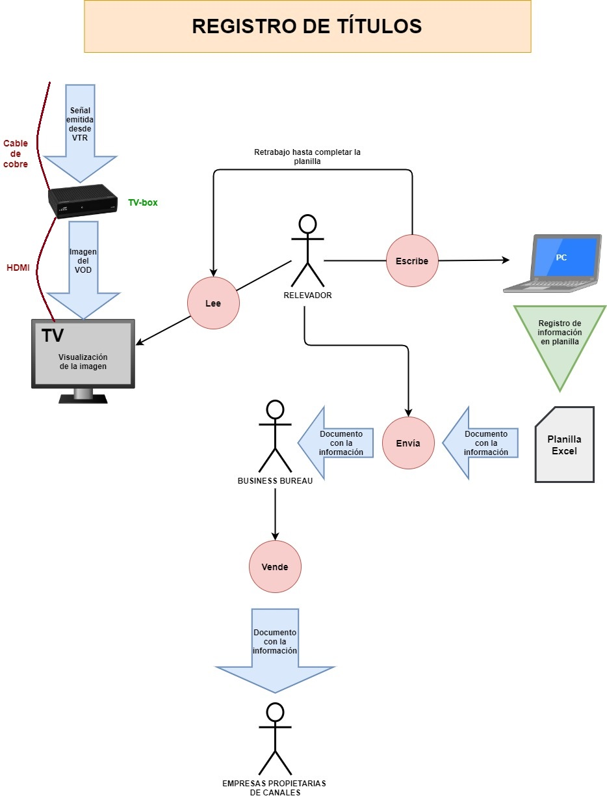

## **IDENTIFICACIÓN DE LA OPORTUNIDAD**

Mediante el diagrama causa-efecto se identifican las problemáticas u obstáculos más importantes que conlleva este proceso y que dan lugar a la oportunidad de desarrollo del proyecto, la oportunidad de sistematizar este registro repetitivo y lento convirtiéndolo en un proceso más eficiente y con menos necesidad de esfuerzo humano, utilizando tecnología para el desarrollo de este.

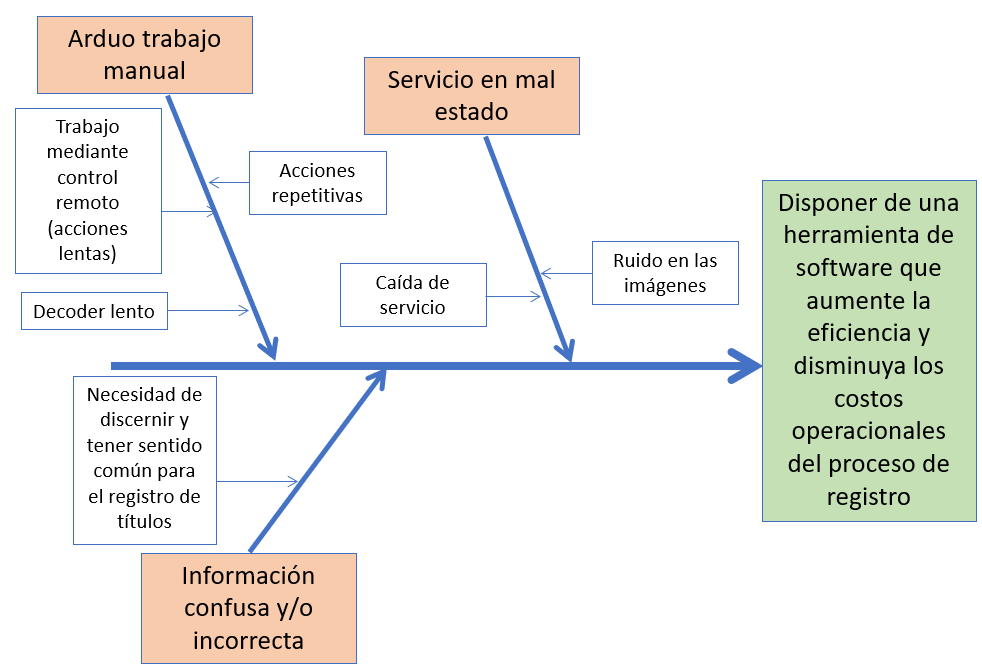

Causas que dan lugar a la oportunidad:

1.  Arduo trabajo manual:
    -   Trabajo mediante control remoto (acciones lentas): el trabajo de relevamiento requiere de un esfuerzo manual, tedioso y lento; provocando muchos puntos de fallas y agotamiento, influyendo en la necesidad de disponer de una herramienta que apoye el proceso
    -   Decoder lento: la baja capacidad de procesamiento del TV-box provoca que la navegación a través de la plataforma, mediante el control remoto, sea lenta; invirtiendo mucho tiempo en el trabajo, influyendo en la oportunidad definida.
    -   Acciones repetitivas: constantemente se requieren de las mismas acciones para recorrer el VOD; esto incide en la oportunidad de mejora y sistematización de las acciones repetitivas.
2.  Servicio en mal estado:
    -   Caída de servicio: el servicio entregado por la empresa VTR puede sufrir intermitencias y/o caídas; provocando que el relevador deba esperar a que el servicio vuelva a estar operativo para seguir con el proceso de registro, esto provoca que se acorte el plazo de tiempo asignado al relevador para terminar el trabajo.
    -   Ruido en las imágenes: la baja calidad de la señal emitida por VTR junto con la baja capacidad de procesamiento del TV-box puede provocar que la imagen emitida se distorsione; provocando que el relevador deba esperar a que la calidad de las imágenes se estabilice y sean legibles, acortando considerablemente el tiempo que le es asignado para que complete el trabajo de relevamiento.
3.  Información confusa y/o incorrecta:

-   Necesidad de discernir y tener sentido común para el registro de títulos: es necesario analizar la información mostrada por el VOD para poder clasificarla según su tipo; provocando que el relevador deba revisar más de una vez un dato a registrar, invirtiendo mucho esfuerzo y acortando el plazo de tiempo asignado para completar el proceso de registro.

## **ALCANCE DEL PROYECTO**

El alcance de este proyecto se compone de las principales causas que dan lugar a la oportunidad de desarrollo del proyecto, estas se muestran en color verde en el siguiente diagrama causa-efecto.

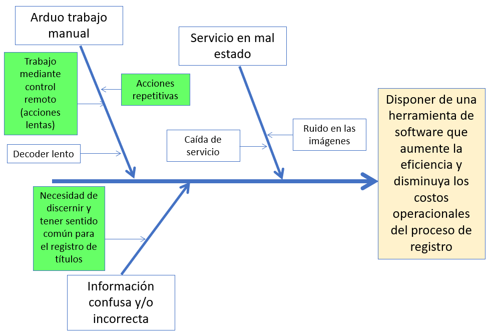

A continuación, se detallará brevemente el cómo se abordarán cada una de las causas de dicha oportunidad.

-   Trabajo mediante control remoto: para abordar esta causa, se modelarán las distintas actividades que realiza una persona hoy en día, distinguiendo aquellas que sea susceptibles emular mediante un algoritmo en lenguaje de programación.
-   Necesidad de discernir y tener sentido común para el registro de títulos: esta causa se abordará utilizando algoritmos implantados en la herramienta de software, estos algoritmos permitirán que el programa sea capaz de reconocer datos en la imagen siguiendo reglas establecidas por el programador, de esta manera, también se reemplazará el esfuerzo humano invertido en leer y detectar la información.
-   Acciones repetitivas: al realizar el proceso de registro se repiten acciones que se necesitan llevar a cabo para realizar este trabajo, es por eso que a través de la herramienta de software se ahorrarán ciertos trabajos que el relevador debe repetir constantemente durante el proceso, como es el análisis que hará el programa sobre el video grabado.

### **SUPUESTOS DEL ALCANCE**

En base a los objetivos y el alcance del proyecto, se da por cierto y se espera a que se cumplan para lograr un correcto desarrollo del proyecto los siguientes puntos:

-   Se deberá disponer del servicio activo entregado por VTR
-   El suministro eléctrico donde se instale la plataforma de este proyecto debe permanecer estable y sin cortes
-   El ruido y desincronización en las imágenes emitidas por el VOD debe ser baja
-   Se deberá disponer de un equipo informático con un sistema operativo estable, como Windows o Linux

### **LIMITACIONES DEL ALCANCE**

Para el desarrollo del producto de software se debe tener presente las siguientes limitaciones, es decir, los siguientes aspectos o funcionalidades se encuentran fuera del alcance del proyecto.

-   El equipo de proyecto y/o relevador no será capaz de solucionar la mala calidad de señal emitida del servicio entregado por parte de la empresa VTR
-   El equipo de proyecto y/o relevador no será capaz de solucionar o disminuir el ruido y desincronización de las imágenes emitidas por el TV-box
-   El equipo de proyecto y/o relevador no será capaz de optimizar o aumentar la capacidad de procesamiento del TV-box, es decir, el proyecto se llevará a cabo con las circunstancias actuales en las que se encuentra el decoder y servicio entregado por VTR.

## **OBJETIVO GENERAL**

Se construirá un producto de software y los procedimientos operativos que ameriten, que ayude a realizar el trabajo de relevamiento en las acciones de visualizar, extraer y almacenar los datos requeridos, con el objetivo de facilitar y disminuir los costos operacionales del proceso de registro.

## **OBJETIVOS ESPECÍFICOS**

1 – Disminuir el tiempo de entrega del trabajo de relevamiento en al menos un 20%.

Métricas:

-   La capacidad productiva del relevador, al completar un fragmento del trabajo total, se comparará con la capacidad productiva que tendrá la herramienta al analizar y completar varios fragmentos de forma paralela.

2 - Disminuir los costos operacionales en al menos un 20%.

Métricas:

-   Se realizarán encuestas de satisfacción a los ejecutores del servicio, antes y después de la implementación del proyecto. Estas encuestas medirán el esfuerzo humano requerido para realizar el trabajo de relevamiento.

## **SOLUCIÓN PROPUESTA**

Debido al arduo trabajo que conlleva realizar el relevamiento, siendo este un proceso lento e ineficiente, se plantea desarrollar un producto de software que permita disminuir los costos operacionales de la empresa registradora.

Desarrollar un producto de software en base a la oportunidad de mejora es beneficioso para la empresa registradora y también para el alumno, ya que, el alumno tiene la posibilidad de brindar esta herramienta como un servicio o producto completo a cambio de dinero. Para “Business Bureau” la compra de un software de estas características puede conseguir abaratar costos para la empresa misma.

Existe la necesidad de desarrollar una herramienta de software que permita sistematizar, optimizar y posiblemente automatizar el proceso de levantamiento de datos de la plataforma VOD, desde la visualización de los datos emitidos a través de la pantalla hasta la escritura de estos en un documento virtual.

Es por esta razón que se pretende desarrollar lo siguiente:

-   Conexión estable entre el computador (Windows o Linux) la tarjeta capturadora y el decodificador, permitiendo que la imagen emitida por el decodificador de señal TV-box envíe la imagen a través de la tarjeta

capturadora de video y finalmente llegue al computador, donde podrá ser visualizada a través de un software dedicado a la grabación y transmisión de video.

-   Grabación de un video corto en el que se muestre un pequeño recorrido de la plataforma VOD, ese video posteriormente se utilizará para
-   analizarlo con la herramienta de software. Este video se grabará utilizando un software dedicado a la grabación de video.
-   Programa informático desarrollado con lenguajes de programación que sea capaz de leer y analizar el video grabado anteriormente aplicando algoritmos en la imagen de este. Debe ser capaz de analizar y detectar datos representados en la imagen, finalmente, debe guardar esos datos en un documento virtual.

En la siguiente página, se muestra un flujo de cómo sería el proceso de registro una vez implementada la herramienta de software.

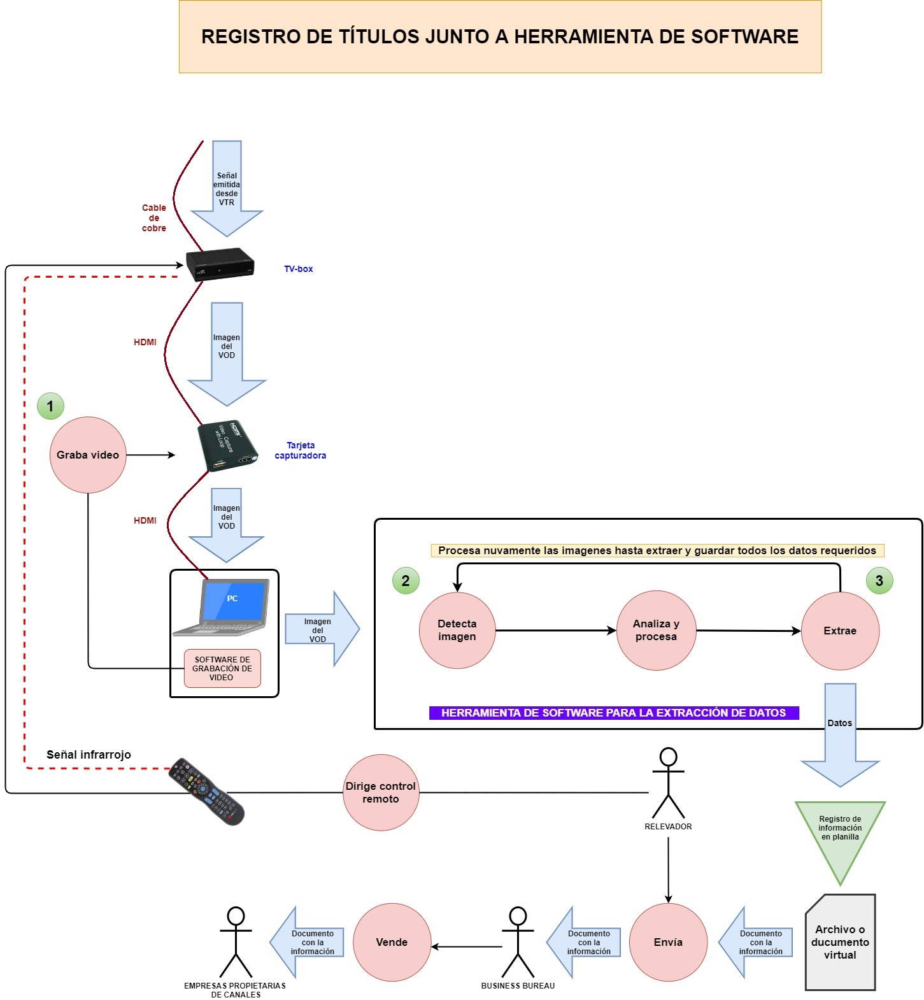

En la siguiente matriz se describen las verificaciones y evidencias de los puntos de control representados en el diagrama de registro de títulos

<table><tbody><tr><td>
N°
</td><td>
NOMBRE
</td><td>
DESCRIPCIÓN
</td></tr><tr><td>

</td><td>
Grabación de video por software dedicado
</td><td><ul><li>Proceso en el que se verifica que el software de grabación de video graba las imágenes del VOD enviadas desde la tarjeta capturadora</li><li>Evidencia: el software de grabación de video debe alojar un archivo de video dentro de algún repositorio del computador</li></ul></td></tr><tr><td>

</td><td>
Detección de imagen por herramienta de software
</td><td><ul><li>Proceso en el que se verifica que la herramienta de software reconoce y analiza el archivo de video importado</li><li>Evidencia: la herramienta de software debe crear automáticamente un documento virtual dentro de algún repositorio del computador</li></ul></td></tr><tr><td>

</td><td>
Extracción de datos por herramienta de software
</td><td><ul><li>Proceso en el que se verifica que la herramienta de software ha arrojado las salidas esperadas</li><li>Evidencia: la herramienta de software debe escribir los datos requeridos en el documento virtual</li></ul></td></tr></tbody></table>

## **ENTREGABLES**

<table><tbody><tr><td>
Producto de software operativo
</td></tr><tr><td>
Manual de usuario
</td></tr><tr><td>
Salidas del producto de software
</td></tr><tr><td>
Documentación del proyecto
</td></tr><tr><td>
Documentación de aceptación y cierre de proyecto
</td></tr></tbody></table>

## **EQUIPO DE PROYECTO**

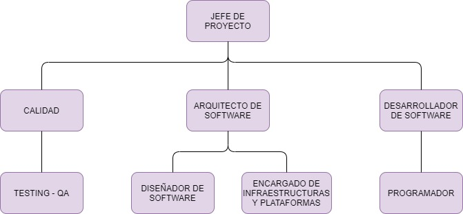

## **ROLES Y RESPONSABILIDADES**

<table><tbody><tr><td>
ROL
</td><td>
RESPONSABILIDADES
</td><td>
CANTIDAD
</td></tr><tr><td>
Jefe de proyecto
</td><td><ul><li>Planificar y gestionar acciones</li><li>Supervisar el avance del proyecto</li><li>Asignar recursos</li></ul></td><td>
1
</td></tr><tr><td>
Desarrollador de software
</td><td><ul><li>Planificar el desarrollo de módulos y paquetes de software</li><li>Unificar módulos de código en la herramienta de software principal</li></ul></td><td>
1
</td></tr><tr><td>
Arquitecto de software
</td><td><ul><li>Modelado de la arquitectura del software</li><li>Selección de tecnologías a utilizar</li><li>Unificar componentes del sistema</li></ul></td><td>
1
</td></tr><tr><td>
Programador
</td><td><ul><li>Desarrollo de módulos unitarios y funciones de código</li></ul></td><td>
1
</td></tr><tr><td>
Diseñador de software
</td><td><ul><li>Diseño del sistema en alto nivel</li><li>Diseño de interacción entre datos y programa de software</li></ul></td><td>
1
</td></tr><tr><td>
Encargado de infraestructuras TI
</td><td><ul><li>Instalación de hardware y tecnología</li><li>Mantener y supervisar instalaciones de hardware a utilizar en el proyecto</li></ul></td><td>
1
</td></tr></tbody></table>

## **ESTRUCTURA DE DESGLOSE DEL TRABAJO**

A continuación, se muestra la descomposición de las tareas y actividades que se abordarán en este proyecto

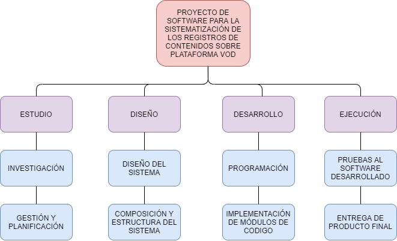

## **CRONOGRAMA DEL PROYECTO**

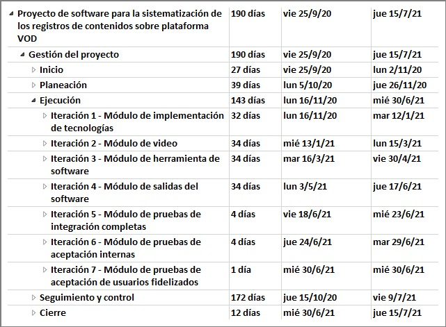

## **FACTORES CRÍTICOS DE ÉXITO**

Los factores que se harán presentes en este proyecto y que afectarán al éxito de este son los siguientes:

-   La empresa de telecomunicaciones VTR debe emitir una señal de calidad
-   El decodificador de señal TV-box no debe tener fallas en su procesamiento y en la navegación de la plataforma VOD
-   Debe existir documentación suficiente a disposición del equipo para facilitar el desarrollo del proyecto
-   El hardware de video y los equipos informáticos utilizados deben tener baja probabilidad de fallos inesperados

**III**

# **MATERIALES Y MÉTODOS**

## **GESTIÓN DEL PROYECTO**

La gestión de este proyecto se llevará a cabo utilizando la guía de los fundamentos para la dirección de proyectos (PMBOK 4° edición), siguiendo los estándares, pautas y normas para la gestión de proyectos representados en este.

El ciclo de vida del proyecto está compuesto por las siguientes fases:

1 – Inicio

2 – Planeación

3 – Ejecución

4 – Seguimiento y control

5 – Cierre

### **FASES DEL PROYECTO**

1 - Inicio:

Esta fase inicial del proyecto se compone de aquellas actividades que dan comienzo a este mismo, como son la identificación de la oportunidad, las causas que dan lugar a la oportunidad, el entorno de la oportunidad y el alcance inicial del proyecto.

2 – Planeación:

La fase de planeación se compone de aquellas actividades que dan lugar a un plan de acción para abordar dicho proyecto, como son la definición de los objetivos generales, los objetivos específicos, el alcance total del proyecto y la solución propuesta para la oportunidad presentada.

3 – Ejecución:

Esta fase está compuesta por aquellas actividades que competen al desarrollo del proyecto con el objetivo de cumplir la solución propuesta y abordar el alcance.

4 – Seguimiento y control:

Esta fase está compuesta por aquellas actividades para la supervisión del progreso y evolución del proyecto, con el objetivo de realizar cambios y correcciones si se considera necesario.

5 – Cierre:

Esta fase está compuesta por aquellas actividades que dan lugar al cierre del proyecto, como son la aceptación de una documentación formal y la finalización de las actividades de desarrollo.

### **PLANES DE PROYECTO**

I - Plan de gestión de riesgos:

Este plan tiene como objetivo identificar, cualificar y cuantificar los riesgos, posteriormente identificar el nivel de probabilidad e impacto que generan los posibles riesgos en las diversas fases del proyecto, afectando el correcto avance y desarrollo de este.

En base a la identificación de los riesgos se desarrollarán estrategias y acciones para abordar respuestas a los riesgos del proyecto.

Siguiendo los fundamentos presentes en la guía PMBOK; las actividades que conlleva la gestión de riesgos son:

<table><tbody><tr><td>
1
</td><td>
Planificar la gestión de riesgos
</td></tr><tr><td>
2
</td><td>
Identificar los riesgos
</td></tr><tr><td>
3
</td><td>
Realizar el análisis cualitativo de los riesgos
</td></tr><tr><td>
4
</td><td>
Realizar el análisis cuantitativo de los riegos
</td></tr><tr><td>
5
</td><td>
Planificar la respuesta a los riesgos
</td></tr><tr><td>
6
</td><td>
Implementar la respuesta a los riesgos
</td></tr><tr><td>
7
</td><td>
Monitorear los riesgos
</td></tr></tbody></table>

1 – Planificar la gestión de riesgos:

En la planificación se definirá el cómo se realizarán las actividades de gestión de riesgos para el proyecto para lograr un adecuado nivel de riesgos en este. Mediante el análisis de los documentos y los factores ambientales del proyecto se dará lugar al plan de gestión de los riesgos.

2 – Identificar los riesgos:

En la identificación se determinarán los riesgos que pueden afectar al proyecto, posteriormente se documentarán las características de estos. Se revisará la documentación del proyecto, el plan de gestión de los riesgos, el alcance inicial, el plan de gestión del cronograma, el plan de calidad, los factores ambientales del proyecto y finalmente se realizará un análisis de supuestos, dando lugar al documento de registro de riesgos.

3 – Realizar el análisis cualitativo de los riesgos:

En el análisis cualitativo se priorizarán los riesgos individuales del proyecto con el objetivo de posteriormente analizar o tomar acciones frente a estos, evaluando su probabilidad de ocurrencia e impacto. Se revisará la documentación del proyecto, el plan de gestión de los riesgos, el registro de riesgos y supuestos y los factores ambientales del proyecto utilizando técnicas como la matriz de probabilidad e impacto, categorización de los riesgos y la evaluación de probabilidad e impacto, dando lugar a una actualización de los documentos del proyecto; documento de registro de supuestos y registro de riesgos.

4 – Realizar análisis cuantitativo de los riesgos:

En esta fase se realizará un análisis numérico de la combinación entre riesgos individuales del proyecto identificados y otras incertidumbres sobre los objetivos generales del proyecto. Se analizarán documentos como el plan de gestión de los riesgos, el plan de gestión del cronograma, factores ambientales del proyecto y el registro de los riesgos, dando lugar a una actualización de la documentación; documentación de informes de riesgos.

5 – Planificar la respuesta a los riesgos:

En esta fase se desarrollarán estrategias y se acordarán acciones para abordar los riesgos identificados en el proyecto, así como también tratar los riesgos individuales del proyecto. Se analizarán documentos como el registro de riesgos, factores ambientales.

6 – Implementar la respuesta a los riesgos:

En esta fase se implementarán los planes acordados que dan respuesta a los riesgos, se asegurará que la respuesta a los riesgos se ejecutará según lo planificado, se minimizarán las amenazas individuales y se maximizarán las oportunidades individuales. Se revisará documentación como el informe de riesgos y el plan de gestión de los riesgos, dando lugar a solicitudes de cambio o actualizaciones en la documentación del proyecto en caso de ser necesario.

7 – Monitorear riesgos:

En esta fase se monitoreará la implementación de los planes acordados que dan respuesta a los riesgos, se hará un seguimiento y se identificarán nuevos riesgos, también se evaluará la efectividad que ha tenido el proceso de gestión de riesgos. Se evaluarán documentos como el informe de riesgos e informes de desempeño, dando lugar a solicitudes de cambio y actualizaciones a los documentos del proyecto en caso de ser necesario.

Matriz de definición de probabilidad a utilizar:

<table><tbody><tr><td>
NIVEL
</td><td>
DESCRIPTOR
</td><td>
DESCRIPCIÓN
</td></tr><tr><td>
5
</td><td>
Casi seguro
</td><td>
Alta probabilidad de ocurrencia; ha sucedido a menudo en el pasado
</td></tr><tr><td>
4
</td><td>
Probable
</td><td>
Alta probabilidad de ocurrencia; ha sucedido varias veces en el

pasado (más de un 50%)
</td></tr><tr><td>
3
</td><td>
Posible
</td><td>
Probabilidades iguales de ocurrencia (50%/50%)
</td></tr><tr><td>
2
</td><td>
Poco probable
</td><td>
Baja probabilidad de ocurrencia (menos de un 50%)
</td></tr><tr><td>
1
</td><td>
Raro
</td><td>
Probabilidad muy baja de ocurrencia
</td></tr></tbody></table>

Matriz de definición de nivel de impacto a utilizar:

<table><tbody><tr><td>
NIVEL
</td><td>
DESCRIPCIÓN
</td><td>
IMPACTO EN PROGRAMA
</td><td>
IMPACTO EN RENDIMIENTO
</td></tr><tr><td>
1
</td><td>
Insignificante
</td><td>
Desplazamiento de hitos internos no críticos; fecha de término será alcanzada
</td><td>
Insignificante impacto en la capacidad y funcionalidades; daños menores no reportable al medio ambiente y totalmente recuperable
</td></tr><tr><td>
2
</td><td>
Menor
</td><td>
Menor desplazamiento de hitos semi-críticos; hitos requieren ser programados, aun así, fecha de término será alcanzada
</td><td>
Reducción menor en capacidad y funcionalidades pero tolerables; daños menores no reportables al medio ambiente
</td></tr><tr><td>
3
</td><td>
Moderado
</td><td>
Desplazamiento de algunos hitos críticos de entrega; fecha de término puede verse afectada, pero dentro de lo aceptable
</td><td>
La degradación en la capacidad o funcionalidad tiene efectos notorios en el rendimiento y en el alcance de los objetivos; daño moderado en el medio ambiente
</td></tr><tr><td>
4
</td><td>
Mayor
</td><td>
Mayor desplazamiento de hitos críticos de entrega; fecha de término no será alcanzada y necesitará ser extendida
</td><td>
Degradación severa de la capacidad y funcionalidad, se afectará severamente el rendimiento y alcance de los objetivos; significante, se ha expandido el daño al medio ambiente y es reportable
</td></tr><tr><td>
5
</td><td>
Severo
</td><td>
Programa irremediablemente perdido con poca o nula probabilidad de recuperación; fracaso en la finalización
</td><td>
La degradación en la capacidad y funcionalidad se hace extensiva, servicios y/o instalaciones quedan inutilizables, el rendimiento y logro de los objetivos es comprometido severamente; daño irreparable a largo plazo en el medio ambiente, el incidente es reportable
</td></tr></tbody></table>

Matriz de riesgo a utilizar:

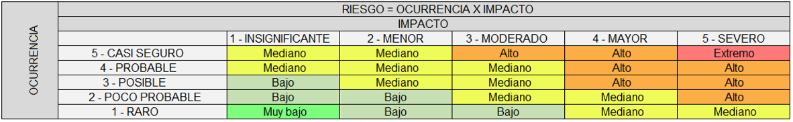

Matriz de definición de riesgo a utilizar:

<table><tbody><tr><td>

</td><td>

DEFINICIÓN DE RIESGO
</td></tr><tr><td>
EXTREMO
</td><td>
Detener inmediatamente la actividad; corregir inmediatamente
</td></tr><tr><td>
ALTO
</td><td>
Verificar y detener actividad en caso de ser necesario; se debe corregir inmediatamente y evaluar la mejor alternativa de mitigación
</td></tr><tr><td>
MEDIO
</td><td>
Reducir el riesgo lo más posible y desarrollar estrategias de forma inmediata; el problema debe remediarse en un periodo de tiempo menor al de los riesgos bajos
</td></tr><tr><td>
BAJO
</td><td>
Se deben considerar soluciones o mejoras rentables; se requieren comprobaciones periódicas para asegurar la eficacia de las medidas de control
</td></tr><tr><td>
MUY BAJO
</td><td>
No se requiere acción específica
</td></tr></tbody></table>

II - Plan de calidad:

En el plan de calidad se especificarán y se documentarán los estándares de calidad que se utilizarán en el proyecto, los objetivos de calidad, las herramientas de calidad y los entregables y/o procesos que estarán sujetos a revisión, todo esto con el objetivo de verificar si el proyecto satisface las necesidades para lo que fue planteado desde un comienzo.

Para la fase de planificación de la calidad se utilizará como herramienta un diagrama de flujo de actividades para garantizar la productividad y calidad del equipo de desarrollo, como se muestra en el siguiente formato:

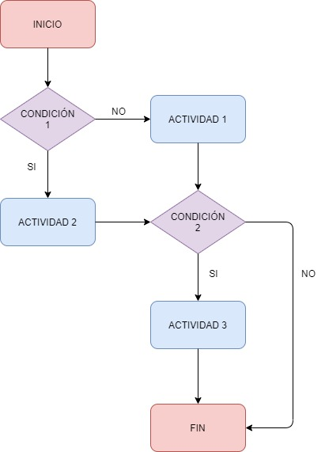

Posteriormente, en la fase de la gestión de calidad, se convertirán en actividades ejecutables aquellos planes de gestión de calidad, y así aumentar la probabilidad de cumplir con los objetivos de calidad.

Finalmente, en la fase de control de calidad, se efectuará un monitoreo y registro de los resultados obtenidos en la ejecución de las actividades de calidad, con el objetivo de evaluar el desempeño y proponer cambios en caso de ser necesarios.

Como salida se obtendrá el documento de plan de calidad, en el que se describirán las acciones necesarias para asegurar la calidad del proyecto y que recursos o personas serán asignadas a estas acciones.

III - Plan de comunicaciones:

En esta fase se asegurará que se satisfagan las necesidades de la información del proyecto y de los interesados de este, con el objetivo de lograr un óptimo flujo de información.

Se utilizará una matriz de comunicaciones como herramienta para especificar los objetivos de comunicación, como muestra el siguiente formato.

**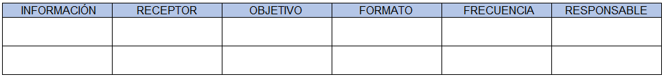**

IV - Plan de gestión de cambios:

En este plan se documentarán y se planificarán implementaciones que den respuesta a las necesidades de cambio que el proyecto pueda tener, sea por factores ambientales, infraestructura o tecnología, es decir, se planificarán aquellas actividades que favorecen a la transformación de procesos que necesiten ser cambiados.

Previo a la realización de un cambio, se debe completar una solicitud de cambio, esta debe ser analizada acorde a las características del proyecto para posteriormente ser aceptada por el jefe de proyecto.

El formato de solicitud de cambio a utilizar es el siguiente:

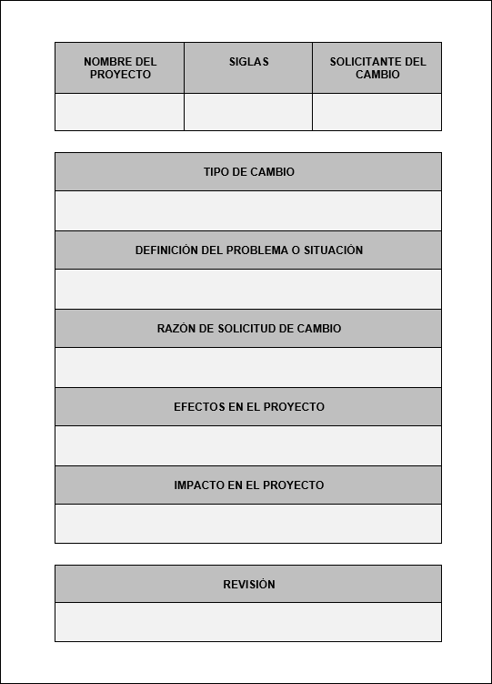

V - Plan de gestión del alcance:

En este plan se detallará el cómo el alcance del proyecto será definido, desarrollado, monitoreado, controlado y verificado, con el objetivo de garantizar que se incluyan todos los trabajos necesarios para completar el proyecto exitosamente.

Dentro del plan de gestión del alcance se define:

-   Enunciado o declaración del alcance
-   Creación y aprobación de EDT
-   Validación del alcance
-   Aprobación de entregables y cambios del alcance

VI - Plan de gestión del cronograma:

En este plan se definirán las políticas que permiten la elaboración y gestión del cronograma, como también lo relacionado con la gestión de cambios.

Se realizarán las actividades:

-   Definir actividades
-   Secuenciar actividades
-   Estimar tiempo y recursos a las actividades
-   Desarrollar cronograma

VII - Plan de pruebas:

Este plan tiene como objetivo describir las técnicas, herramientas y actividades relacionadas con la ejecución y validación del plan de pruebas, con el objetivo de corroborar si el sistema satisface los requerimientos iniciales y cumple con las métricas de calidad establecidas

En este plan se definirá:

-   Componentes de software a ser probados
-   Tipos de pruebas a implementar
-   Herramientas a utilizar
-   Ambiente para ejecución de pruebas

## **GESTIÓN DEL PRODUCTO**

En la gestión del producto se realizará una planificación para poner en producción el desarrollo de un producto que cumpla con las funcionalidades requeridas y alcance los objetivos esperados.

### **METODOLOGÍA DE DESARROLLO**

El desarrollo del producto de software será implementado utilizando una metodología de desarrollo ágil, específicamente la metodología de desarrollo Scrum, esto con el objetivo de dividir el desarrollo del producto en pequeños módulos de desarrollo iterativos. Con esta metodología, se facilitarán las tomas de decisiones al momento abordar posibles obstáculos o cambios durante el desarrollo del producto.

La metodología de desarrollo Scrum se adecúa apropiadamente a las características del proyecto, esto se debe a que la herramienta de software para la extracción de datos es potencialmente divisible en pequeños y cortos módulos, favoreciendo la velocidad de su desarrollo y aumentando la probabilidad de la mantención de estos, finalmente serán integrados en un producto final de software.

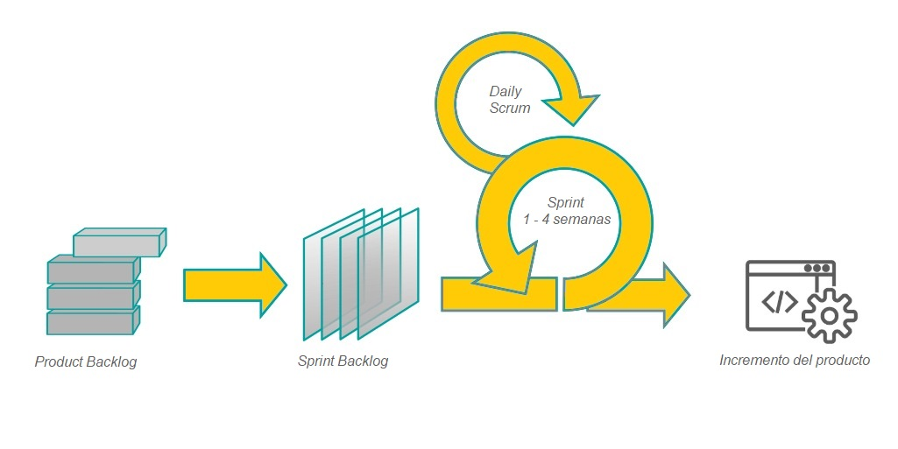Modelo de desarrollo Scrum:

Los ciclos iterativos a desarrollar con esta metodología son:

1.  Módulo de implementación de tecnologías
2.  Módulo de video
3.  Módulo de herramienta de software
4.  Módulo de salidas del software
5.  Módulo de pruebas de integración completas
6.  Módulo de pruebas de aceptación internas
7.  Módulo de pruebas de aceptación de usuarios fidelizados

### **MODELOS DE VISTAS DE ARQUITECTURA**

El diseño arquitectónico del software se describirá utilizando el modelo de vistas de arquitectura 4+1, dando lugar a diversas vistas que describen el sistema desde diferentes perspectivas y roles que pueden existir dentro del desarrollo del producto.

Modelo de vistas de arquitectura 4+1:

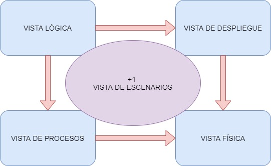

Cada vista está compuesta por diversos diagramas UML que describen estas mismas, las vistas presentes en el modelo son:

-   Vista lógica: esta vista tiene como objetivo describir la funcionalidad y la estructura del sistema; se realizan los diagramas de clase, diagrama de comunicación y diagrama de secuencia.
-   Vista de desarrollo: esta vista tiene como objetivo ilustrar el sistema desde la perspectiva del programador y lograr una administración de los artefactos de software; se realizan los diagramas de componentes y diagrama de paquetes.
-   Vista de procesos: esta vista tiene como objetivo describir los procesos del sistema, su comunicación y su dinamismo, visualizándolos en tiempo de ejecución. En esta vista se consideran aspectos como concurrencia, distribución, rendimiento y escalabilidad; se realiza el diagrama de actividad.
-   Vista física: esta vista tiene como objetivo describir la topología de componentes de software en la capa física, como también las conexiones físicas entre estos; se realiza el diagrama de despliegue.
-   Vista de escenarios: esta vista se genera al realizar una descripción del sistema mediante un conjunto de casos de uso, en el que se especifican interacciones entre procesos y objetos; se realiza el diagrama de casos de uso.

### **PATRÓN DE ARQUITECTURA DE SOFTWARE**

El desarrollo del software se llevará a cabo implementando el patrón de arquitectura en capas, esto es debido a que el patrón arquitectónico se adecúa correctamente a las características del problema a solucionar y a las propiedades del software a desarrollar.

La arquitectura estará organizada en tres capas, la capa de “presentación”, la capa de “lógica de negocio” y la capa de “persistencia de datos”. Cada capa estará compuesta de diversos componentes y todos los componentes correspondientes a una misma capa compartirán el mismo nivel de abstracción. Las capas serán estructuradas de forma horizontal, una capa solo entregará servicios a la capa sucesora, consumirá servicios de la capa antecesora, y viceversa, es decir, no habrá saltos de capa durante la interacción que estas tengan.

El enfoque estructural de esta arquitectura permitirá una división efectiva del problema a resolver, desagregando las funcionalidades en los diversos componentes que forman las capas, favoreciendo la modularización de la herramienta de software, y, por ende, facilitando la mantención y el reemplazo de componentes.

Descripción de la composición de la arquitectura:

-   Capa de presentación: la capa de presentación abarca todas las funcionalidades pertenecientes a las interfaces de usuario proporcionadas por el sistema, junto a todas las funcionalidades de interacción y modificación de dichas interfaces de usuario.
-   Capa de lógica de negocio: la capa de lógica de negocio abarca todas las funcionalidades y métodos que contienen las reglas del servicio que se pretende ofrecer con la herramienta. Esta capa recibe e interpreta las peticiones del usuario enviadas desde la capa de presentación, ejecutando aquellos métodos y funcionalidades requeridos para cumplir con dichas peticiones, accediendo y alimentándose de la capa de persistencia de datos.
-   Capa de persistencia de datos: esta capa abarca todos modelos y lógica del almacenamiento persistente de datos de la herramienta, aquellos datos que serán manipulados por la lógica de negocio y posteriormente representados al usuario en la capa de presentación.

En la siguiente página se representa el diseño del patrón de arquitectura y su funcionamiento.

Diseño de patrón:

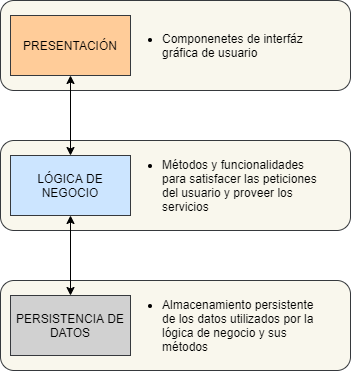

### **HERRAMIENTAS DE CONTROL DE VERSIONES**

Se utilizarán herramientas de software para el control de versiones de archivos y de documentos, con el objetivo de registrar todos los cambios realizados en estos, de esta manera, se podrán recuperar o utilizar versiones antiguas de los archivos y/o documentos ante la necesidad de estos.

Herramientas de software para la creación y registro de documentación:

-   Microsoft Word: esta herramienta será utilizada para procesar y registrar el texto perteneciente a la documentación del proyecto
-   Microsoft Project: esta herramienta será utilizada para la creación y administración del cronograma del proyecto, con sus respectivas actividades y recursos asignados a estas, específicamente para la creación de la carta Gantt.
-   Microsoft Excel: esta herramienta será utilizada para la creación de hojas de cálculo en cualquier documento y/o actividad del proyecto que requiera ser desarrollada o documentada en este formato.

Herramientas de control de versión de software:

-   Git: se utilizará para el control de versiones del código fuente de la herramienta de software en desarrollo junto con toda su documentación digital, registrando y almacenando cada versión de estos archivos y documentos, permitiendo la recuperación de versiones anteriores ante la necesidad de estos

Los archivos que contendrán el código fuente junto con los documentos relacionados al proyecto estarán almacenados de forma local y se sincronizarán con un repositorio online, este repositorio estará a alojado en la plataforma GitHub, con esto se concluye que; posterior a cada modificación significativa en la documentación o en el código fuente del proyecto se creará una copia de la carpeta, permitiendo registrar una “versión” perteneciente a un periodo de tiempo.

En la siguiente página se especifica gráficamente el procedimiento para el control de versiones del proyecto.

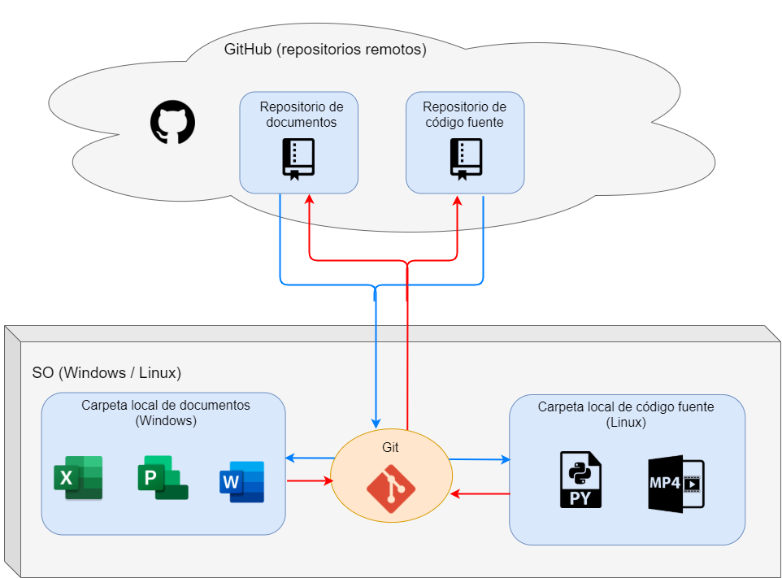

**IV**

# **RESULTADOS Y DISCUSIÓN**

## **RESULTADOS Y DISCUSIÓN**

El proyecto “sistematización de los registros de contenidos sobre plataforma VOD” se desarrolló utilizando el marco de trabajo Scrum, este modelo permitió el desarrollo en diversas iteraciones recurrentes. Las diversas iteraciones son:

1 – módulo de implementación de tecnologías

2 – módulo de video

3 – módulo de herramienta de software

4 – módulo de salidas del software

5 – módulo de pruebas de integración completas

6 – módulo de pruebas de aceptación internas

7 – módulo de pruebas de aceptación de usuarios fidelizados

Diagrama de contexto:

**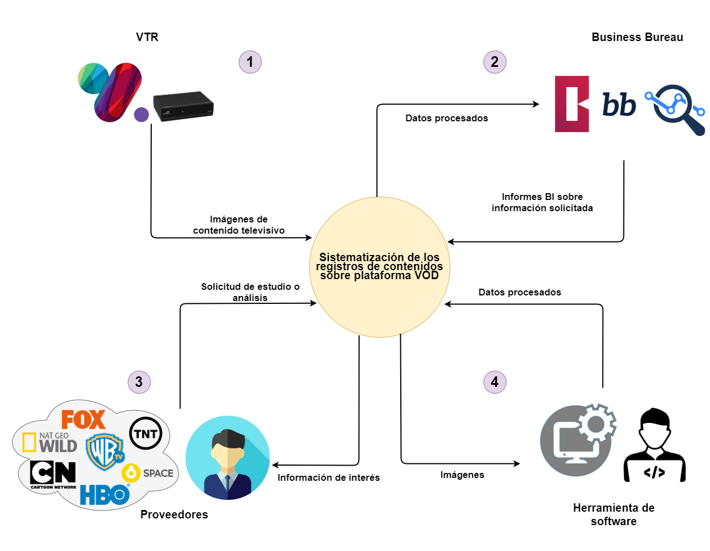**

1 – VTR: la empresa de telecomunicaciones emite imágenes a través de su decodificador tv-box.

2 – Business Bureau: recibe los datos que ya fueron procesados por la herramienta, posteriormente la empresa analizará y generará reportes en base a esa información.

3 – Proveedores: son los interesados en obtener información sobre el correcto cumplimiento de la transmisión de su contenido televisivo en la plataforma de la empresa VTR.

4 – Herramienta de software: esta es la encargada de procesar las imágenes de entrada, generando como salida diversos datos procesados.

Con el desarrollo de este proyecto, se verá beneficiada principalmente la actividad de análisis y extracción de datos realizada por el relevador, actividad que será impulsada positivamente por la funcionalidad “extraer información” perteneciente al módulo de video, sistematizando el proceso de recopilación de información y logrando finalmente una disminución en los costos operacionales del proceso de registro.

## **ESPECIFICACIÓN DE REQUISITOS**

**Introducción**

En el presente documento de ERS se describirá en detalle qué hará el producto a desarrollar para el proyecto “sistematización de los registros de contenidos sobre plataforma VOD”, se describirán los propósitos, ámbitos del sistema, personas involucradas, definiciones y abreviaturas. Se utilizarán las recomendaciones y buenas prácticas para la especificación de requisitos definidas en el estándar IEEE 830.

**Propósito**

Se tiene como propósito aclarar y detallar en profundidad los requisitos del producto a desarrollar, con la finalidad de definir aquellas funcionalidades que este debe cumplir para lograr satisfacer dichos requisitos, abarcando requisitos funcionales y no funcionales. Se utilizarán tablas para describir las funcionalidades propias del comportamiento del sistema.

Este documento va dirigido a todas aquellas personas que necesiten comprender el comportamiento del sistema, sea para adicionar requisitos, detallarlos, o realizar una construcción y desarrollo del sistema.

**Ámbito del sistema**

Se abreviará y se nombrará como “SSRC-VOD” el “proyecto de software para la sistematización de los registros de contenidos sobre plataforma VOD”, proyecto de software dedicado a mejorar y optimizar el proceso de registro de contenido televisivo transmitido a través de una plataforma VOD. A continuación, se describirá a grandes rasgos qué es lo que hará y lo que no hará el sistema.

-   Lo que el sistema sí cumplirá:

1 – el sistema será capaz de implementar funcionalidades OCR sobre imágenes y videos.

2 – el sistema recopilará y extraerá datos sobre el material entregado como entrada.

3 – el sistema exportará los datos de interés como salida, datos procesados y ordenados.

-   Lo que el sistema no cumplirá:

1 – el sistema no procesará ni analizará la plataforma VOD en su totalidad.

2 – el sistema no enviará los datos automáticamente a los interesados que solicitan esta información.

3 – el sistema no automatizará el proceso manual de registro, ya que, de todas formas, necesitará de un usuario capaz de ingresar el material de entrada.

**Personal involucrado**

<table><tbody><tr><td>
NOMBRE
</td><td>
Renato Germani Brugnoni
</td></tr><tr><td>
ROL
</td><td><ul><li>Líder de proyecto</li><li>Arquitecto de software</li><li>Programador</li><li>Tester</li></ul></td></tr><tr><td></td><td></td></tr><tr><td>
RESPONSABILIDADES
</td><td><ul><li>Dirigir al equipo de desarrollo del proyecto</li><li>Diseñar componentes y módulos del sistema</li><li>Desarrollar los componentes y módulos del sistema</li><li>Realizar pruebas al software construido</li></ul></td></tr><tr><td>
INFORMACIÓN DE CONTACTO
</td><td>
r.germanibrugnoni@uandresbello.edu
</td></tr></tbody></table>

**Referencias**

<table><tbody><tr><td>
NOMBRE
</td><td>
REFERENCIA
</td></tr><tr><td>
Estándar de documento ERS
</td><td>
IEEE 830
</td></tr></tbody></table>

**Resumen**

La estructura del presente documento de ERS se compondrá de tres secciones, la primera sección consta de una breve introducción al producto de software, como son el ámbito en el que se halla, definiciones y personal involucrado.

La segunda sección del documento contiene una descripción general del producto, como son las características de los diversos usuarios, las funciones del producto, restricciones, suposiciones y dependencias.

Finalmente, en la tercera y última sección, se describirán más detalladamente los requisitos específicos que el sistema debe satisfacer, especificando los requerimientos funcionales y no funcionales de este.

**Contexto**

El sistema está diseñado para ser utilizado, en primera instancia, por el trabajador relevador, este será construido utilizando el lenguaje de

programación Python en su versión 3, específicamente haciendo uso de la librería “openCV”, librería dedicada a la visión artificial.

Los usuarios finales interesados en obtener los datos que el software extraerá son compañías de canales televisivos y dueños de contenido de pago, la entidad encargada de entregarles esta información de interés es una compañía

de estudio de mercado, la compañía de estudio de mercado consigue esto efectuando un análisis sobre la plataforma en la que se transmiten dichos contenidos de pago.

**Restricciones**

-   El software dependerá de entradas en buen estado y sin carencias de calidad en las imágenes para poder realizar un análisis y procesamiento válido.
-   El software necesitará ser ejecutado en algún sistema operativo; Windows, Linux o Mac OS.
-   El software necesitará ser ejecutado por un usuario.
-   El material de entrada deberá ser ingresado por un usuario.

**Requisitos funcionales**

Estos especifican qué debe hacer el sistema frente a determinadas circunstancias e interacciones que el usuario tenga con este. Los siguientes son:

<table><tbody><tr><td>
ID
</td><td>
RF-01
</td></tr><tr><td>
NOMBRE
</td><td>
Interfaz gráfica
</td></tr><tr><td>
CARACTERÍSTICAS
</td><td>
El programa presentará una interfaz que permitirá interactuar con el sistema.
</td></tr><tr><td>
DESCRIPCIÓN
</td><td>
El programa deberá mostrar al usuario una interfaz, en la que podrá interactuar con las diversas funcionalidades del software.
</td></tr><tr><td>
PRIORIDAD
</td><td>
Alta
</td></tr></tbody></table>

<table><tbody><tr><td>
ID
</td><td>
RF-02
</td></tr><tr><td>
NOMBRE
</td><td>
Lectura de datos en fuente de datos .csv por parte de la herramienta de software
</td></tr><tr><td>
CARACTERÍSTICAS
</td><td>
El aplicativo buscará los datos de interés a detectar en una fuente de datos que contendrá todos los datos posibles a encontrar.
</td></tr><tr><td>
DESCRIPCIÓN
</td><td>
El módulo de video buscará y comparará los datos extraídos del material de análisis con los datos existentes en la fuente de datos, aquellos datos de interés que se desean detectar y extraer.
</td></tr><tr><td>
PRIORIDAD
</td><td>
Alta
</td></tr></tbody></table>

<table><tbody><tr><td>
ID
</td><td>
RF-03
</td></tr><tr><td>
NOMBRE
</td><td>
Lectura archivo video
</td></tr><tr><td>
CARACTERÍSTICAS
</td><td>
El programa tendrá un button que permitirá escoger el video a analizar.
</td></tr><tr><td>
DESCRIPCIÓN
</td><td>
El sistema deberá permitir al usuario ingresar el video a analizar, a través del button de la interfaz. Al interactuar con este, redireccionará a un explorador de archivos.
</td></tr><tr><td>
PRIORIDAD
</td><td>
Alta
</td></tr></tbody></table>

<table><tbody><tr><td>
ID
</td><td>
RF-04
</td></tr><tr><td>
NOMBRE
</td><td>
Ventana con consola
</td></tr><tr><td>
CARACTERÍSTICAS
</td><td>
El aplicativo tendrá una pequeña ventana en la que se podrá visualizar la terminal/consola del sistema.
</td></tr><tr><td>
DESCRIPCIÓN
</td><td>
El sistema mostrará a través de la ventana los procesos ejecutados por el sistema.
</td></tr><tr><td>
PRIORIDAD
</td><td>
Media
</td></tr></tbody></table>

<table><tbody><tr><td>
ID
</td><td>
RF-05
</td></tr><tr><td>
NOMBRE
</td><td>
Salidas
</td></tr><tr><td>
CARACTERÍSTICAS
</td><td>
El programa tendrá un button que permitirá obtener los datos o archivos de salida.
</td></tr><tr><td>
DESCRIPCIÓN
</td><td>
El sistema redireccionará al usuario a un explorador de archivos cuando este interactúe con el button, específicamente al repositorio donde están alojadas las salidas.
</td></tr><tr><td>
PRIORIDAD
</td><td>
Alta
</td></tr></tbody></table>

*Los requerimientos están especificados en forma ascendente*

**Requisitos no funcionales**

Estos requisitos definirán el cómo funciona el sistema, representarán las características y restricciones generales del programa en construcción, los siguientes son:

<table><tbody><tr><td>
ID
</td><td>
RNF-01
</td></tr><tr><td>
NOMBRE
</td><td>
Capacidad de procesamiento
</td></tr><tr><td>
CARACTERÍSTICAS
</td><td>
El programa será eficiente con los recursos computaciones.
</td></tr><tr><td>
DESCRIPCIÓN
</td><td>
El sistema deberá ser capaz de cumplir adecuadamente su función utilizando los recursos computacionales con los que dispone.
</td></tr><tr><td>
PRIORIDAD
</td><td>
Media
</td></tr></tbody></table>

<table><tbody><tr><td>
ID
</td><td>
RNF-02
</td></tr><tr><td>
NOMBRE
</td><td>
Compatibilidad con SO
</td></tr><tr><td>
CARACTERÍSTICAS
</td><td>
El sistema será compatible con Windows, Linux y Mac OS.
</td></tr><tr><td>
DESCRIPCIÓN
</td><td>
El programa podrá ser ejecutado por el usuario en 3 sistemas operativos distintos, Windows, Linux y Mac OS.
</td></tr><tr><td>
PRIORIDAD
</td><td>
Alta
</td></tr></tbody></table>

<table><tbody><tr><td>
ID
</td><td>
RF-03
</td></tr><tr><td>
NOMBRE
</td><td>
Compatibilidad archivos de imagen
</td></tr><tr><td>
CARACTERÍSTICAS
</td><td>
El sistema deberá admitir imágenes con formato JPEG, JPG, PNG y GIF.
</td></tr><tr><td>
DESCRIPCIÓN
</td><td>
El programa deberá ser capaz de procesar y analizar imágenes en los formatos JPEG, JPG, PNG y GIF.
</td></tr><tr><td>
PRIORIDAD
</td><td>
Alta
</td></tr></tbody></table>

<table><tbody><tr><td>
ID
</td><td>
RF-04
</td></tr><tr><td>
NOMBRE
</td><td>
Compatibilidad archivos de video
</td></tr><tr><td>
CARACTERÍSTICAS
</td><td>
El sistema deberá admitir videos en formato AVI y MP4.
</td></tr><tr><td>
DESCRIPCIÓN
</td><td>
El programa deberá ser capaz de procesar y analizar videos en los formatos AVI y MP4, también podrá analizar otros formatos siempre y cuando el códec de estos esté instalado en el SO.
</td></tr><tr><td>
PRIORIDAD
</td><td>
Alta
</td></tr></tbody></table>

## **PRODUCTO DE SOFTWARE Y PROCEDIMIENTOS ADMINISTRATIVOS**

La metodología utilizada para el desarrollo del proyecto ha permitido segmentar el avance del proyecto en siete módulos, de los cuales cuatro de ellos corresponden a iteraciones de preparación, diseños y construcción de software. Los tres módulos restantes corresponden a módulos de pruebas.

### **MÓDULO DE IMPLEMENTACIÓN DE TECNOLOGÍAS**

**Diseño módulo implementación de tecnologías**

Mediante el siguiente diagrama se representan las actividades llevadas a cabo para lograr la correcta implementación de las tecnologías a utilizar en el proyecto, como también su respectivo entorno de desarrollo.

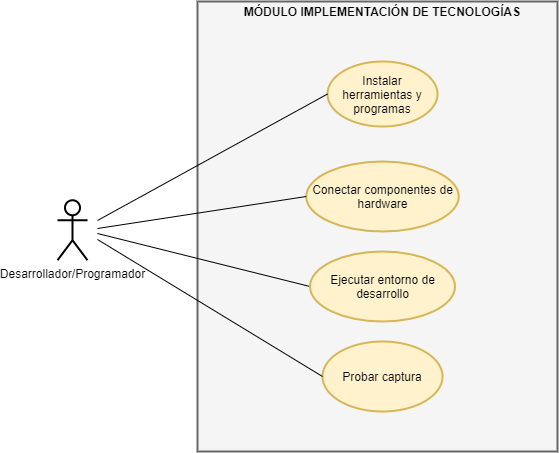

Para lograr una comprensión completa del diseño, se representan más en detalle los casos de uso “instalar herramientas y programas”, “conectar componentes de hardware” y “probar captura”, junto a las especificaciones de estos y los respectivos diagramas de secuencia (ver **Anexo A**).

**Construcción del módulo**

Este módulo se considera un módulo fundamental para el desarrollo del proyecto, ya que contiene todos aquellos procedimientos y actividades que tienen como objetivo la preparación del entorno de trabajo y la recopilación de material a analizar.

El no cumplir correctamente las actividades pertenecientes a este módulo podría provocar que la instalación de las tecnologías no se concrete de la manera correcta, se pueden generar conflictos entre los dispositivos y sus controladores, provocando que estos, junto con los programas necesarios, no funcionen de la forma óptima.

Un funcionamiento no óptimo de las herramientas y programas puede provocar que la recopilación del material a analizar sufra de algún defecto, y finalmente se vea afectado el nivel de calidad que este tenga.

Lograr calidad sobre los videos capturados es sumamente importante considerando la deficiencia de esta en las imágenes que el decodificar emite, el nivel de calidad que posean los videos definirá el grado de potencialidad de estos para ser analizados por la herramienta, de lo contrario, la herramienta padecerá dificultades y complejidades para lograr una correcta extracción de los datos.

Posterior a haber concluido con las instalaciones de los programas y herramientas necesarias como:

-   Python3: lenguaje de programación a utilizar
-   OpenCV: librería de visión artificial
-   Tesseract: motor de reconocimiento óptico de caracteres
-   PyTesseract: contenedor de Python para el motor Tesseract
-   Open Broadcaster Software: software de grabación de video

Se estableció conexión entre los tres dispositivos cruciales que dan lugar a la oportunidad abordada por el proyecto, el decodificador TV-Box, la tarjera capturadora de video y el equipo computacional del proyecto, implementando el cableado necesario que estos requieren para su comunicación.

Como ya se mencionó anteriormente, sobre la importancia en la calidad de las imágenes, se configuró la comunicación entre los dispositivos y se establecieron los parámetros para que el comportamiento del programa de grabación de video sea óptimo, logrando una transmisión de imagen estable, desde la emisión de las imágenes de la plataforma VOD por parte del decodificador, hasta la recepción de las imágenes por parte del equipo computacional.

Se representa imagen de OBS recibiendo la emisión del decodificador y mostrándola por pantalla (ver **Anexo B**)

Luego de verificar el correcto funcionamiento de las herramientas y programas, se capturaron diversas imágenes con el fin de probar su potencialidad para ser analizadas. Se desarrollaron scripts de prueba utilizando las librearías ya instaladas para extraer datos y pequeñas muestras de las imágenes capturadas, específicamente dos scripts de prueba.

El primer script de prueba tuvo como objetivo probar la potencialidad de las imágenes capturadas por la herramienta, determinadas por la calidad de estas. Esa prueba se llevó a cabo generando un script que sea capaz de extraer texto presente en las imágenes implementando el motor de reconocimiento óptico de caracteres Tesseract, utilizando precisamente la adaptación de este al lenguaje Python, Pytesseract.

Primeramente, se intentó extraer todo texto que pueda ser reconocido por el motor OCR al ingresar como entrada una imagen representativa de la portada de un contenido televisivo, esta imagen se ingresó en tamaño completo, es decir, la resolución original de la imagen emitida por el decodificador. El resultado de esta extracción no fue positiva; el motor OCR detectaba caracteres incorrectos o, en el peor de los casos, directamente no detectaba ningún carácter.

Para la visualización de la imagen introducida como entrada en el primer script de prueba (ver **Anexo C**)

Estos resultados inesperados se deben a la cantidad de diseños gráficos que representa la interfaz del VOD, provocando que estos se conviertan solamente en distracciones para la herramienta, una cualidad que hace más dificultosa la extracción.

Basándose en lo anterior, se procedió a realizar recortes manuales, de todas aquellas secciones en las que se puede visualizar el dato de interés a extraer, obteniendo diversas imágenes pequeñas en las que se representa solo y solo el texto que debe reconocer la herramienta.

Esto tuvo como objetivo, implementar los diversos recortes realizados manualmente en el mismo script de prueba, de esta manera, el algoritmo no tendrá distracciones y se enfocará en extraer únicamente el dato representado en la imagen.

El script logró extraer los datos representados en cada una de las imágenes, sin alterar los datos por diseños gráficos o excesivos espacios vacíos entre ellos. Se imprimieron los datos en pantalla mediante la terminal del sistema operativo, los siguientes fueron:

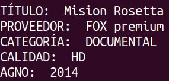

Imagen representativa del funcionamiento del primer script de prueba y su interacción con los diferentes recortes (ver **Anexo D**)

Esta primera extracción asentó las bases para trabajar en una evolución de este script, dando lugar al segundo script de prueba.

El segundo script de prueba tuvo como objetivo identificar las mismas secciones recortadas anteriormente, a diferencia de que, en esta ocasión, sería el script el que debiera delimitar las regiones de interés. De esta forma, se logró delimitar regiones en la imagen, entregando coordenadas como parámetros, coordenadas en medida de pixeles, obteniendo finalmente un script que es capaz de extraer datos de ciertas regiones de interés, sin la necesidad de ingresar pequeños recortes de la imagen original, más bien, solo basta con ingresar la imagen completa en su resolución original, e indicarle aquellas coordenadas donde debe implementar el motor OCR Pytesseract.

Imagen representativa del funcionamiento del segundo script de prueba y su interacción con los diferentes recortes (ver **Anexo E**)

Las salidas de este script fueron exactamente idénticas a las salidas del primer script, debido a que se utilizó la misma imagen de análisis.

Para ver una representación de la imagen original y sus respectivas regiones de interés divididas por el mismo programa, analizando únicamente una sola imagen (ver **Anexo F**)

### **MÓDULO DE VIDEO**

**Diseño módulo de video**

Mediante el siguiente diagrama se representan las actividades que el módulo de video es capaz de efectuar, aquellas actividades que hacen posible la extracción de datos sobre el video importado por el usuario.

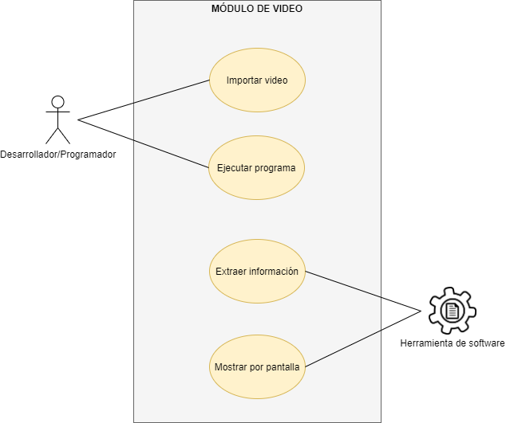

Para lograr una comprensión completa del diseño, se representan más en detalle los casos de uso “ejecutar programa” y “mostrar por pantalla”, junto a las especificaciones de estos y los respectivos diagramas de secuencia (ver **Anexo G**).

**Construcción módulo de video**

Este módulo es considerado el pilar fundamental para el cumplimiento del proyecto, ya que contiene todos los procedimientos que dan lugar a la construcción de la lógica e implementación para la extracción de datos de los videos capturados.

Sin un correcto cumplimiento de este módulo, primeramente, se podría ver afectado el diseño de la lógica del módulo, generando un modelamiento erróneo y poco óptimo, provocando finalmente que la construcción de este no sea la adecuada o la correcta. Esto puede afectar considerablemente los resultados del módulo durante la ejecución de sus funcionalidades una vez se haya construido. Son estas razones por las que se hizo mucho énfasis sobre un cumplimiento minucioso de este módulo, priorizando como objetivo la adecuada extracción de datos y la prevención de percances futuros.

Las primeras actividades realizadas que dieron inicio al módulo fueron:

-   Diseño: se modeló la lógica del módulo
-   Captura de videos a analizar: se capturaron los videos necesarios para ingresar como material de entrada en la herramienta de software a construir, basándose en aquellas características que pueden cualificar al material como potencialmente analizable.

Posterior al modelamiento de los respectivos diseños del módulo, se codificó una estructura similar a la ya construida en los scripts de prueba realizados en el módulo de implementación de tecnologías, esta vez, a diferencia de los scripts de prueba, se implementó sobre videos en formato .mp4.

El análisis de datos e implementación del motor OCR sobre videos dio lugar a un aumento en la complejidad para la implementación de la lógica y en el cumplimiento de la funcionalidad de esta.

Al momento de analizar un video, el módulo analiza cada frame del video, uno por uno, de forma secuencial, desde el comienzo hasta el final. Esto generó percances en el desarrollo ya que, para el motor OCR, cada frame poseía cualidades y características muy distintas a su antecesor o a su subsiguiente, incluso estando ubicados casi en el mismo momento de reproducción del video y a un solo frame de diferencia. Esto generó que la probabilidad de existir ambigüedad en el proceso de análisis sea mucho mayor, provocando una incongruencia en la extracción de datos.

Teniendo en cuenta el percance anterior, se procedió a implementar un recorrido de umbralizaciones en el proceso de binarización de imágenes, se logró una evolución en la estructura del módulo, permitiendo analizar cada frame binarizado en cada una de sus posibles umbralizaciones, provocando finalmente una disminución en la probabilidad de ambigüedad en el análisis y una extracción de datos más precisa.

Para visualizar una imagen binarizada en una de sus posibles umbralizaciones (ver **Anexo H**)

Luego de lograr un aumento en la precisión del proceso de análisis, se estableció comunicación entre la fuente de datos y el módulo construido, esta fuente es aquella que contiene los datos posibles de encontrar y de extraer, haciendo posible la búsqueda de estos mediante una comparación entre los datos detectados por la herramienta y los datos realmente válidos que se deben encontrar.

Diagrama representativo sobre la funcionalidad de búsqueda y comparación de datos detectados frente a la fuente:

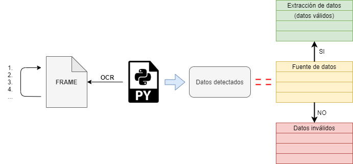

El módulo, durante el proceso de análisis, implementa el reconocimiento óptico de caracteres en aquellas regiones de interés donde, por las características propias de la plataforma VOD, se asume que aparecerán los datos objetivo. Analiza la imagen binarizada durante el recorrido de todas las umbralizaciones posibles en busca de los datos correctos realizando una comparación con la fuente de datos, designando el dato detectado como válido en el momento en que el dato detectado sea similar a algún dato alojado en la fuente de datos. Esto hace posible la búsqueda de los datos objetivo en distintas regiones de interés de forma simultánea.

Las regiones de interés en las que el módulo se enfoca se analizan en distintos momentos de la reproducción de video, es decir, los datos objetivo no se presentan durante toda la secuencia de frames, cada dato puede presentarse en un rango distinto de frames en comparación a otro. Esto se debe a las cualidades propias del video grabado, determinado por características como; desplazamientos realizados dentro de la plataforma VOD mediante el control remoto al momento de realizar la grabación, o tipo de material a analizar, material catalogado como series, películas, contenido gratuito o de paga.

En conclusión, cada dato debe ser analizado en un rango de frames determinado, algunos datos poseen el mismo rango de frames y otros poseen rangos distintos, dentro de estos rangos el módulo analiza la región de interés en busca del dato determinado por ese rango.

Los rangos son calculados en base al tiempo de reproducción del video en medida de segundos, es decir, tomando como ejemplo que cierto dato se presenta en el video entre los segundos tres y seis, el rango será la cantidad de frames que transcurran en ese periodo de tiempo.

La siguiente tabla representa un ejemplo de cómo la búsqueda de datos es determinada por un rango para cada uno de ellos.

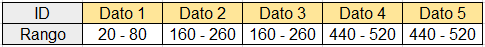

Esta forma que caracteriza al módulo en su proceso de análisis da lugar y permite la parametrización de la herramienta final, haciendo posible la modificación de los rangos y regiones de interés que esta debe analizar, consiguiendo una herramienta genérica que detecte cualquier dato de interés especificado por el usuario, siempre y cuando este se encuentre almacenado en la fuente de datos.

### **MÓDULO DE HERRAMIENTA DE SOFTWARE**

**Diseño módulo de herramienta de software**

Mediante el siguiente diagrama se representan aquellas funcionalidades que influyen en la evolución iterativa de la herramienta, dadas principalmente por las bases fundamentales construidas en el módulo de video, estas pertenecen al módulo de herramienta de software.

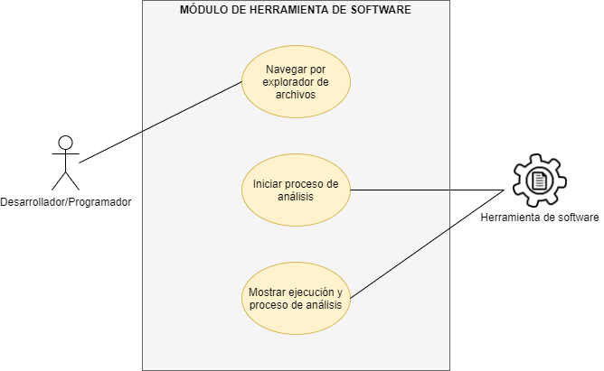

Para lograr una comprensión completa del diseño, se representa más en detalle el caso de uso “navegar por explorador de archivos, junto a las especificaciones de este y los respectivos diagramas de secuencia (ver **Anexo I**).

**Construcción módulo de herramienta de software**

El módulo de herramienta de software comenzó con la construcción de la GUI del aplicativo, para la construcción de esta se hizo uso de la biblioteca estándar de interfaz gráfica de usuario utilizada en Python3, la biblioteca Tkinter. Para el correcto desarrollo de este módulo fue necesario comprender y realizar un estudio sobre el funcionamiento de esta biblioteca, sus características, y las cualidades que esta puede aportar al módulo y a la construcción de la herramienta final, así como también sus puntos débiles y dificultades que esta puede generar en el desarrollo del aplicativo.

Posterior al modelamiento del diseño del módulo y de la correcta comprensión y estudio de la biblioteca a utilizar, se dio inicio a la construcción de la GUI, con esta fue posible encapsular, en diversos buttons, widgets y labels, las diferentes funcionalidades de la herramienta y los módulos anteriormente construidos, consiguiendo finalmente una interfaz gráfica en la que el usuario es capaz de navegar por los distintos tipos de material a analizar, ingresar el material objetivo y obtener el archivo contenedor de los datos procesados posterior a la finalización del análisis.

Representación gráfica de la GUI construida con sus diferentes buttons, widgets y labels (ver **Anexo J**)

A pesar de haber conseguido una construcción exitosa de las funcionalidades más relevantes de la GUI y de lograr el encapsulamiento de los módulos en los diferentes buttons, surgió un percance en el intento de reproducción del video en proceso de análisis dentro de la GUI.

Se tuvo como objetivo conseguir una visualización, en forma secuencial, de los frames en proceso de análisis, es decir, una reproducción del video.

Para lograr esto se implementó un frame en la GUI, con el propósito de contener el video en reproducción, haciendo posible su visualización al mismo tiempo que la lógica del aplicativo realiza el análisis en determinado video. La visualización de frames dentro de la GUI, en primera instancia, no fue posible, debido a las diferencias entre la biblioteca utilizada en la lógica de la funcionalidad de análisis y la biblioteca utilizada para la interfaz gráfica de usuario.

*Entiéndase frame contenedor como ventana o cuadro donde se visualizará el video en análisis, distinto a frames pertenecientes al material de análisis (imágenes secuenciales).*

La funcionalidad de visualización y reproducción ofrecida por la biblioteca OpenCV, utilizada en la codificación de la lógica del módulo de video y el

proceso de análisis, no es compatible con la biblioteca Tkinter utilizada para la construcción de la interfaz gráfica.

Debido a este percance que imposibilitaba la reproducción del material en proceso de análisis dentro de la GUI, se debió analizar y estudiar posibles soluciones, testeando, experimentando y codificando diversas funcionalidades, como también un nuevo reanálisis y replanteamiento de la lógica construida en módulos anteriores, cuestionando su efectividad y su potencial de éxito. No está de más mencionar que, luego de varios cuestionamientos, replanteamientos y auto críticas a los módulos construidos, fue inevitable la aparición de mucha frustración y pérdida de esperanza, sin embargo, el profesor guía siempre estuvo en esos momentos para entregar calma y tranquilidad, desde su experiencia logró hacer entender que, tarde o temprano, la solución sí se puede encontrar.

Finalmente, sí se encontró un camino prometedor por el cual era posible conseguir la visualización del video en la GUI, se trata de una conversión o transformación del objeto de imagen analizado por la librería OpenCV, una transformación que tiene como propósito final, conseguir un objeto de dicha imagen en un formato que pueda ser leído por la librería Tkinter utilizada para la interfaz gráfica.

La conversión de formato en el objeto de imagen se basa en una secuencia de cinco pasos, en los cuales se utilizan tres bibliotecas distintas, estas fueron:

-   OpenCV: biblioteca utilizada en la lógica construida en la funcionalidad de análisis y extracción.
-   imutils: biblioteca que proporciona un conjunto de funcionalidades para la manipulación de procesamiento de imágenes.
-   PIL (Python Imaging Library): librería utilizada para la edición de imágenes, esta permite manipular y editar imágenes en forma de objetos objetos.

Esta conversión fue necesaria ya que, para hacer posible la visualización del video dentro de la GUI, Tkinter debía recibir objetos de tipo PIL, es decir, el objeto analizado por la lógica de análisis en formato OpenCV debía pasar por un conversor intermediario que envíe dicho objeto en formato PIL hacia la GUI desarrollada con Tkinter.

La secuencia de conversión se puede describir como;

1 – la lógica y módulo de análisis lee y extrae datos del objeto de imagen en formato OpenCV.

2 – biblioteca OpenCV transforma escala de colores BGR a escala RGB del objeto de imagen.

3 – biblioteca imutils detecta dicho objeto, convirtiendo las cualidades y patrones de la imagen en un array numérico.

4 – librería PIL interpreta todos los números del array y con estos construye un objeto de imagen tipo PIL.

5 – Tkinter recibe objeto en formato PIL y lo despliega en la GUI.

Cabe mencionar que, la conversión de escala de colores se debe a que la biblioteca OpenCV trabaja con la escala BGR, mientras que la biblioteca PIL trabaja con la escala RGB.

Diagrama representativo de la secuencia de conversión de formato de imagen (ver **Anexo K**)

La incompatibilidad entre los formatos utilizados para las imágenes en el código de la lógica de análisis y el código de la interfaz gráfica no fue el único percance. La solución a la incompatibilidad de imágenes se diseñó y se desarrolló fuera del código fuente principal, más bien, se implementó dentro de diversos scripts de prueba, esto provocó que, al momento de implementar la lógica de la solución en el código fuente, el aplicativo se comporte de una manera inesperada y poco acorde al comportamiento obtenido en los scripts de prueba, manteniendo el incumplimiento del objetivo de reproducir el video analizado dentro de la GUI.

La herramienta estaba padeciendo los aspectos negativos de un lenguaje de programación interpretado; la herramienta podía ejecutar una sola funcionalidad a la vez, y a diferencia de los scripts de prueba, el código fuente contiene diversas funcionalidades, provocando que una funcionalidad comience a ejecutarse únicamente si la antecesora ha terminado su ejecución. Este percance dio lugar a la necesidad de integrarse en la búsqueda de soluciones y optimizaciones de la herramienta mediante la implementación de multiprocesamiento.

Mediante el uso de la biblioteca Multiprocessing, biblioteca utilizada para la creación de procesos y ejecuciones en paralelo en Python3, se ejecutaron las

funcionalidades de análisis y visualización de imágenes en la GUI en procesos distintos de forma paralela, pero a pesar de implementar esta distribución de funcionalidades y ejecuciones entre procesos, tampoco se consiguió el objetivo, debido a que se estaba intentando utilizar un mismo objeto para dos procesos distintos ejecutándose simultáneamente, generando un deadlock entre ellos y finalmente crasheando la ejecución. Es por esta razón, que se debía buscar la forma de que los procesos puedan compartir el mismo objeto de imagen, simultáneamente, de forma ordenada y estable.

Basándose en la necesidad anteriormente mencionada, se invirtieron los esfuerzos en comprender y experimentar con el funcionamiento y utilización de Queues, estructura proporcionada por la biblioteca Multiprocessing. Esta estructura era muy prometedora y era una opción válida para la comunicación entre procesos y el intercambio del objeto de imagen entre ellos, sin embargo, esta no proporcionaba la velocidad y eficiencia necesaria para mantener una ejecución estable y una visualización libre de delay entre el proceso de análisis y la visualización del video analizado.

En segunda instancia, luego de descartar la utilización de Queues, se realizó un estudio, investigación y comprensión del funcionamiento de Pipes, estos también son proporcionados por la biblioteca Multiprocessing. Los Pipes permiten establecer comunicación entre procesos y compartir objetos de una forma más eficiente que las Queues.

La creación de un Pipe en un programa retorna dos objetos, cada uno corresponde a un extremo de la conexión o tubería, y cada uno de los extremos tendrá dos métodos, un método de envío de datos y un método de recepción de datos, es decir, cada uno de los extremos puede utilizarse como emisor o como receptor, siendo indiferente el orden en el que fueron instanciados.

Para apreciar un diagrama representativo del modelo de Pipes (ver **Anexo L**)

Finalmente, se diseñó una solución, en la que se mantuvo la ejecución paralela del proceso de análisis junto al proceso de la GUI, estableciendo una comunicación mediante la conexión de un Pipe, en la que el proceso de análisis hace uso del extremo emisor para el envío del objeto de imagen en formato OpenCV, posteriormente el proceso de la GUI hace uso del extremo receptor para recibir el objeto de imagen y comenzar la conversión de formato utilizando las bibliotecas imutils y PIL, plasmándolo y representándolo finalmente en el frame contenedor.

Se representa mediante un diagrama el comportamiento entre el proceso de análisis y el proceso GUI durante su ejecución, graficando su comunicación e intercambio del objeto de imagen (ver **Anexo M**)

Posterior al desarrollo exitoso del frame contenedor de video en la GUI, el cual permitió la reproducción del material al momento en el que este se encuentra en proceso de análisis, se dio inicio al desarrollo del widget de terminal, widget que representa la terminal del sistema operativo en el cual se está ejecutando el aplicativo, o mejor dicho, widget que representa las salidas de la ejecución del aplicativo.

El objetivo de este widget es exhibir al usuario el output generado por la herramienta cuando está en tiempo de ejecución, output que es representado en la terminal del sistema operativo. Con el desarrollo de este widget es posible plasmar dentro de la GUI el output generado por la herramienta, permitiendo que el usuario aprecie las salidas en tiempo de ejecución sin la necesidad de abrir la terminal del sistema.

La solución a esta necesidad se basó en la construcción de un label contenedor, similar al frame contenedor de video, pero en esta ocasión, sería un contenedor de output. La solución diseñada consiste en una actualización constante del label contenedor cada vez que el output de ejecución aumente sus cadenas de texto, desplegando de manera secuencial las mismas salidas representadas en la terminal del sistema. Para lograr plasmar en el label, en formato string, el output del sistema operativo, se debía realizar una captura de dicho output del sistema, y para esta tarea se debió comprender el concepto de “stdout” (standard output).

Stdout hace referencia al lugar dentro del OS en donde se representan las salidas de un proceso o programa, el cual, en este caso, se trata de la terminal o consola del sistema. Teniendo en cuenta lo anteriormente dicho, se estableció como meta la captura del stdout, con el propósito de lograr una manipulación, lectura, extracción, o cualquier otra tarea que permita hacer uso de este dentro de la herramienta de análisis.

Al tratarse de datos que, en primera instancia, no son manipulables ni accesibles desde el código fuente del programa en Python, es que se debió comprender el uso de las bibliotecas “sys” e “io”, se detalla una breve especificación de las bibliotecas a continuación.

-   Biblioteca sys: proporciona funciones y utilidades para la manipulación del entorno de ejecución, permitiendo el acceso al intérprete de Python3.

-   Biblioteca io: proporciona utilidades para la manipulación de diferentes tipos de entrada/salida.

Mediante la utilización de dichas bibliotecas se codificó un “capturador de salidas” dentro del código de cada uno de los módulos de análisis, el capturador es capaz de extraer las salidas arrojadas por el intérprete, siempre y cuando, las salidas objetivo a capturar, se encuentren dentro de un rango de longitud en el código.

Para un mejor entendimiento sobre “rango de longitud” en el código, se define lo siguiente; el capturador consta de una apertura y un cierre, y todas las salidas arrojadas por el intérprete que se encuentren entre la apertura y el cierre, podrán ser almacenadas en una variable temporal, para posteriormente poder ser manipuladas dentro del código fuente y utilizarlas con un propósito objetivo.

El detalle del comportamiento del capturador consta de cinco métodos, los cuales son:

1 – respaldo de stdout: se realiza un backup del stdout principal para posteriormente hacer una recuperación de este una vez haya finalizado la captura de salidas

2 – apertura de captura: se da comienzo a la captura de output, estableciendo el inicio del rango a capturar.

3 – asignación: el output capturado se acumula secuencialmente dentro de una variable

4 – cierre de captura: se da por finalizado el proceso de captura, estableciendo el punto final del rango a capturar

5 – recuperación de stdout principal: se reestablece el stdout capturado en el primer método, debido a que, posterior al cierre de captura, el intérprete queda sin un stdout definido.

De esta forma, todo lo que arroje el intérprete de Python entre la apertura y el cierre, será almacenado en una variable especificada por el programador.

*Un aspecto importante a tener en cuenta respecto al flujo de captura es; la asignación y manipulación de salidas dentro de una variable solo puede ser posible si se cierra el proceso de captura, en caso de quedar abierto, se genera un fallo en la asignación, y, por consiguiente, la manipulación de este.*

Para una visualización del diagrama de flujo del funcionamiento del capturador de salidas (ver **Anexo N**)

El capturador de output de la herramienta, al conseguir un exitoso almacenamiento temporal de las salidas en una variable, permitió e hizo posible la manipulación o utilización de las salidas en la interfaz gráfica, reintegrándose así la búsqueda del objetivo de visualización de salidas en la GUI de la herramienta.

Al igual que la reproducción de imagen en el frame contenedor de video, el capturador de output se encontraba en un proceso distinto en el que se encontraba el widget de terminal, dando lugar a la necesidad de crear un segundo Pipe, con el propósito, esta vez, de conseguir un intercambio del output capturado mediante un canal de comunicación distinto entre los procesos, los procesos correspondientes a la funcionalidad de análisis y a la funcionalidad de GUI. Para cumplir con dicho objetivo, se implementó un segundo Pipe o tubería con la misma lógica utilizada en la implementación del primer Pipe para el intercambio del objeto de imagen, obteniendo, finalmente, un segundo Pipe capaz de establecer una segunda comunicación entre ambos procesos, es decir, los procesos se comunican e intercambian datos a través de dos conexiones de forma simultánea, intercambiando el objeto de imagen mediante el primer Pipe y la variable temporal contenedora del output mediante el segundo Pipe.

Para una visualización del diagrama representativo de la comunicación entre ambos procesos y el intercambio de la variable contenedora de output entre estos (ver **Anexo Ñ**)

Finalmente, se terminó de desarrollar el label contenedor de salidas construido en un comienzo, obteniendo como resultado un label capaz de actualizarse de forma constante y secuencial, cada vez que el intérprete de Python3 arroje registros o indicadores de ejecución durante el proceso de análisis, recibiendo y representando dichos registros o indicadores en el label, cumpliendo con la intención propuesta de conseguir un “widget” de terminal o consola.

De esta forma, se da por finalizada la construcción del módulo de herramienta de software, en la que se desarrolló toda la interfaz gráfica necesaria para una adecuada interacción con las funcionalidades y módulos de análisis construidos, una reproducción estable del video en proceso de análisis dentro de esta, y, finalmente, la visualización del output mediante el widget de terminal o consola, haciendo posible el análisis e interpretación de los indicadores en tiempo de ejecución por parte del usuario.

Se representa el diagrama de las comunicaciones de ambos Pipes en paralelo, entre el proceso de análisis OpenCV y el proceso de GUI Tkinter, el traspaso del objeto de imagen y los outputs a través de los Pipes, junto con la reproducción de estos en el respectivo frame contenedor de video y widget de terminal contenedor de salidas (Ver **Anexo O**)

### **MÓDULO DE SALIDAS DEL SOFTWARE**

**Diseño módulo de salidas del software**

Mediante el siguiente diagrama se representan todas las funcionalidades correspondientes al almacenamiento de los datos de salida, datos extraídos por la herramienta luego de haber completado exitosamente el análisis del material de entrada mediante la implementación del reconocimiento óptico de caracteres, implementación llevada a cabo mediante funciones y métodos pertenecientes a módulos antecesores.

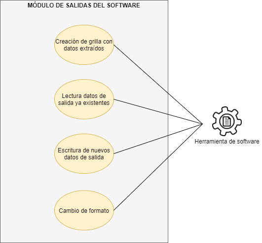

Para lograr una comprensión completa del diseño, se detallan las especificaciones de los casos de uso y los respectivos diagramas de secuencia (ver **Anexo P**).

**Construcción módulo de salidas del software:**

El último módulo de desarrollo de software corresponde al módulo de salidas del software, módulo en el que desemboca el objetivo final del proyecto, el objetivo de cumplir con la solución propuesta respecto al análisis, extracción y almacenamiento sistematizado de los datos requeridos en el trabajo de relevamiento. El objetivo principal del módulo de salidas del software se enfoca en concretar el almacenamiento de los datos analizados y extraídos por la herramienta, logrando el registro de estos y, por ende, su persistencia en el tiempo.

Posterior a la exitosa extracción de datos por parte de la herramienta, los datos permanecen en memoria RAM a la espera de ser utilizados antes de dar por finalizados los procesos y funcionalidades de análisis, dichos datos, deben representarse en formato de grilla y de forma ordenada, específicamente, en el formato utilizado por el relevador al momento de realizar el trabajo de relevamiento de la plataforma VOD.

Para abordar la oportunidad de mejora propuesta por el proyecto es imprescindible efectuar el registro de los datos dentro de un archivo CSV o Excel, teniendo poca incidencia, sobre el cumplimiento de dicha propuesta, el formato de almacenamiento final a utilizar por la herramienta. A pesar de esto, finalmente, con el propósito de mantener una coherencia y abarcar aún más la propuesta de solución del proyecto, se optó por construir una funcionalidad de almacenamiento y exportación de datos en archivos con formato Excel, permitiendo, de esta forma, el registro de los datos en el mismo formato de grilla utilizado por el trabajador relevador al realizar el trabajo de relevamiento de la plataforma VOD.

Para efectuar el almacenamiento de datos, se codificó, dentro de cada módulo de análisis, una funcionalidad de exportación, a la que llamaremos exportador. La lógica del exportador, al igual que el capturador de salidas construido en el módulo predecesor, está basado en una secuencia de ejecuciones y transformaciones de formato, utilizando módulos y bibliotecas dedicadas con sus respectivos métodos. Se detalla a continuación, una breve descripción de los módulos y bibliotecas utilizadas por el exportador durante la funcionalidad de almacenamiento;

-   Biblioteca Pandas: biblioteca dedicada a la ciencia de datos, ofrece métodos para la manipulación y análisis de datos mediante la utilización de estructuras de datos.
-   Módulo xlsxwriter: módulo utilizado en el lenguaje Python para la escritura de números, texto, fórmulas o hyperlinks en múltiples hojas de cálculo de archivos Excel.
-   Biblioteca openpyxls: biblioteca utilizada para la escritura y lectura de archivos Excel en formato xlsx, xlsm, .xltx, .xltm.

Posterior a la extracción de datos, y antes de que finalice la ejecución de la funcionalidad de análisis, se da efecto a la utilización del exportador de datos, ejecutando secuencialmente, todas aquellas transformaciones y métodos necesarios que hacen posible el almacenamiento persistente de los datos en memoria secundaria y en formato de grilla. Dicho esto, se describe a continuación, la secuencia que da forma al exportador de datos;

1 – creación de diccionario: se crea una estructura de datos diccionario, insertando, dentro de esta, los datos extraídos por la herramienta, asignando el nombre de las columnas utilizadas en el formato de grilla como keys, es decir, el nombre que define el tipo de dato, y, como values, se asignan todos los datos extraídos por la herramienta.

2 – creación de Pandas DF con diccionario: se crea una estructura de datos Pandas dataframe, asignando, dentro de esta, el diccionario contenedor de los datos de extracción creado en el primer método.

3 – respaldo de DF de datos ya existentes: el exportador lee el archivo Excel contenedor de datos de salida, extrayendo, en formato dataframe, los datos ya existentes en cada una de las hojas Excel, almacenando de forma temporal los datos en dichas estructuras. (El hecho de que se defina “hojas Excel” en plural será aclarado posterior a la descripción de la secuencia de exportación).

4 – creación de DF final: se crea una nueva estructura de datos Pandas dataframe, asignando el dataframe de datos ya existentes junto al dataframe contenedor de los nuevos datos de extracción para cada una de las hojas Excel, es decir, el dataframe final corresponde a la suma de los datos ya existentes en el archivo Excel y los datos extraídos por la herramienta.

5 – creación de diccionario a almacenar: se crea una estructura de datos diccionario, insertando, dentro de esta, los DF finales creados en el método anterior, correspondiente a cada una de las hojas Excel por separado. En la creación del diccionario a almacenar, se asigna como keys, los nombres de las hojas Excel definidas por el relevador, correspondientes al tipo de material al que pertenecen los datos, y, finalmente, se asignan como values del diccionario, los DF contenedores de datos finales.

6 – creación de objeto de escritura xlsxwriter: instanciación de objeto Pandas con método de lectura xlsxwriter, es decir, se instancia un objeto que combina ambas bibliotecas.

7 – sobre escritura de archivo: el exportador recorre, mediante un ciclo iterativo, las keys del diccionario contenedor de datos creado en el método cinco, keys correspondientes a los nombres de las hojas Excel a almacenar. De esta forma, dentro y durante la iteración, el exportador sobre escribe el archivo Excel con los values del diccionario en la hoja que posea el mismo nombre que la key iterada, es decir, el dataframe correspondiente a un cierto tipo de dato.

*En los apartados anteriores, las siglas “DF” hacen referencia a la estructura de datos dataframe.*

Para un mejor entendimiento, se representa un diagrama sobre el funcionamiento de la secuencia ejecutada por el exportador (ver **Anexo Q**)

La necesidad de construir un exportador capaz de almacenar datos en archivos Excel, con el propósito de mantener la coherencia con el formato de grilla utilizado por el relevador, trajo consigo la necesidad de separar en dos hojas Excel distintas, los datos correspondientes a un cierto tipo de material.

Siendo más específicos, la herramienta analiza tres tipos de material distintos, y dos de ellos comparten los mismos tipos de datos a extraer, esto quiere decir que, dos tipos de material de análisis serán almacenados en una hoja Excel, y, el tipo de material de análisis restante, será almacenado en una hoja Excel aparte. Esta forma de almacenar los datos en el archivo Excel no fue ideada para la eficiencia del proyecto, más bien, y como ya se mencionó antes, corresponde netamente al formato utilizado por el relevador al momento de realizar el trabajo de relevamiento, manteniendo la coherencia y permitiendo que la herramienta reduzca aún más el esfuerzo humano realizado por el relevador.

*No debe confundirse “hoja” con “archivo” Excel, “hoja” hace referencia a sheet o pestaña dentro de un mismo archivo, por lo tanto, las dos hojas Excel, correspondientes a cada tipo de material de análisis, se encuentran dentro del mismo archivo contenedor de datos .xlsx.*

La razón por la cual una de las dos hojas es utilizada para el almacenamiento de dos tipos de material distintos, y, la hoja restante es utilizada únicamente para un solo tipo de material, se aclara a continuación, detallando en diversas tablas, los tipos de material de análisis y los tipos de datos que son extraídos de estos;

1 – tipo de material premium y los datos que son extraídos de este:

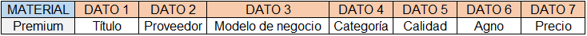

2 – tipo de material alquiler y los datos que son extraídos de este:

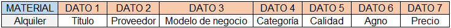

3 – tipo de material series y los datos que son extraídos de este:

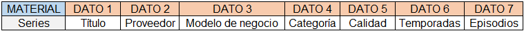

Como se puede apreciar en las tablas anteriores, los tipos de material premium y alquiler comparten casi los mismos tipos de datos, es por esa razón que, para el trabajo de relevamiento, ambos datos se registran en una misma hoja Excel. Se menciona “casi” los mismos tipos de datos debido a que, realmente, los datos a registrar no son totalmente análogos, ya que, los contenidos de tipo premium no poseen el registro de datos “precio”, dicho dato corresponde únicamente al tipo de material alquiler, y, el dato “proveedor”, suele aparecer de forma escasa en el tipo de contenido alquiler. Aun así, a pesar de estas pequeñas diferencias, se considera más eficiente y organizado, el registro de los datos correspondientes a ambos tipos de material en una misma hoja. Esta consideración de eficiencia y orden no está determinada por el relevador, más bien, por la empresa contratista de estudio de mercado.

Por otro lado, los datos a extraer del tipo de contenido series, no considera el dato “precio”, debido a que ningún título de este tipo de contenido posee tal dato, y, por cualidades propias de este tipo de contenido, se incorpora el registro de los datos “temporadas” y “episodios”.

Se representa mediante imágenes, los formatos utilizados en cada una de las hojas, el formato utilizado para el registro de contenido premium y alquiler, junto al formato utilizado para el registro de contenido series (ver **Anexo R**).

De esta forma, se da por finalizada la construcción del exportador de datos, y, por ende, el módulo de salidas del software, cerrando el ciclo iterativo correspondiente a los módulos de desarrollo de software. La herramienta, hasta el presente punto de desarrollo, es capaz de cumplir la funcionalidad principal de análisis y extracción de datos propuesta en el inicio del proyecto.

## **DIAGRAMA DE COMPONENTES**

Se representa a continuación, el diagrama de componentes del sistema. Este manifiesta la modularización del sistema mediante divisiones y dependencias entre módulos.

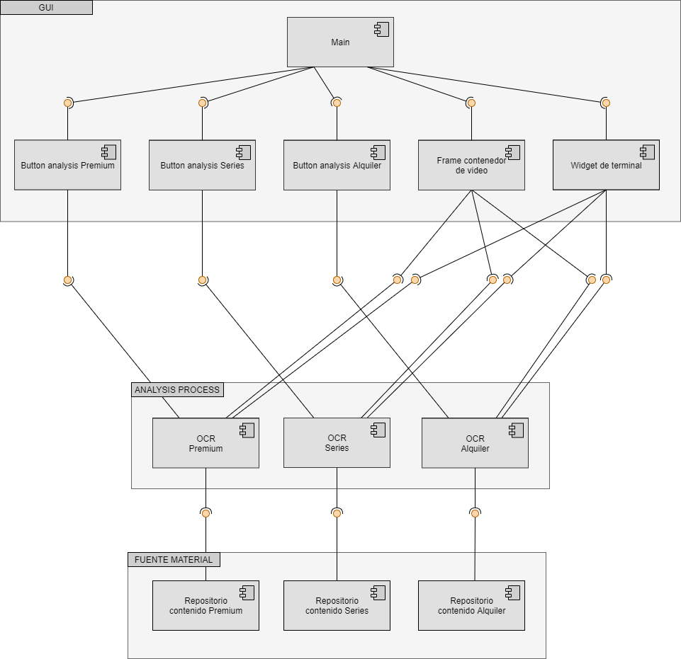

## **DIAGRAMA DE DESPLIEGUE**

Se representa a continuación, el diagrama de despliegue del sistema. Este manifiesta, a través de relaciones entre nodos, el diseño de la arquitectura física de hardware en la que se ejecutan los componentes lógicos del sistema.

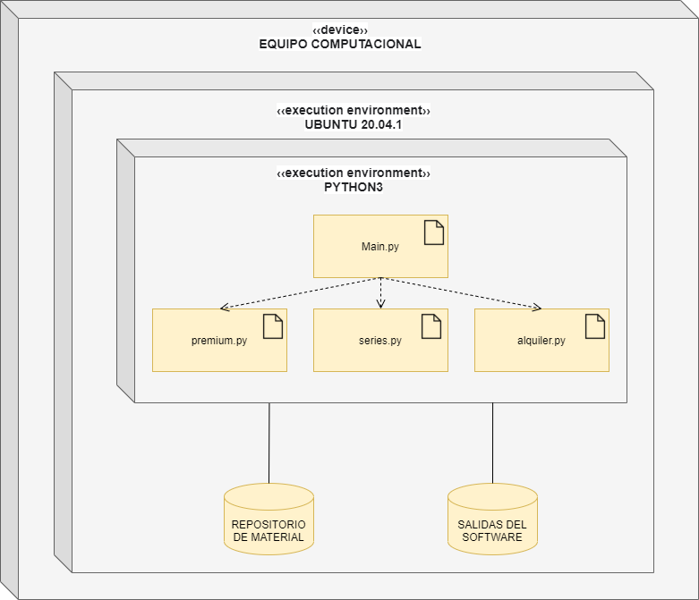

Como se puede apreciar en el diagrama anterior, las relaciones entre nodos se basan principalmente en la utilización de nodos como contenedores, esto se debe a que, todos los componentes lógicos del sistema se ejecutan en un mismo equipo computacional.

## **PROBLEMAS PRESENTADOS DURANTE EL PROYECTO**

1 - Restricciones propias del lenguaje de programación:

Luego de haber finalizado la construcción del módulo de video, efectivamente se consiguió que el módulo aplique el análisis y realice la extracción de los datos requeridos, sin embargo, por la naturaleza propia de Python3, al ser un lenguaje interpretado, ejecuta la funcionalidad de extracción perteneciente al módulo de manera secuencial para cada uno de los materiales de entrada que se ingresen, esto quiere decir que, en estricto rigor, puede analizar una y solo una fuente de datos a la vez, provocando un mayor tiempo de ejecución.

Es por esta razón que se detectó una posible mejora con la implementación de programación concurrente, mediante la utilización de hilos. Una ejecución del código del módulo de video de manera concurrente permitiría ejecutar la funcionalidad de extracción de datos sobre las distintas fuentes de información de manera simultánea.

Finalmente se adecuó la codificación del módulo de video para que cumpla con el concepto de programación concurrente, se utilizó el módulo Threading de Python3 para hacer uso de los hilos en el programa.

Luego de la implementación de hilos, se obtuvo un resultado inesperado, el programa requería mucho más tiempo de lo que requería al ejecutarse de manera secuencial.

Esto se debe al global interpreter lock (GIL) de Python, este se encarga de que solo un hilo pueda tomar el control del intérprete, con el objetivo de, en caso de

que un hilo finalice su ejecución, no se libere un espacio en memoria que pueda estar siendo utilizado por otro hilo. En conclusión, al ejecutar el

programa mediante hilos, los diversos hilos comparten el mismo proceso y espacio en memoria.

Basándose en el hecho de que la programación concurrente en Python mediante la utilización de hilos se ejecuta en un mismo proceso, se propuso ejecutar el módulo de video mediante la programación paralela utilizando multiprocesamiento. El objetivo fue segmentar la funcionalidad de extracción de datos en diversos procesos, para que cada uno de los procesos analice y

extraiga datos de distintas fuentes de información en paralelo. Cada proceso tendrá su propia identificación y su propio espacio en memoria.

Luego de la implementación de multiprocesamiento en el módulo de video, el programa sí fue capaz de ejecutar la funcionalidad de extracción de datos en procesos independientes y ejecutándose de manera paralela, sin embargo, provocó una saturación en el equipo computacional del proyecto, provocando que los procesos se bloqueen entre sí.

Imagen de monitorización sobre el uso de los 6 cores encargados de ejecutar el módulo de video:

**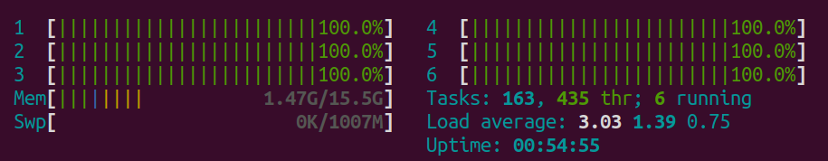**

A raíz de esta problemática, se realizó un análisis y diversas pruebas con el objetivo de detectar algún factor determinante sobre esta causa y una posible solución.

Aspectos relevantes detectados:

-   Cantidad de procesos (funciones de extracción) ejecutadas simultáneamente:

El programa soporta un máximo de 3 procesos ejecutando la función de extracción de forma simultánea, esto no quiere decir que no puedan

existir bloqueos entre los 3 procesos, tales bloqueos dependen de la combinación entre las diversas fuentes de información, debido a las

distintas cantidades de memoria y capacidad de procesamiento que requiere cada proceso al analizar un video dado.

-   Tiempo entre el comienzo de las ejecuciones de procesos:

El equipo computacional del proyecto logró distribuir mejor los recursos para cada uno de los procesos cuando se aislaron los inicios de las ejecuciones con un periodo de tiempo determinado. Dependiendo de la cantidad de tiempo que se establece entre cada ejecución se obtienen diferentes resultados, es por esto que se realizó un análisis sobre el

comportamiento y los resultados del módulo, combinando parámetros como; cantidad de procesos ejecutados, tipo de material analizado, tiempo de ejecución definido entre cada proceso.

En las siguientes planillas se detallan los resultados de los tiempos de ejecución, donde; a – cada columna representa los segundos definidos entre cada inicio de proceso. b – “Px” representa el identificador de cada proceso, con un máximo de tres. c – cada color representa un tipo de material a analizar, es decir, las entradas de los procesos.

A - Tiempos de ejecución para procesos de forma independiente: se representa el tiempo que demora cada proceso ejecutándose independientemente, cada uno analizando un tipo de material.

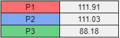

B - Tiempos de ejecución para dos procesos en forma paralela: se representa el tiempo requerido para la ejecución de dos procesos, combinando dos tipos de material.

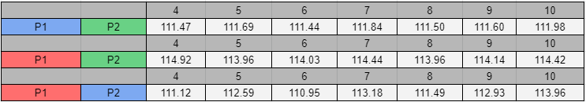

C – Tiempos de ejecución para tres procesos en forma paralela:

-   Tiempo de ejecución requerido para ejecutar tres procesos, analizando el mismo tipo de material

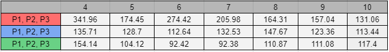

-   Tiempo de ejecución requerido para ejecutar tres procesos, combinando tres tipos distintos de material.

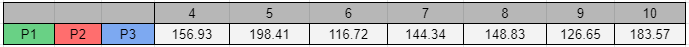

Finalmente, y gracias a la ayuda del profesor guía, su retroalimentación, sus consejos, y la entrega de ideas creativas para la resolución de problemas, se optó por ejecutar el módulo en forma paralela utilizando máquinas virtuales, de esta forma, se hace posible una extracción de datos tantas veces como el usuario desee, analizando el material de entrada en distintas máquinas virtuales simultáneamente.

2 – Desincronización en la captura de imágenes:

Sin lugar a dudas, uno de los sucesos que hicieron de este proyecto, un proyecto del que se precisó bastante tiempo y esfuerzo, fue la actividad de captura de material de análisis. Esta actividad, incide considerablemente en el éxito del proyecto, debido a que la calidad de las imágenes define el grado de dificultad que experimenta la herramienta al momento de efectuar el análisis mediante el reconocimiento óptico de caracteres. Dos de los principales sucesos posibles de manifestarse en la actividad de captura son;

-   Imagen borrosa: la imagen no representa la definición de pixeles acorde a la establecida en el decodificador, capturadora y software de grabación de video.
-   Desincronización en la imagen: la imagen presenta desincronizaciones o “cortes” que hacen parecer que la imagen transmitida por el decodificador se encuentra dividida.

Un material de análisis que haya sido capturado durante los sucesos anteriormente mencionados provocaría que la herramienta sea poco eficaz durante el proceso de análisis, incluso, podría provocar que esta no sea capaz de extraer los datos requeridos. Esta dificultad o incapacidad puede provocarse debido a “cortes” en la imagen o siluetas poco definidas, generando confusión y distracción en el funcionamiento del motor OCR.

Lo dicho anteriormente demuestra claramente la necesidad de realizar una captura ausente de aquellos sucesos que afecten considerablemente la calidad de las imágenes o material de análisis, es por esto que, el equipo de proyecto, realizó al menos veinte capturas de cada tipo de material. La abundancia de capturas tuvo el propósito de mermar la posible carencia de calidad en las imágenes, debido a la alta recurrencia de los sucesos no deseados que afectan la calidad de dicho material de análisis. La disminución de probabilidades de obtener un material carente de calidad se haría posible seleccionando únicamente un solo video perteneciente a los veinte o más videos capturados de un tipo de material, descartando todos aquellos videos en los que, durante sus capturas, se presentaron los sucesos que cualifican al material como carente de calidad.

Se representa una captura realizada en la que acontecen aquellos sucesos no deseados, con el fin de evidenciar la influencia de estos en la disminución de la calidad de las imágenes, y, la contribución en el descarte de dicho material, debido a su poca utilidad y potencialidad de ser analizado (ver **Anexo S**).

Se debe tener en cuenta que, estos sucesos no deseados, al provenir directamente del decodificador de señal, dependen netamente de la compañía de telecomunicaciones y los equipos tecnológicos mediante los que provee sus servicios. Por dicha razón, se decidió allanar la dificultad generada por la carencia en la calidad mediante el método de captura anteriormente descrito, descartando una intervención en el dispositivo decodificador de señal, debido a que una actividad de este tipo se encuentra fuera del alcance del proyecto.

## **ANÁLISIS DE CUMPLIMIENTO DE OBJETIVOS**

1 – Disminuir el tiempo de entrega del trabajo de relevamiento en al menos un 20%.

A - Resultado: **cumplido**

B - Análisis de resultado: se utilizó, como muestra comparativa, el tiempo requerido por el relevador para completar el trabajo de relevamiento de forma manual. Dicho tiempo fue medido desde el comienzo hasta el final del trabajo, este corresponde a relevamientos pasados realizados por el alumno.

Se representa a continuación, la tabla de distribución de los tiempos medidos a lo largo de todo el periodo de trabajo, junto a la tabla representativa de la cantidad de títulos relevados para dicho trabajo. En la primera tabla, cada cifra corresponde al tiempo medido sobre una y solo una sección del VOD.

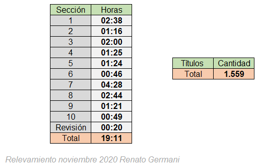

Considerando los datos presentados en las tablas, se obtiene un total de 18 h y 51 min sin contar los 20 min dedicados a la revisión final de los registros. Esta cantidad de horas, al ser distribuidas en la cantidad de títulos registrados, se obtiene un tiempo de 42 s por cada título.

Por parte de la herramienta, esta es capaz de efectuar el análisis y extracción en un tiempo mínimo de 90 s y un tiempo máximo de 112 s, estas cifras fueron medidas al ejecutar los procesos de análisis con al menos un video por cada tipo de material de análisis, tomando como muestra, finalmente, las distintas cantidades de tiempo que precisó la herramienta para completar cada extracción.

Se presenta a continuación, las imágenes representativas de las distintas cantidades de tiempo que precisa la herramienta para cada tipo de material de análisis.

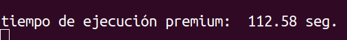

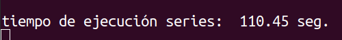

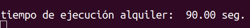

Teniendo en cuenta las muestras presentadas para cada tipo de material, se define, con objeto de comparación, un tiempo promedio de 104 s por video analizado.

Por todos los datos presentados anteriormente se conoce el tiempo requerido por el relevador para realizar el trabajo de forma manual, y, por otro lado, se conoce el tiempo promedio requerido por la herramienta para efectuar el análisis y extracción. Con dichos datos, es posible llevar a cabo una comparación entre la velocidad de la herramienta y la velocidad manual del relevador, y, efectivamente, para el resultado de esta comparación, el trabajador relevador precisa de menos tiempo para efectuar el registro de un título representado en la plataforma VOD;

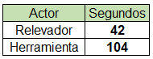

Esta desventaja que tiene la herramienta de software frente al trabajador relevador existe únicamente en el contexto de registros unitarios, debido a que, la diferencia de tiempo entre los dos actores hace referencia a comparaciones de tiempo de registro de un único título a la vez.

Es posible remediar dicha desventaja mediante la ejecución de la herramienta en distintos procesos de forma paralela, utilizando máquinas virtuales o distintos equipos computacionales. De esta forma, la herramienta, al ejecutar diversos análisis en paralelo, necesita tan solo tres ejecuciones para superar la velocidad de registro del relevador. Para un mejor entendimiento, se representa a continuación, la cantidad de segundos requeridos por el relevador y la cantidad de segundos requeridos por la herramienta durante el incremento de registros realizados.

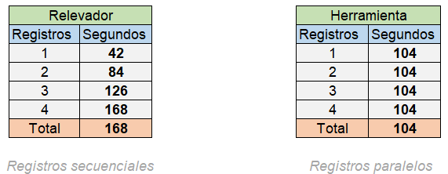

Como se puede observar en las tablas presentadas, hasta el segundo registro, el relevador es más veloz durante la actividad, sin embargo, desde el tercer registro en adelante, la herramienta logra ser más eficiente que el relevador, debido a que la ejecución de diversos análisis en forma paralela siempre requerirá la misma cantidad de tiempo, el tiempo requerido para efectuar un único registro.

Se representa a continuación, el cálculo y variación de eficiencia durante la operación de registro entre el trabajador relevador y la herramienta de software.

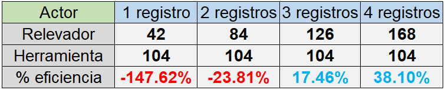

Como se puede observar, la herramienta de software es capaz de alcanzar un aumento en la eficiencia del tiempo desde el cuarto registro, cumpliendo con el aumento del veinte por ciento propuesto como objetivo y obteniendo un aumento total del 38.10%.

A pesar de este cumplimiento, y con el propósito de obtener un cálculo porcentual realista sobre la eficiencia, se consideró una segunda muestra de tiempo; el tiempo requerido por la herramienta durante la ejecución de procesos de análisis en forma paralela dentro de un mismo equipo computacional. Estas muestras de tiempo fueron calculadas y documentadas en el apartado “problemas presentados durante el proyecto”, página 78, en el que se mencionan, precisamente, los problemas que trajo consigo la ejecución de procesos de análisis en un mismo equipo computacional.

Los problemas presentados eran, principalmente, la saturación de los recursos computacionales al sobrepasar un límite de procesos simultáneos, no obstante, esto no significa que un equipo computacional no sea capaz de ejecutar procesos de análisis en paralelo; efectivamente, la herramienta es capaz de efectuar el análisis y extracción de datos ejecutando un máximo dos procesos de forma simultánea, siempre y cuando se asigne un pequeño lapso de tiempo entre la ejecución de un proceso y otro, de esta forma, no habrá una saturación de los recursos.

Dicho esto, se considera, la segunda muestra de tiempo, una muestra más realista, debido a que existe la posibilidad de que una compañía o usuario no posea los recursos computacionales para ejecutar cuatro procesos de análisis en cuatro equipos computacionales distintos. Considerando una ejecución paralela de dos procesos de análisis en distintas máquinas virtuales, la cantidad de equipos computacionales se reduce a la mitad.

Al igual que las muestras anteriores, se obtuvo un promedio de tiempo de ejecución; promedio entre las veintiuna medidas de tiempo de ejecuciones paralelas de dos procesos de análisis en un mismo equipo computacional, presentados en la tabla de la página 78, este corresponde a un total de 112 s por cada par de videos analizados de forma simultánea.

Dicho esto, se representa a continuación, la tabla representativa de las cantidades de tiempo requeridas por cada actor durante el incremento de los procesos de análisis, considerando el incremento de la herramienta en par de procesos.

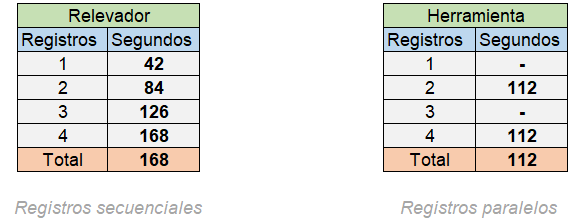

Con los datos de comparación entre el trabajador relevador y la segunda medida de tiempo, se procede a realizar el cálculo de la variación de eficiencia durante el incremento de procesos;

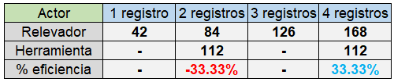

Como se puede observar en la tabla de variación, al igual que en los cálculos realizados con la primera muestra de tiempo, en el cuarto registro se cumple con el veinte por ciento de incremento de eficiencia propuesto para el segundo objetivo específico. Esta vez, en comparación al incremento obtenido en la primera muestra de tiempo, se logra el objetivo con un 4.77% menos de incremento, debido al mayor número de segundos requeridos por la herramienta al ejecutar proceso de forma paralela.

A pesar de esta pequeña variación, en ambas modalidades de ejecución se cumple el objetivo propuesto, debido a que, un aumento de eficiencia en la utilización del tiempo influye y hace posible la disminución de los tiempos de entrega requeridos por el relevador.

*Cabe destacar que, no en todos los relevamientos se solicitan las mismas cantidades exactas de títulos, por lo tanto, se requieren distintas cantidades de tiempo para cada uno de ellos, es por esta razón que los cálculos realizados deberían considerarse solamente como aproximaciones. Esto no quiere decir que en nuevos relevamientos se deje de cumplir el objetivo, ya que los cálculos son proporcionales a la cantidad de títulos registrados en la cantidad de tiempo utilizado para ello.*

2 - Disminuir los costos operacionales en al menos un 20%.

A – Resultado: **cumplido**

B – Análisis de resultado: Se llevó a cabo una encuesta de satisfacción con objeto de medir el esfuerzo invertido por los ejecutores del servicio, en dicha encuesta se realizan preguntas que abarcan los conceptos de tiempo, esfuerzo y dificultades presentadas en la actividad de registro. Se tomaron como muestra tres relevadores, con objeto de que respondan de forma crítica y objetiva las preguntas seleccionadas.

Para ver una imagen representativa de las preguntas formuladas en la encuesta (**ver Anexo T**)

Con la finalidad de efectuar el cálculo en la variación del esfuerzo invertido por el relevador, antes y después de la implementación de la herramienta, se considerará como muestra, un total de 20 puntos y un mínimo de 4 puntos por cada respuesta de encuesta registrada.

Se representa a continuación, los puntajes obtenidos de las respuestas entregadas por los relevadores antes y después de la implementación del servicio.

\- Antes de la implementación del servicio:

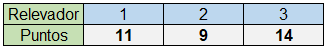

\- Después de la implementación del servicio:

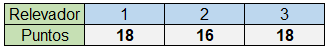

Considerando los datos anteriormente presentados, se puede determinar un total de 34 puntos en las encuestas respondidas antes de la implementación

del aplicativo, y, un total de 52 puntos en las encuestas respondidas después de la implementación del aplicativo.

Teniendo en cuenta que el puntaje máximo a obtener al tomar como muestra tres relevadores corresponde a un total de 60 puntos, se determina que; tal puntaje corresponde al 100% de satisfacción del relevador respecto a las actividades de registro.

Dicho esto, se representa a continuación, la tabla de variación en el porcentaje de satisfacción del relevador respecto al máximo de satisfacción posible.

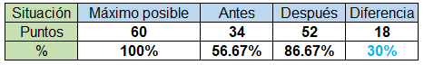

Como se puede apreciar, se obtuvo un incremento del 30% en la satisfacción del relevador luego de la implementación del aplicativo. En base a este dato porcentual se concluye que; la satisfacción del relevador o usuario influye considerablemente en la disminución de los costos operacionales del trabajo de relevamiento, debido a que dicha satisfacción es generada por la sistematización u optimización del trabajo, es decir, existe una relación directa entre la sistematización de la herramienta y la satisfacción del usuario. Es por esta razón, que se da por cumplido el objetivo propuesto de disminuir los costos operacionales en al menos un 20%, estableciendo una relación entre el incremento de satisfacción y la disminución de los costos operacionales.

## **VERSIONAMIENTO DE CÓDIGO FUENTE Y DOCUMENTACIÓN**

Durante el desarrollo de los diferentes módulos se llevó a cabo un seguimiento de los cambios y evoluciones implementadas que acontecieron durante el desarrollo del proyecto.

El seguimiento de dichos cambios y evoluciones se llevó a cabo mediante la utilización de software para el control de versiones, específicamente Git. Con Git fue posible, luego de cada evolución en la documentación o en el código fuente, almacenar dicho código o documento con los cambios implementados, asignando un identificador a cada modificación o evolución almacenada. El generar registros históricos de cada modificación, da lugar a la posibilidad de accionar un retroceso a cualquier versión anterior que haya sido almacenada, permitiendo la recuperación de documentación o parte del código fuente en caso de pérdida de estos, o, en caso de cometer un error por parte del equipo de proyecto durante el desarrollo.

Se representa a continuación, el estado de las modificaciones o evoluciones del código fuente antes de ser consolidadas como nuevas versiones.

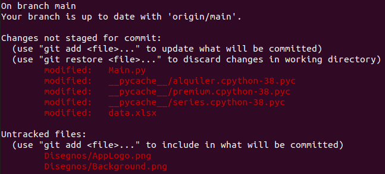

Al ser consolidadas y confirmadas como una nueva versión, se representan de la siguiente forma.

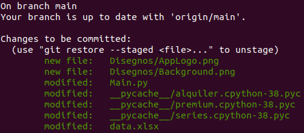

De la misma forma, se representa a continuación, el estado de las modificaciones o evoluciones en la documentación del proyecto antes de ser consolidadas.

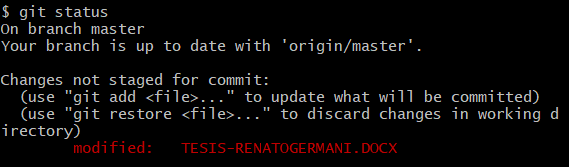

Estas, al ser consolidadas y confirmadas como una nueva versión, se representan de la forma en la que son consolidadas las versiones del código fuente.

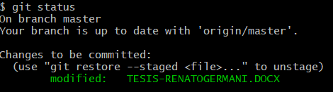

Los registros de modificaciones y evoluciones realizadas en el código fuente y en la documentación del proyecto se almacenaron, durante todo el desarrollo del proyecto, en un repositorio remoto de Git, específicamente GitHub.

Para esta finalidad, se establecieron dos repositorios para el control de versiones del proyecto, uno se estableció de forma dedicada al código fuente de la herramienta de software, y, el segundo repositorio, se estableció de forma dedicada a la documentación del proyecto.

Para apreciar imágenes de los repositorios de GitHub dedicados al código fuente del proyecto y a la documentación del proyecto respectivamente (ver **Anexo U**)

De esta forma, fue posible, durante el desarrollo del proyecto, retroceder en la línea de versionamiento del código y documentación perteneciente a este, haciendo posible la recuperación de versiones de archivos anteriores, y, facilitando el análisis sobre lo ya realizado para las mejoras de futuras construcciones.

## **CONTROL DE CAMBIOS**

Solicitud de cambio n°1

<table><tbody><tr><td>
<strong>NOMBRE DEL PROYECTO</strong>
</td><td>
<strong>SIGLAS</strong>
</td><td>
<strong>SOLICITANTE DEL CAMBIO</strong>
</td></tr><tr><td>
PROYECTO DE SOFTWARE PARA LA SISTEMATIZACIÓN DE LOS REGISTROS DE CONTENIDOS SOBRE PLATAFORMA VOD
</td><td>
SSRC-VOD
</td><td>
Renato Germani Brugnoni
</td></tr></tbody></table>

<table><tbody><tr><td>
<strong>TIPO DE CAMBIO</strong>
</td></tr><tr><td>
Acción preventiva
</td></tr><tr><td>
<strong>DEFINICIÓN DEL PROBLEMA O SITUACIÓN</strong>
</td></tr><tr><td>
Agregar fuente de datos en formato .csv
</td></tr><tr><td>
<strong>RAZÓN DE SOLICITUD DE CAMBIO</strong>
</td></tr><tr><td>
Se considera más eficiente y preciso, por parte del módulo de video, la búsqueda de datos dentro de una fuente de datos en formato .csv, dicha fuente contendrá los datos de interés a extraer.
</td></tr><tr><td>
<strong>EFECTOS EN EL PROYECTO</strong>
</td></tr><tr><td><ul><li>corto plazo: modificación en la especificación de requisitos de software, precisamente, la agregación de un requerimiento funcional en el que se especifique la incorporación de la fuente de datos.</li><li>largo plazo: construcción y desarrollo de una funcionalidad de comunicación entre el módulo de video y la fuente de datos, con objeto de efectuar la lectura en dicha fuente.</li></ul></td></tr><tr><td>
<strong>IMPACTO EN EL PROYECTO</strong>
</td></tr><tr><td><ul><li>en base a lo planificado en el cronograma de proyecto, se debió, dentro de la iteración de construcción de módulo de video, realizar nuevamente las tareas de análisis de requisitos y diseño del sistema, provocando un atraso en el proyecto con un total de cinco días.</li></ul></td></tr></tbody></table>

<table><tbody><tr><td>
<strong>REVISIÓN</strong>
</td></tr><tr><td>
Aprobada
</td></tr></tbody></table>

Solicitud de cambio n°2

<table><tbody><tr><td>
<strong>NOMBRE DEL PROYECTO</strong>
</td><td>
<strong>SIGLAS</strong>
</td><td>
<strong>SOLICITANTE DEL CAMBIO</strong>
</td></tr><tr><td>
PROYECTO DE SOFTWARE PARA LA SISTEMATIZACIÓN DE LOS REGISTROS DE CONTENIDOS SOBRE PLATAFORMA VOD
</td><td>
SSRC-VOD
</td><td>
Renato Germani Brugnoni
</td></tr></tbody></table>

<table><tbody><tr><td>
<strong>TIPO DE CAMBIO</strong>
</td></tr><tr><td>
Acción correctiva
</td></tr><tr><td>
<strong>DEFINICIÓN DEL PROBLEMA O SITUACIÓN</strong>
</td></tr><tr><td>
Remover button de ingreso de imagen en módulo de herramienta de software
</td></tr><tr><td>
<strong>RAZÓN DE SOLICITUD DE CAMBIO</strong>
</td></tr><tr><td>
Se considera irrelevante e innecesario el análisis de una imagen en la herramienta de software, esta funcionalidad genera distracción sobre el objetivo principal del aplicativo.
</td></tr><tr><td>
<strong>EFECTOS EN EL PROYECTO</strong>
</td></tr><tr><td><ul><li>corto plazo: modificación en la especificación de requisitos de software, precisamente, la eliminación del requerimiento funcional que hace referencia al button de ingreso de imagen.</li><li>largo plazo: eliminación de lectura de imagen en el módulo de video y eliminación de button en el módulo de herramienta de software.</li></ul></td></tr><tr><td>
<strong>IMPACTO EN EL PROYECTO</strong>
</td></tr><tr><td><ul><li>en base a la planificado en el cronograma del proyecto, el presente cambió provocó un atraso total de doce días, debido a la necesidad de corregir las actividades de análisis de requisitos y diseño del sistema en el módulo de video y en el módulo de herramienta de software, también se debió ejecutar nuevamente una pequeña parte de la tarea de desarrollo en las actividades de construcción y entrega pertenecientes al módulo de herramienta de software.</li></ul></td></tr></tbody></table>

<table><tbody><tr><td>
<strong>REVISIÓN</strong>
</td></tr><tr><td>
Aprobada
</td></tr></tbody></table>

Solicitud de cambio n°3

<table><tbody><tr><td>
<strong>NOMBRE DEL PROYECTO</strong>
</td><td>
<strong>SIGLAS</strong>
</td><td>
<strong>SOLICITANTE DEL CAMBIO</strong>
</td></tr><tr><td>
PROYECTO DE SOFTWARE PARA LA SISTEMATIZACIÓN DE LOS REGISTROS DE CONTENIDOS SOBRE PLATAFORMA VOD
</td><td>
SSRC-VOD
</td><td>
Renato Germani Brugnoni
</td></tr></tbody></table>

<table><tbody><tr><td>
<strong>TIPO DE CAMBIO</strong>
</td></tr><tr><td>
Acción correctiva
</td></tr><tr><td>
<strong>DEFINICIÓN DEL PROBLEMA O SITUACIÓN</strong>
</td></tr><tr><td>
Remover button de ejecución de análisis
</td></tr><tr><td>
<strong>RAZÓN DE SOLICITUD DE CAMBIO</strong>
</td></tr><tr><td>
Se considera innecesario la utilización de un button para la ejecución del proceso de análisis, debido a que, se obvia la necesidad de accionar y dar inicio al análisis y extracción de datos. También, se considera más eficiente, en medidas de tiempo, el inicio del proceso de análisis de forma automática al realizar una carga de material de análisis.
</td></tr><tr><td>
<strong>EFECTOS EN EL PROYECTO</strong>
</td></tr><tr><td><ul><li>corto plazo: modificación en la especificación de requisitos de software, precisamente, la eliminación del requerimiento funcional que hace referencia al button de ejecución del análisis.</li><li>largo plazo: revisión y modificación de código en módulo de herramienta de software, generando un comportamiento en el que los procesos de análisis sean capaces de ejecutarse de forma autónoma al momento de cargar un archivo de material de análisis.</li></ul></td></tr><tr><td>
<strong>IMPACTO EN EL PROYECTO</strong>
</td></tr><tr><td><ul><li>según lo planificado en el cronograma de proyecto, el presente cambio provocó un atraso total de 7 días, debido a que, surgió la necesidad de revisar y corregir las tareas de análisis de requisitos y diseño del sistema correspondientes a las actividades de ingeniería de sistemas, también, se debió ejecutar nuevamente una pequeña parte de la tarea de desarrollo perteneciente a las actividades de construcción y entrega.</li></ul></td></tr></tbody></table>

<table><tbody><tr><td>
<strong>REVISIÓN</strong>
</td></tr><tr><td>
Aprobada
</td></tr></tbody></table>

## **ACTA DE ACEPTACIÓN DEL PROYECTO**

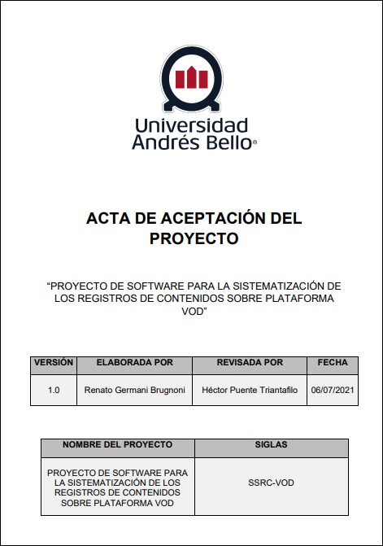

**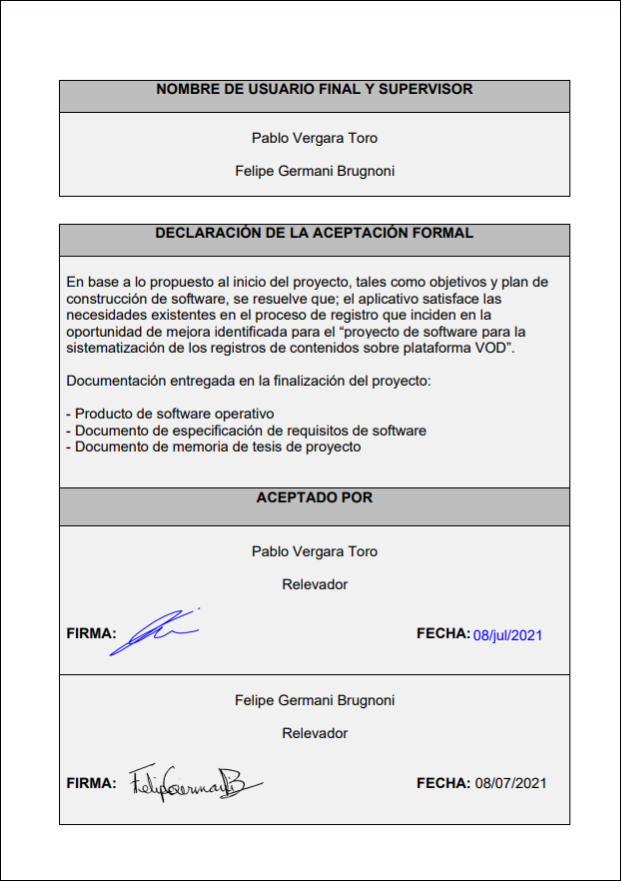**

**V**

# **CONCLUSIONES**

## **CONCLUSIONES**

El proyecto para la “sistematización de los registros de contenidos sobre plataforma VOD”, sin lugar a duda, ha sido un camino largo, demandante de un arduo trabajo, tiempo y esfuerzo, desde actividades prácticas como es la propia documentación y construcción del software, hasta ejercicios personales como la superación y el desarrollo personal.

La decisión de abordar este proyecto trajo consigo muchas dudas e incertidumbres sobre el posible éxito del mismo, generó miedos e inseguridades que favorecían a, finalmente, desistir sobre la idea de proyecto. A pesar de la presencia de dichos sentimientos, el no abordar este proyecto hubiese sido, a opinión del alumno, escoger el “camino fácil”, encaminando así la búsqueda de una idea de proyecto más sencilla, un proyecto que entregue mayor seguridad y tranquilidad al alumno, un proyecto que presente menos dificultades en el camino hacia la obtención del título profesional, sin embargo, el temor e incertidumbre que provocaba este largo camino no era motivo para no abordar un proyecto de estas características; un proyecto innovador, implementa tecnologías nuevas y resuelve una problemática del mundo real.

Al tratarse de un proyecto innovador que implementa tecnologías nuevas, el éxito de este dependía en gran parte de la capacidad autodidacta del alumno, la capacidad de investigar entre las abundantes fuentes de información y adquirir los conocimientos necesarios para cada cometido, articulando dichos conocimientos para la construcción y avance del proyecto de forma progresiva. De esta manera, se mantuvo el desarrollo de la herramienta superando diversos y nuevos obstáculos constantemente.

La manifestación constante de incidentes y obstáculos en el desarrollo del proyecto ralentizó el avance de este, e incluso, por momentos lo detenía por completo, debido a la ausencia de soluciones para un obstáculo o incidente en específico. El no superar un obstáculo o no lograr poner en marcha nuevamente la construcción de la herramienta generó un círculo vicioso de acciones inconclusas en el alumno, del que por momentos parecía no encontrar salida, empeorando la calidad del trabajo, la utilización del tiempo y disminuyendo las horas productivas.

Los obstáculos manifestados durante el desarrollo del proyecto corresponden, en gran parte, a peculiaridades propias de las tecnologías utilizadas, principalmente en la codificación de la herramienta, es por esa razón que, y volviendo a lo mencionado en el comienzo de este apartado con las palabras “superación y desarrollo personal”, se hace referencia al esfuerzo que tuvo que invertir el alumno en mantener la paciencia y perseverancia durante el desarrollo del proyecto, junto con ejercitar la auto motivación constante en búsqueda de prosperar en el cumplimiento de cada cometido.

La auto motivación, paciencia y perseverancia ejercitada por el alumno fue potenciada considerablemente por el profesor guía, transmitiendo tranquilidad desde su experiencia, entregando consejos, sugerencias y propuestas para la resolución de problemas mediante el ingenio, propiciando un aumento en la creatividad y razonamiento del alumno. Evidentemente, de forma incuestionable, sin la ayuda y apoyo constante del profesor guía, no podría haber sido posible la forma en la que se abordaron los diversos obstáculos, precisando el cumplimiento de objetivos y evitando caminos que no aportan valor al proyecto.

El profesor no solo fue un aporte desde lo académico, sino también desde lo personal y humano; dentro de esta sociedad, en la que vivimos constantemente inmersos en el deber desde ámbitos formales, sea de tipo académico o laboral, se aprecia enormemente el dar la dimensión de ser persona, dar lugar a espacios de conversación humana y expresión de sentimientos. Estas acciones, que parecen ser sencillas, son capaces de apaciguar la percepción negativa, banal y poco humana que por momentos el alumno puede tener sobre la realidad, provocada por las actividades rutinarias, la pérdida de esperanza y motivación.

Son todos estos hechos los que influyeron de forma positiva en el crecimiento y desarrollo del alumno, en hacer de esta experiencia una prueba digna del perfil al que se está aspirando. Por todo lo dicho, ya se han mencionado los aspectos y puntos de vista desde el ámbito personal.

Respecto al plan del proyecto y su razón de ser, se puede decir que, efectivamente, se logró cumplir con el cometido de sistematizar el proceso de registro de contenidos televisivos transmitidos en la plataforma VOD. La herramienta de software construida es capaz de analizar, utilizando tecnologías de visión artificial, una pequeña muestra de imágenes en la que se representan los datos de interés requeridos en el trabajo de relevamiento, llevando a cabo finalmente la extracción de estos. Dicha muestra, equivale a un segmento ejemplar de la plataforma VOD que el trabajador relevador analiza manualmente, invirtiendo horas humanas.

La sistematización de registro de contenidos, al ser efectuada por la herramienta de software, disminuye considerablemente el esfuerzo humano requerido para realizar el registro de títulos de contenidos televisivos, basándose en la secuencia de los procesos; ingreso de material, análisis, extracción, almacenamiento y obtención de datos, en la que el usuario debe invertir esfuerzo humano únicamente en los procesos de ingreso de material y obtención de datos.

El transcurso hacia la obtención del producto final no fue un camino llano, como ya se mencionó antes, se presentaron diversos obstáculos y dificultades durante el desarrollo, y, la complejidad de estos, fue influenciada por la poca

experiencia del alumno en proyectos ingenieriles. Esta inexperiencia, a pesar de ser un factor que indudablemente afectó al desarrollo del proyecto, perdió relevancia frente al inmenso valor del aprendizaje adquirido por la superación de dificultades, favoreciendo la familiarización en el ámbito de proyectos y la preparación para la entrada al campo laboral.

El producto construido en este proyecto permite al usuario utilizar la herramienta para los fines que él estime conveniente, es decir, el usuario puede utilizar la herramienta para analizar cualquier tipo de material, siempre y cuando, este cumpla con los parámetros necesarios para el correcto funcionamiento del motor OCR durante el proceso de análisis, junto a la existencia del registro de los datos de interés en la fuente de datos, aquella fuente de datos que utiliza la herramienta para comparar los datos extraídos con los datos objetivo a detectar. Dichos parámetros, son determinados principalmente por los factores; calidad de la imagen, duración del video y coordenadas de las regiones de interés a analizar.

El producto de software no solo sistematiza el registro de contenidos y satisface la oportunidad de mejora propuesta para el proyecto, más bien, implanta las bases fundamentales para la continuación del desarrollo de la herramienta. Con esto se quiere decir que, la herramienta tiene potencial de evolución si se prosigue el desarrollo de esta, y, si efectivamente esto se llevara a cabo, sería posible construir una herramienta capaz de sistematizar y quizás automatizar el proceso de registro de la plataforma VOD en su totalidad.

Una herramienta capaz de efectuar un registro de la plataforma VOD en su totalidad puede llegar a ser un beneficio significativo en ámbitos económicos. La herramienta puede ser entregada a la compañía Business Bureau a cambio de dinero, con la finalidad de reducir sus gastos destinados a la recopilación de datos, debido a la innecesaria contratación de trabajadores relevadores provocada por el registro automático de la herramienta. Considerando estas características, la herramienta puede ser ofrecida en su totalidad, u, ofrecida en forma de servicio, tanto a la compañía Business Bureau como a otras compañías dedicadas a la consultoría e investigación de mercado.

**VI**

# **ANEXOS**

## **Anexo A**

A continuación, se detallan los diseños de casos de uso para el módulo implementación de tecnologías.

Caso de uso “instalar herramientas y programas”

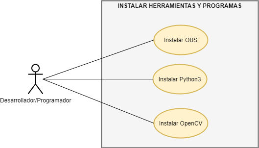

<table><tbody><tr><td>
NOMBRE
</td><td>
Instalar OBS
</td></tr><tr><td>
OBJETIVO
</td><td>
Preparar el software de grabación de video y aplicar configuración óptima.
</td></tr><tr><td>
ACTOR PRINCIPAL
</td><td><ul><li>Desarrollador / Programador</li></ul></td></tr><tr><td>
PRECONDICIÓN
</td><td>
Se debe tener conexión a internet y un OS operativo en el equipo computacional del proyecto.
</td></tr><tr><td>
POST CONDICIÓN
</td><td>
El software de grabación de video se encuentra operativo para realizar capturas y grabaciones.
</td></tr><tr><td>
FLUJO NORMAL
</td><td>
<strong>1 – </strong>instalar:
<ul><li>ingresar al repositorio del proveedor y descargar archivos de instalación.</li><li>ejecutar archivos de instalación.</li></ul>
<strong>2 – </strong>ejecutar:
<ul><li>ejecutar programa y verificar funcionamiento estable.</li><li>verificar versión.</li></ul>
<strong>3 – </strong>revisar instalación:
<ul><li>verificar versión de instalación en ajustes del sistema.</li><li>verificar compatibilidad con componentes de E/S en ajustes del sistema.</li></ul></td></tr><tr><td>
FLUJO ALTERNATIVO
</td><td>
En caso de existir incompatibilidad durante la ejecución:
<ul><li>verificar dependencias especificadas por el proveedor e instalarlas en el equipo en caso de ser necesario.</li></ul></td></tr><tr><td>
OBSERVACIONES
</td><td>
El desarrollador debe asegurarse de descargar los archivos de instalación correspondientes a la arquitectura que posea la CPU del equipo computacional, sea 32 o 64 bits.
</td></tr></tbody></table>

<table><tbody><tr><td>
NOMBRE
</td><td>
Instalar Python3
</td></tr><tr><td>
OBJETIVO
</td><td>
Preparar el lenguaje de programación y su entorno con la versión necesaria para el desarrollo del proyecto.
</td></tr><tr><td>
ACTOR PRINCIPAL
</td><td><ul><li>Desarrollador / Programador</li></ul></td></tr><tr><td>
PRECONDICIÓN
</td><td>
Se debe tener conexión a internet y un OS operativo en el equipo computacional del proyecto.
</td></tr><tr><td>
POST CONDICIÓN
</td><td>
El entorno de programación se encuentra operativo y listo para ser utilizado en la construcción de la herramienta.
</td></tr><tr><td>
FLUJO NORMAL
</td><td>
<strong>1 – </strong>instalar:
<ul><li>ejecutar comando de instalación en la terminal mediante el uso del gestor de paquetes utilizado por el SO del equipo computacional.</li></ul>
<strong>2 – </strong>ejecutar:
<ul><li>ejecutar entorno de programación en la terminal del OS.</li></ul>
<strong>3 – </strong>revisar instalación:
<ul><li>verificar versión del lenguaje utilizando el comando de verificación de versión en la terminal.</li></ul></td></tr><tr><td>
FLUJO ALTERNATIVO
</td><td>
En caso de existir un error en la ejecución del comando:
<ul><li>verificar sintaxis en el tipeo del comando de instalación.</li><li>verificar conexión a internet.</li><li>verificar versión del gestor de paquetes.</li><li>verificar el uso del gestor de paquetes adecuado.</li></ul></td></tr><tr><td>
OBSERVACIONES
</td><td>
El desarrollador debe asegurarse de hacer uso de los comandos correspondientes al gestor de paquetes utilizado por el OS del equipo computacional.
</td></tr></tbody></table>

<table><tbody><tr><td>
NOMBRE
</td><td>
Instalar OpenCV
</td></tr><tr><td>
OBJETIVO
</td><td>
Preparar la biblioteca de visión artificial en su versión necesaria para el desarrollo del proyecto.
</td></tr><tr><td>
ACTOR PRINCIPAL
</td><td><ul><li>Desarrollador / Programador</li></ul></td></tr><tr><td>
PRECONDICIÓN
</td><td>
Se debe tener conexión a internet y se debe haber completado el caso de uso “instalar Python3”.
</td></tr><tr><td>
POST CONDICIÓN
</td><td>
La librería se encuentra operativa y disponible para hacer uso de todas sus funcionalidades en la construcción de la herramienta.
</td></tr><tr><td>
FLUJO NORMAL
</td><td>
<strong>1 – </strong>instalar:
<ul><li>ejecutar comando de instalación en la terminal especificando la versión del lenguaje de programación con el que se hará uso de la biblioteca.</li></ul>
<strong>2 – </strong>ejecutar:
<ul><li>invocar biblioteca dentro del entorno de programación.</li></ul>
<strong>3 – </strong>revisar instalación:
<ul><li>verificar versión de la biblioteca utilizando el comando de verificación de versión en la terminal.</li></ul></td></tr><tr><td>
FLUJO ALTERNATIVO
</td><td>
En caso de existir un error en la ejecución del comando:
<ul><li>verificar sintaxis en el tipeo del comando de instalación.</li><li>verificar conexión a internet.</li><li>verificar versión del gestor de paquetes para Python3.</li><li>verificar el uso del gestor de paquetes adecuado.</li><li>verificar que la versión que se pretende instalar sea la adecuada.</li><li>verificar versión del lenguaje de programación instalado previamente.</li></ul></td></tr><tr><td>
OBSERVACIONES
</td><td>
El desarrollador debe asegurarse de hacer uso de los comandos correspondientes a la versión necesaria de la biblioteca para la construcción de la herramienta.
</td></tr></tbody></table>

*Diagrama de secuencia para el caso de uso “instalar OBS”:*

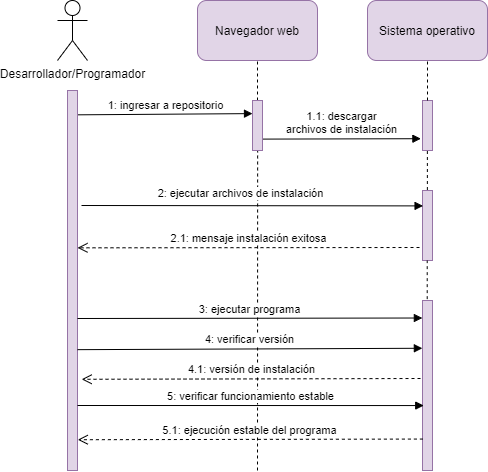

*Diagrama de secuencia para el caso de uso instalar “Python3”:*

*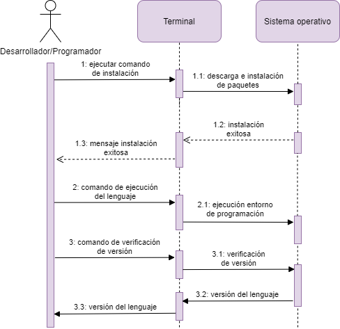*

*Diagrama de secuencia para el caso de uso instalar “OpenCV”:*

*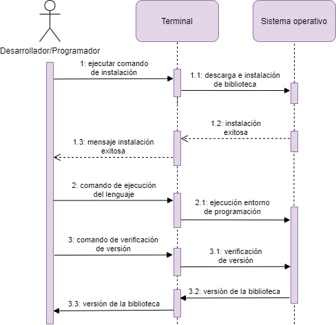*

Caso de uso “conectar componentes de hardware”:

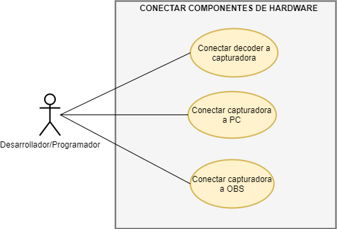

<table><tbody><tr><td>
NOMBRE
</td><td>
Conectar decoder a capturadora
</td></tr><tr><td>
OBJETIVO
</td><td>
Establecer conexión física entre el decodificador y la tarjeta capturadora de video.
</td></tr><tr><td>
ACTOR PRINCIPAL
</td><td><ul><li>Desarrollador / Programador</li></ul></td></tr><tr><td>
PRECONDICIÓN
</td><td>
Se debe tener a disposición del proyecto los cables HDMI necesarios.
</td></tr><tr><td>
POST CONDICIÓN
</td><td>
El decodificador y la tarjeta capturadora mantienen una comunicación física a través de sus puertos de E/S.
</td></tr><tr><td>
FLUJO NORMAL
</td><td>
<strong>1 -</strong> conectar cable HDMI en el puerto de salida del decodificador.

<strong>2 -</strong> conectar el cable HDMI proveniente de la salida del decodificador en el puerto de entrada de la tarjeta capturadora.
</td></tr><tr><td>
FLUJO ALTERNATIVO
</td><td>
Ninguno
</td></tr><tr><td>
OBSERVACIONES
</td><td>
El desarrollador debe asegurarse de que los cables se encuentren en buen estado.
</td></tr></tbody></table>

<table><tbody><tr><td>
NOMBRE
</td><td>
Conectar capturadora a PC
</td></tr><tr><td>
OBJETIVO
</td><td>
Establecer conexión física entre la tarjeta capturadora y el equipo computacional del proyecto.
</td></tr><tr><td>
ACTOR PRINCIPAL
</td><td><ul><li>Desarrollador / Programador</li></ul></td></tr><tr><td>
PRECONDICIÓN
</td><td>
El equipo computacional del proyecto debe tener puertos USB disponibles.
</td></tr><tr><td>
POST CONDICIÓN
</td><td>
La tarjeta capturadora y el equipo computacional del proyecto mantienen una comunicación física a través de sus puertos de E/S.
</td></tr><tr><td>
FLUJO NORMAL
</td><td>
<strong>1 –</strong> conectar salida de conector USB de la tarjeta capturadora en el puerto de entrada del equipo computacional.

<strong>2 – </strong>identificar señales de reconocimiento por parte del OS; señales sonoras o visuales (por pantalla) que expresen el correcto reconocimiento de la tarjeta capturadora.
</td></tr><tr><td>
FLUJO ALTERNATIVO
</td><td>
En caso de no recibir ninguna señal por parte del equipo computacional:
<ul><li>verificar estado de los puertos USB</li><li>revisar drivers de puertos USB</li></ul></td></tr><tr><td>
OBSERVACIONES
</td><td>
Ninguna
</td></tr></tbody></table>

<table><tbody><tr><td>
NOMBRE
</td><td>
Conectar capturadora a OBS
</td></tr><tr><td>
OBJETIVO
</td><td>
Establecer conexión virtual entre la tarjeta capturadora y el software de grabación de video.
</td></tr><tr><td>
ACTOR PRINCIPAL
</td><td><ul><li>Desarrollador / Programador</li></ul></td></tr><tr><td>
PRECONDICIÓN
</td><td>
Se deben haber completado los casos de uso “conectar decoder a capturadora” y “conectar capturadora a PC”.
</td></tr><tr><td>
POST CONDICIÓN
</td><td>
La tarjeta capturadora se encuentra operativa y lista para ser utilizada mediante el software de grabación de video.
</td></tr><tr><td>
FLUJO NORMAL
</td><td>
<strong>1 –</strong> ingresar tarjeta capturadora como fuente de imagen dentro del software de grabación de video.

<strong>2 – </strong>verificar imagen recibida por el software de grabación de video.
</td></tr><tr><td>
FLUJO ALTERNATIVO
</td><td>
En caso de no recibir imagen:
<ul><li>verificar estado de los cables HDMI.</li><li>verificar reconocimiento de tarjeta capturadora en equipo computacional.</li></ul></td></tr><tr><td>
OBSERVACIONES
</td><td>
El desarrollador debe asegurarse de que el decodificador esté encendido y este reciba una señal estable por parte de la empresa de telecomunicaciones.
</td></tr></tbody></table>

*Diagrama de secuencia para el caso de uso conectar “decoder a capturadora”:*

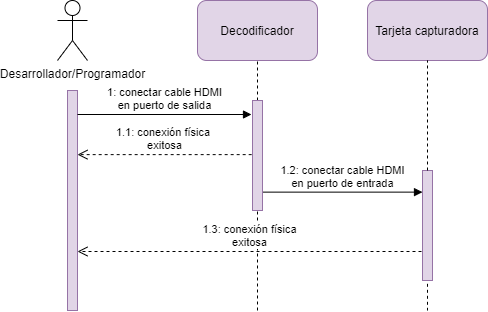

*Diagrama de secuencia para el caso de uso “conectar capturadora a PC”:*

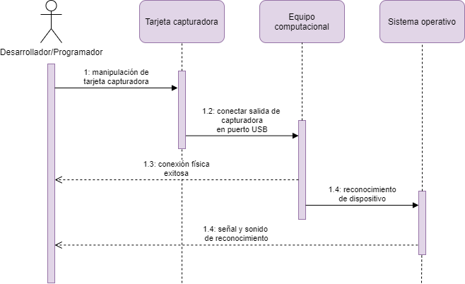

*Diagrama de secuencia para el caso de uso “conectar capturadora a OBS”:*

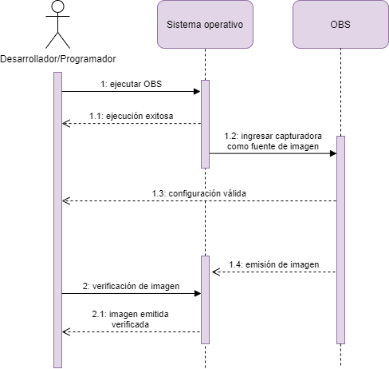

*Se entiende las siglas “OBS” como “Open Broadcaster Software”, software de grabación de video utilizado para el proyecto.*

Caso de uso “probar captura”:

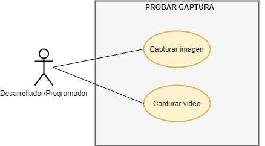

<table><tbody><tr><td>
NOMBRE
</td><td>
Capturar imagen
</td></tr><tr><td>
OBJETIVO
</td><td>
Capturar una imagen de muestra, con el fin de comprobar el correcto funcionamiento de la funcionalidad de captura.
</td></tr><tr><td>
ACTOR PRINCIPAL
</td><td><ul><li>Desarrollador / Programador</li></ul></td></tr><tr><td>
PRECONDICIÓN
</td><td>
Se debe haber completado el caso de uso “instalar OBS”, “conectar decoder a capturadora”, “conectar capturadora a PC” y “conectar capturadora a OBS”.
</td></tr><tr><td>
POST CONDICIÓN
</td><td>
OBS es capaz de capturar una imagen o utilizando como recurso la tarjeta capturadora.
</td></tr><tr><td>
FLUJO NORMAL
</td><td>
<strong>1 –</strong> dentro del software de grabación de video, aplicar configuración óptima:
<ul><li>Resolución</li><li>Escala de colores</li><li>Atajos de teclado</li></ul>
<strong>2 –</strong> ejecutar capturas y verificar salidas.
</td></tr><tr><td>
FLUJO ALTERNATIVO
</td><td>
En caso de obtener una mala calidad en la imagen o imagen negra:
<ul><li>revisar configuración óptima</li></ul>
En caso de existir bloqueo en la salida de imagen debido al protocolo HDCP:
<ul><li>implementar splitter HDMI, adquirido por el equipo de proyecto como método de prevención, con el objetivo de realizar un bypass al protocolo de seguridad.</li></ul></td></tr><tr><td>
OBSERVACIONES
</td><td>
El decodificador debe estar encendido emitiendo imagen por su salida HDMI.
</td></tr></tbody></table>

<table><tbody><tr><td>
NOMBRE
</td><td>
Capturar video
</td></tr><tr><td>
OBJETIVO
</td><td>
Capturar un video de muestra, con el fin de comprobar el correcto funcionamiento de la funcionalidad de grabación de video.
</td></tr><tr><td>
ACTOR PRINCIPAL
</td><td><ul><li>Desarrollador / Programador</li></ul></td></tr><tr><td>
PRECONDICIÓN
</td><td>
Se debe haber completado el caso de uso “instalar OBS”, “conectar decoder a capturadora”, “conectar capturadora a PC” y “conectar capturadora a OBS”.
</td></tr><tr><td>
POST CONDICIÓN
</td><td>
OBS es capaz de capturar un video utilizando como recurso la tarjeta capturadora.
</td></tr><tr><td>
FLUJO NORMAL
</td><td>
<strong>1 –</strong> dentro del software de grabación de video, aplicar configuración óptima:
<ul><li>Resolución</li><li>Fotogramas</li><li>Escala de colores</li><li>Atajos de teclado</li></ul>
<strong>2 –</strong> ejecutar captura de video y verificar salidas.
</td></tr><tr><td>
FLUJO ALTERNATIVO
</td><td>
En caso de obtener una mala calidad en la imagen o imagen negra:
<ul><li>revisar configuración óptima.</li></ul>
En caso de existir bloqueo en la salida de imagen debido al protocolo HDCP:
<ul><li>implementar splitter HDMI, adquirido por el equipo de proyecto como método de prevención, con el objetivo de realizar un bypass al protocolo de seguridad.</li></ul></td></tr><tr><td>
OBSERVACIONES
</td><td>
El decodificador debe estar encendido emitiendo imagen por su salida HDMI.
</td></tr></tbody></table>

Caso de uso “ejecutar entorno de desarrollo” (ilustrado en el caso de uso padre):

<table><tbody><tr><td>
NOMBRE
</td><td>
Ejecutar entorno de desarrollo
</td></tr><tr><td>
OBJETIVO
</td><td>
Verificar que el entorno de desarrollo para la construcción del software se encuentra operativo.
</td></tr><tr><td>
ACTOR PRINCIPAL
</td><td><ul><li>Desarrollador / Programador</li></ul></td></tr><tr><td>
PRECONDICIÓN
</td><td>
Se deben haber completado los casos de uso “instalar Python3”, “instalar OpenCV” y “capturar imagen”.
</td></tr><tr><td>
POST CONDICIÓN
</td><td>
El entorno de desarrollo se encuentra operativo y listo para ser utilizado.
</td></tr><tr><td>
FLUJO NORMAL
</td><td>
<strong>1 – </strong>generar script de prueba: codificar script de prueba en Python3 que permita la importación de una imagen utilizando la biblioteca OpenCV.

<strong>2 –</strong> ejecutar script en terminal y validar salidas.

<strong>3 – </strong>el script mostrará por consola un mensaje notificando la importación exitosa de la imagen.
</td></tr><tr><td>
FLUJO ALTERNATIVO
</td><td>
En caso de haber fallo en la ejecución de Python3:
<ul><li>Verificar código y detectar defecto.</li></ul>
En caso de haber fallo en la invocación de OpenCV:
<ul><li>verificar código y detectar defecto.</li><li>verificar versión de biblioteca utilizada.</li></ul>
En caso de incidente y recibir salidas inesperadas:
<ul><li>verificar código, detectar defecto y realizar modificación en la semántica.</li></ul></td></tr></tbody></table>

*Diagrama de secuencia para el caso de uso “capturar imagen”:*

*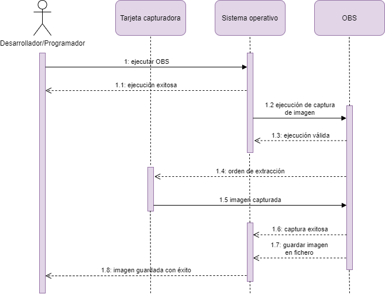*

*Se entiende las siglas “OBS” como “Open Broadcaster Software”, software de grabación de video.*

*Diagrama de secuencia para el caso de uso “capturar video”:*

**

*Se entiende las siglas “OBS” como “Open Broadcaster Software”, software de grabación de video*.

*Diagrama de secuencia para el caso de uso “ejecutar entorno de desarrollo” (ilustrado en el caso de uso padre):*

****

## **Anexo B**

En la siguiente imagen, se representa en el cuadro central, la imagen de la plataforma VOD, transmitida desde el decodificador hacia la tarjeta capturadora mediante un cable HDMI, y finalmente desde la tarjeta capturadora hacia el equipo computacional mediante un puerto USB.

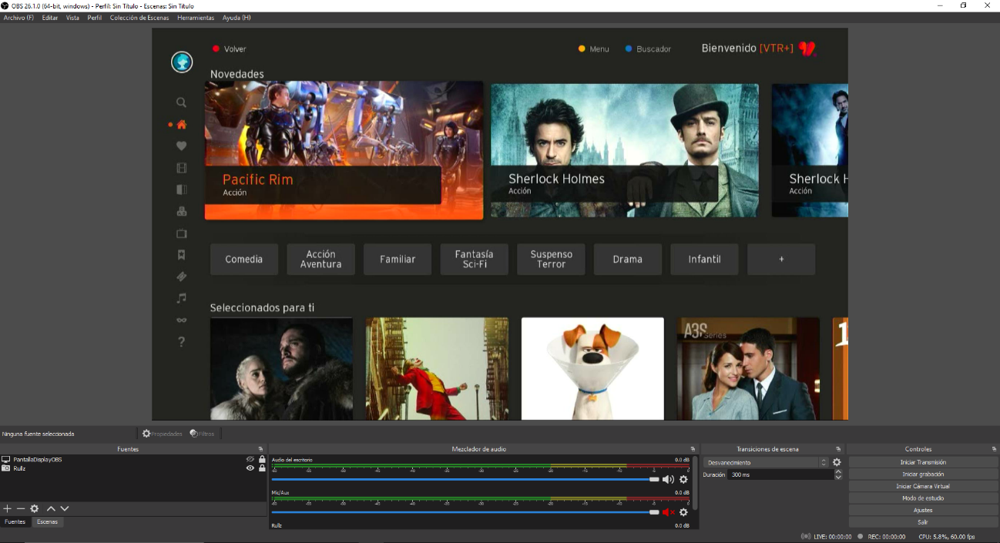

## **Anexo C**

La siguiente imagen corresponde a la captura realizada por el software de grabación de video mediante la tarjeta capturadora, representa la portada de un solo título de contenido televisivo, en donde se encuentran los datos de interés.

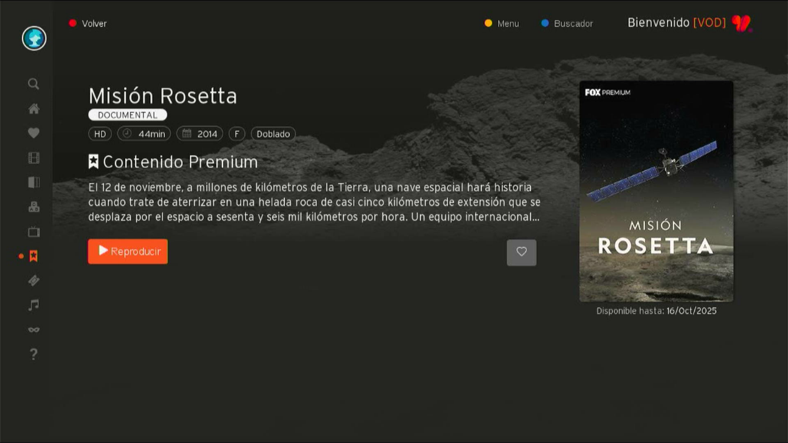

## **Anexo D**

El script analiza cada una de las imágenes, las imágenes contienen un único dato, y este mismo es extraído.

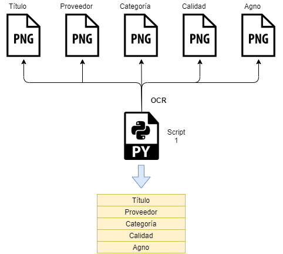

## **Anexo E**

En la siguiente imagen se representa el funcionamiento del segundo script de prueba y su interacción con la imagen de análisis. Se define “ROI” como “region of interest”, el script particiona diversos ROI de la imagen original, con la finalidad de analizar únicamente esas regiones y extraer los datos que se encuentre en él.

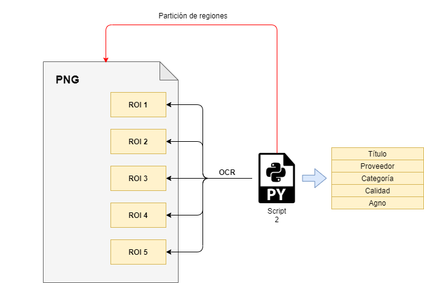

## **Anexo F**

En la siguiente imagen, se representa la ejecución del segundo script de prueba, en la que es posible visualizar la imagen original importada como material de análisis, a su lado izquierdo, aquellas regiones de interés particionadas por la herramienta y parametrizadas por el usuario.

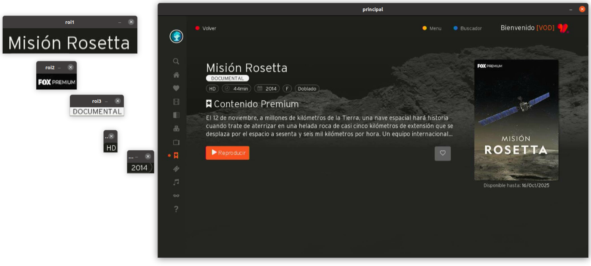

## **Anexo G**

A continuación, se detallan los diseños de casos de uso para el módulo de video.

Caso de uso “ejecutar programa”:

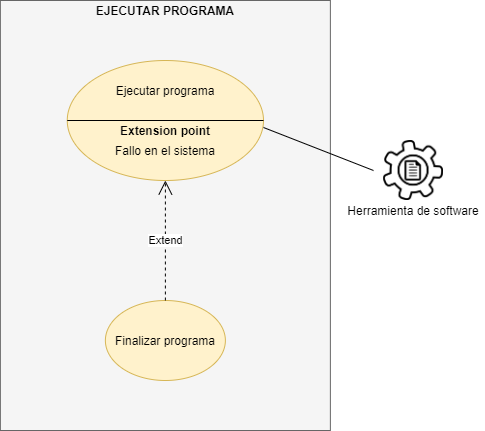

Caso de uso “importar video” (ilustrado en el caso de uso padre):

<table><tbody><tr><td>
NOMBRE
</td><td>
Importar video
</td></tr><tr><td>
OBJETIVO
</td><td>
Ingresar el material de entrada a analizar.
</td></tr><tr><td>
ACTOR PRINCIPAL
</td><td><ul><li>Desarrollador / Programador</li></ul></td></tr><tr><td>
PRECONDICIÓN
</td><td>
Se debe haber completado el caso de uso “capturar video”.
</td></tr><tr><td>
POST CONDICIÓN
</td><td>
El sistema reconoce el formato y ruta del material ingresado.
</td></tr><tr><td>
FLUJO NORMAL
</td><td>
<strong>1 –</strong> especificar ruta del directorio en donde se aloja el material.

<strong>2 – </strong>especificar formato de material a analizar.

<strong>3 – </strong>especificar material a analizar.
</td></tr><tr><td>
FLUJO ALTERNATIVO
</td><td>
En caso de que el archivo sea rechazado:
<ul><li>revisar que el formato cumpla los requisitos.</li><li>revisar sintaxis en la especificación de la ruta.</li><li>revisar estado e integridad de los archivos correspondientes al material de análisis.</li></ul></td></tr><tr><td>
OBSERVACIONES
</td><td>
Ninguna
</td></tr></tbody></table>

<table><tbody><tr><td>
NOMBRE
</td><td>
Ejecutar programa
</td></tr><tr><td>
OBJETIVO
</td><td>
El sistema se ejecuta correctamente y cumple su función en base a los algoritmos que lo componen.
</td></tr><tr><td>
ACTOR PRINCIPAL
</td><td><ul><li>Desarrollador / Programador</li><li>Herramienta de software</li></ul></td></tr><tr><td>
PRECONDICIÓN
</td><td>
El módulo de video debe estar codificado.
</td></tr><tr><td>
POST CONDICIÓN
</td><td>
El sistema se ejecuta y procesa las imágenes sin detenerse a causa de fallos.
</td></tr><tr><td>
FLUJO NORMAL
</td><td>
<strong>1 –</strong> se ejecuta el código mediante la terminal del OS.

<strong>2 – </strong>se examina el proceso de ejecución en la terminal del sistema en busca de indicadores que demuestren la correcta ejecución del módulo.
</td></tr><tr><td>
FLUJO ALTERNATIVO
</td><td>
-
</td></tr><tr><td>
OBSERVACIONES
</td><td>
Ninguna
</td></tr></tbody></table>

Caso de uso “extraer información” (ilustrado en el caso de uso padre):

<table><tbody><tr><td>
NOMBRE
</td><td>
Extraer información
</td></tr><tr><td>
OBJETIVO
</td><td>
El sistema es capaz de reconocer y extraer los datos requeridos.
</td></tr><tr><td>
ACTOR PRINCIPAL
</td><td><ul><li>Herramienta de software</li></ul></td></tr><tr><td>
PRECONDICIÓN
</td><td>
El programa ya debe estar en ejecución, es decir, se debe haber completado el caso de uso “ejecutar programa”.
</td></tr><tr><td>
POST CONDICIÓN
</td><td>
El sistema reconoce los datos de interés mediante la tecnología OCR y los almacena en un archivo.
</td></tr><tr><td>
FLUJO NORMAL
</td><td>
<strong>1 – </strong>analiza las imágenes de entrada.

<strong>2 –</strong> implementa OCR en las regiones de interés de la imagen.

<strong>3 –</strong> detecta los datos de interés y los extrae almacenándolos en un archivo.
</td></tr><tr><td>
FLUJO ALTERNATIVO
</td><td>
En caso de que el sistema haya extraído datos incorrectos:
<ul><li>revisar semántica de la codificación.</li><li>revisar calidad de las imágenes en reproducción o, en el último de los casos, recopilar nuevamente material potencialmente analizable.</li></ul></td></tr><tr><td>
OBSERVACIONES
</td><td>
Si no se obtiene el resultado o el rendimiento esperado se debe seguir desarrollando el código fuente.
</td></tr></tbody></table>

*Diagrama de secuencia para el caso de uso “importar video” (ilustrado en el caso de uso padre):*

**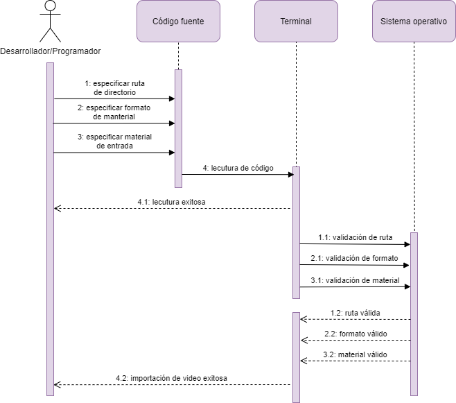**

*Diagrama de secuencia para el caso de uso “ejecutar programa”:*

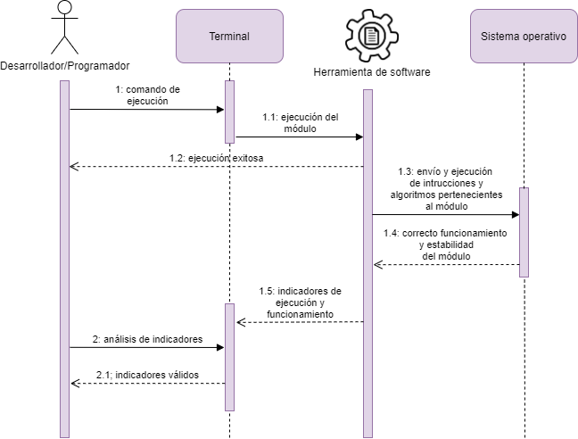

*Diagrama de secuencia para el caso de uso “extraer información” (ilustrado en el caso de uso padre):*

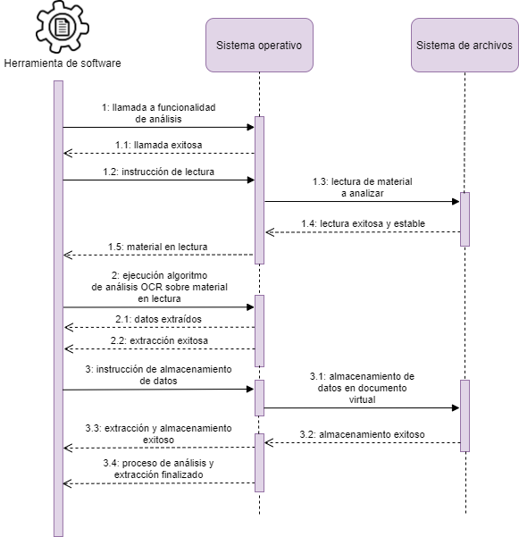

Caso de uso “mostrar por pantalla”

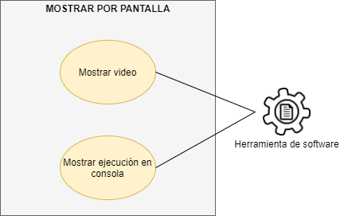

<table><tbody><tr><td>
NOMBRE
</td><td>
Mostrar video
</td></tr><tr><td>
OBJETIVO
</td><td>
El sistema mostrará las imágenes y el proceso de ejecución.
</td></tr><tr><td>
ACTOR PRINCIPAL
</td><td><ul><li>Herramienta de software</li></ul></td></tr><tr><td>
PRECONDICIÓN
</td><td>
El programa ya debe estar en ejecución, es decir, se debe haber completado el caso de uso “ejecutar programa”.
</td></tr><tr><td>
POST CONDICIÓN
</td><td>
El sistema mostrará la imagen o video en proceso de análisis.
</td></tr><tr><td>
FLUJO NORMAL
</td><td>
<strong>1 – </strong>se despliega la imagen o video en proceso de análisis a través de la pantalla del equipo computacional.

<strong>2 – </strong>se reproducen los frames de manera secuencial hasta que finalice el análisis.
</td></tr><tr><td>
FLUJO ALTERNATIVO
</td><td>
En caso de un despliegue incorrecto o una detención en la respuesta de imagen:
<ul><li>revisar semántica de la codificación.</li><li>revisar estado e integridad de los archivos correspondientes al material de análisis.</li></ul></td></tr><tr><td>
OBSERVACIONES
</td><td>
Ninguna
</td></tr></tbody></table>

<table><tbody><tr><td>
NOMBRE
</td><td>
Mostrar ejecución en consola
</td></tr><tr><td>
OBJETIVO
</td><td>
El sistema mostrará el proceso de ejecución a través de salidas en el terminal del OS.
</td></tr><tr><td>
ACTOR PRINCIPAL
</td><td><ul><li>Herramienta de software</li></ul></td></tr><tr><td>
PRECONDICIÓN
</td><td>
El programa ya debe estar en ejecución, es decir, se debe haber completado el caso de uso “ejecutar programa”.
</td></tr><tr><td>
POST CONDICIÓN
</td><td>
El sistema mostrará el proceso de ejecución, de manera secuencial, desde el comienzo hasta el final.
</td></tr><tr><td>
FLUJO NORMAL
</td><td>
<strong>1 – </strong>en el comienzo de la ejecución, se muestra por consola los indicadores que especifican un correcto funcionamiento del programa.

<strong>2 – </strong>durante el análisis, se muestran aquellos indicadores que especifican el correcto análisis de imágenes

<strong>3 – </strong>durante el análisis, se muestra el indicador de proceso en tiempo de ejecución.

<strong>4 – </strong>al final de la ejecución, se muestra el indicador que representa una finalización exitosa del módulo.
</td></tr><tr><td>
FLUJO ALTERNATIVO
</td><td>
En caso de una detención en la ejecución u obtención de un indicador incorrecto:
<ul><li>revisar semántica de la codificación.</li><li>revisar estado e integridad de los archivos correspondientes al material de análisis.</li></ul></td></tr><tr><td>
OBSERVACIONES
</td><td>
Ninguna
</td></tr></tbody></table>

*Diagrama de secuencia para el caso de uso “mostrar video”:*

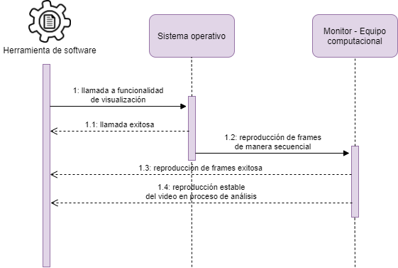

*Diagrama de secuencia para el caso de uso “mostrar ejecución en consola”:*

*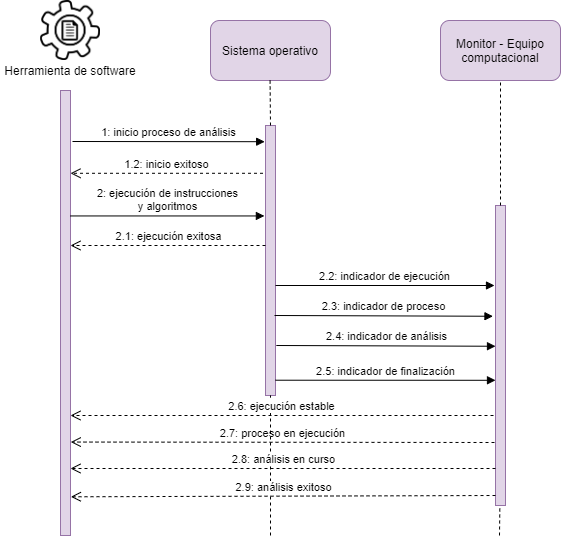*

## **Anexo H**

A continuación, se representa una muestra de una imagen binarizada en uno de sus diferentes umbrales. La herramienta analiza las imágenes en este formato.

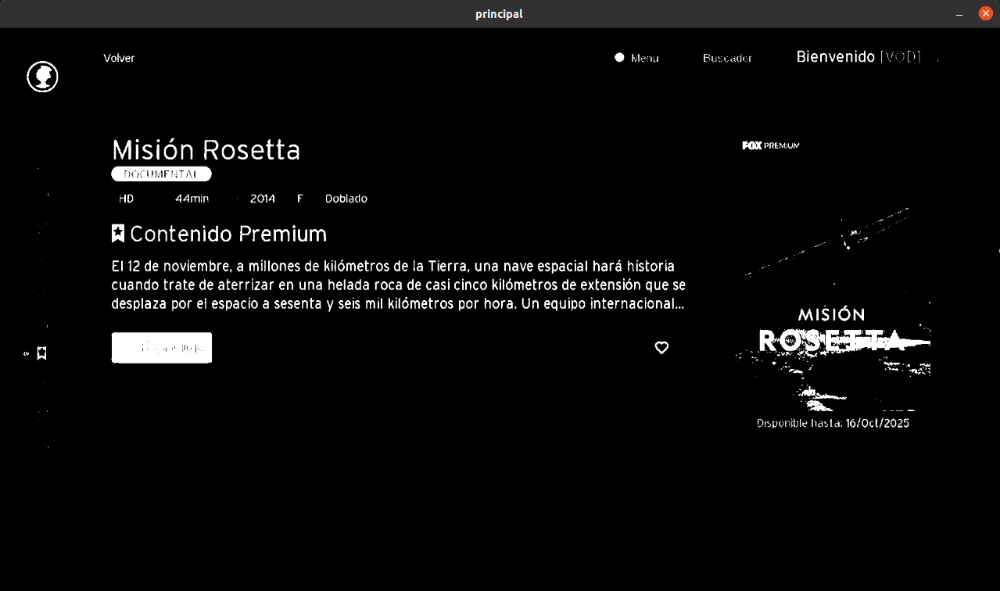

## **Anexo I**

A continuación, se detallan los diseños de casos de uso para el módulo de herramienta de software.

Caso de uso “navegar por explorador de archivos”:

<table><tbody><tr><td>
NOMBRE
</td><td>
Registrar material de análisis
</td></tr><tr><td>
OBJETIVO
</td><td>
Efectuar un registro e ingreso del material analizado.
</td></tr><tr><td>
ACTOR PRINCIPAL
</td><td>
Desarrollador/Programador
</td></tr><tr><td>
PRECONDICIÓN
</td><td>
Se debe haber codificado el módulo de video y debe estar operativo. También, se debe tener a disposición el material de análisis en la ruta especificada en el módulo de video.
</td></tr><tr><td>
POST CONDICIÓN
</td><td>
El material es ingresado exitosamente y se genera un registro de esta acción en un archivo de texto plano.
</td></tr><tr><td>
FLUJO NORMAL
</td><td>
<strong>1 – </strong>el usuario especifica la acción de ingreso de material

<strong>2 – </strong>el usuario ingresa el tipo de material que desee

<strong>3 – </strong>se genera un registro de dicha acción realizada por el usuario en un documento .txt o .csv.
</td></tr><tr><td>
FLUJO ALTERNATIVO
</td><td>
-
</td></tr><tr><td>
OBSERVACIONES
</td><td>
Ninguna
</td></tr></tbody></table>

Caso de uso “iniciar proceso de análisis” (ilustrado en el caso de uso padre):

<table><tbody><tr><td>
NOMBRE
</td><td>
Iniciar proceso de análisis
</td></tr><tr><td>
OBJETIVO
</td><td>
La herramienta da inicio al proceso de análisis.
</td></tr><tr><td>
ACTOR PRINCIPAL
</td><td>
Herramienta de software
</td></tr><tr><td>
PRECONDICIÓN
</td><td>
Se debe haber completado el caso de uso “registrar material de análisis”
</td></tr><tr><td>
POST CONDICIÓN
</td><td>
La herramienta inicia el proceso de análisis durante la ejecución luego de haber aceptado el material ingresado por el usuario.
</td></tr><tr><td>
FLUJO NORMAL
</td><td>
<strong>1 – </strong>la herramienta da comienzo a la ejecución del aplicativo de forma automática luego de recibir una entrada válida.

<strong>2 – </strong>mantiene el análisis en tiempo de ejecución e implementa toda la lógica y algoritmos pertenecientes al módulo de video sobre el material ingresado.
</td></tr><tr><td>
FLUJO ALTERNATIVO
</td><td>
En caso de que el análisis no comience automáticamente:
<ul><li>ingresar nuevamente el material a analizar.</li><li>verificar estado e integridad de archivos de análisis.</li><li>verificar ruta del fichero donde se aloja el material de análisis.</li></ul></td></tr><tr><td>
OBSERVACIONES
</td><td>
Ninguna
</td></tr></tbody></table>

Caso de uso “mostrar ejecución y proceso de análisis” (ilustrado en el caso de uso padre):

<table><tbody><tr><td>
NOMBRE
</td><td>
Mostrar ejecución y proceso de análisis
</td></tr><tr><td>
OBJETIVO
</td><td>
Mostrar por pantalla el video de análisis y los indicadores de la ejecución.
</td></tr><tr><td>
ACTOR PRINCIPAL
</td><td>
Herramienta de software
</td></tr><tr><td>
PRECONDICIÓN
</td><td>
Se deben haber completado el caso de uso “iniciar proceso de análisis”, es decir, el módulo ya debe estar en ejecución.
</td></tr><tr><td>
POST CONDICIÓN
</td><td>
Se representa, mediante interfaz gráfica, la reproducción del video en proceso de análisis, junto con un widget de la terminal del OS, en el que se visualizarán los indicadores del proceso de ejecución.
</td></tr><tr><td>
FLUJO NORMAL
</td><td>
<strong>1 – </strong>mediante interfaz gráfica, la herramienta representa la reproducción de frames del video analizado, de manera secuencial, desde el inicio hasta el final de la ejecución.

<strong>2 –</strong> mediante interfaz gráfica, la herramienta presenta un widget de la terminal correspondiente al OS, mostrando todos los indicadores pertenecientes al proceso de ejecución.
</td></tr><tr><td>
FLUJO ALTERNATIVO
</td><td>
En caso de obtener imagen negra en la reproducción del video:
<ul><li>revisar semántica de la codificación del módulo y modificarla en caso de existir errores en esta.</li></ul>
En caso de obtener indicadores inesperados en el widget de terminal:
<ul><li>revisar semántica de la codificación y modificarla en caso de existir errores en esta.</li></ul></td></tr><tr><td>
OBSERVACIONES
</td><td>
Ninguna
</td></tr></tbody></table>

<table><tbody><tr><td>
NOMBRE
</td><td>
Obtener datos analizados
</td></tr><tr><td>
OBJETIVO
</td><td>
Obtener, abrir y apreciar los datos extraídos por la herramienta.
</td></tr><tr><td>
ACTOR PRINCIPAL
</td><td>
Desarrollador/Programador
</td></tr><tr><td>
PRECONDICIÓN
</td><td>
Se debe haber completado los casos de uso “iniciar proceso de análisis” y “mostrar ejecución y proceso de análisis”.
</td></tr><tr><td>
POST CONDICIÓN
</td><td>
La herramienta permite al usuario dirigirse al directorio en donde se encuentran los datos de salida del análisis, el usuario es capaz de abrir dichas salidas y hacer uso de la información que estas contienen.
</td></tr><tr><td>
FLUJO NORMAL
</td><td>
<strong>1 </strong>– posterior a la extracción efectuada por la herramienta, el usuario se dirige a la ruta del explorador de archivos en donde se encuentran las salidas, esto lo realiza directamente desde la interfaz gráfica mediante el uso de un button.

<strong>2 – </strong>el usuario abre el archivo digital en el que se encuentran los datos de salida.

<strong>3 – </strong>el usuario hace uso del archivo o de los datos que este contiene para interés propio.
</td></tr><tr><td>
FLUJO ALTERNATIVO
</td><td>
En caso de un button inhabilitado por la herramienta:
<ul><li>revisar semántica de la codificación del módulo.</li><li>revisar ruta y estado de fichero en el OS.</li><li>iniciar nuevamente el proceso de análisis.</li></ul></td></tr><tr><td>
OBSERVACIONES
</td><td>
El usuario debe duplicar el archivo en caso de querer hacer uso de él en su estado completo y de manera independiente, es decir, se debe mantener un archivo en el repositorio de salidas para que sean posibles las próximas extracciones.
</td></tr></tbody></table>

*Diagrama de secuencia para el caso de uso “registrar material de análisis”:*

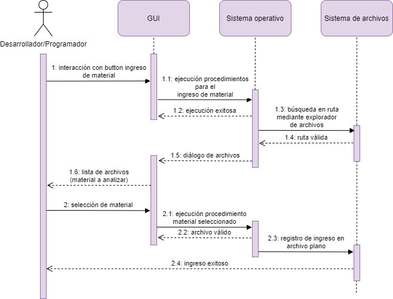

*Diagrama de secuencia para el caso de uso “iniciar proceso de análisis” (ilustrado en el caso de uso padre):*

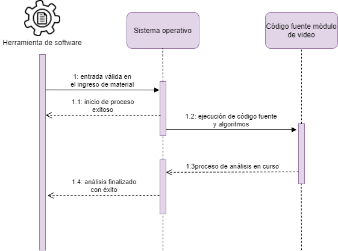

*Diagrama de secuencia para el caso de uso “mostrar ejecución y proceso de análisis” (ilustrado en el caso de uso padre):*

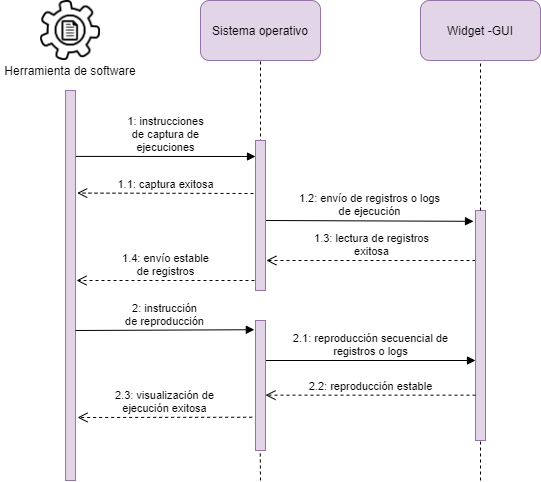

*Diagrama de secuencia para el caso de uso “obtener datos analizados”:*

*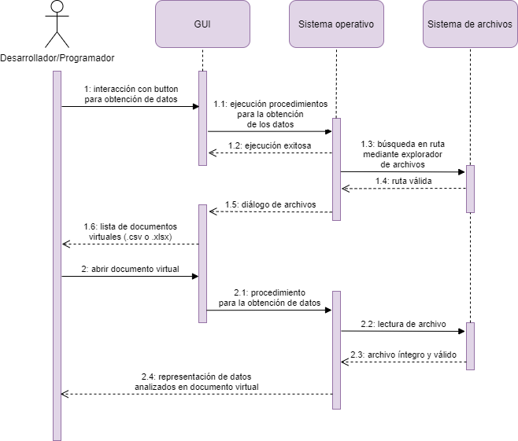*

## **Anexo J**

En la siguiente imagen, se representa la interfaz gráfica construida para el aplicativo, en la que se puede apreciar el frame contenedor para la reproducción del video en análisis, en color gris, el widget representativo de la terminal del sistema operativo, en color negro, y finalmente, los tres buttons correspondientes a cada uno de los tipos de material a analizar, en color azul.

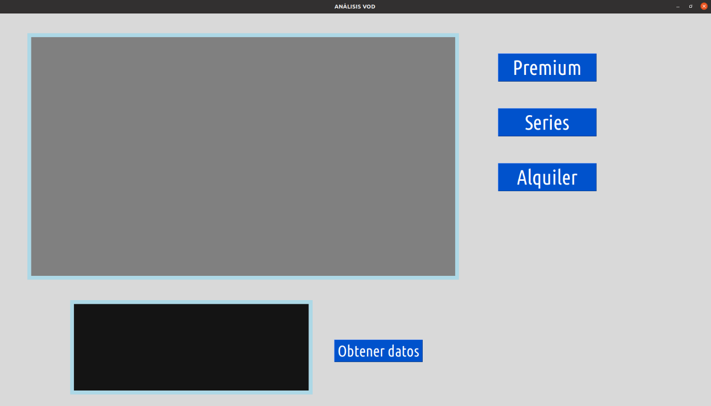

## **Anexo K**

Se representa a continuación, la secuencia de conversión de formato de imagen, en orden de izquierda a derecha, desde la funcionalidad de análisis hasta la reproducción del material en la GUI de la herramienta.

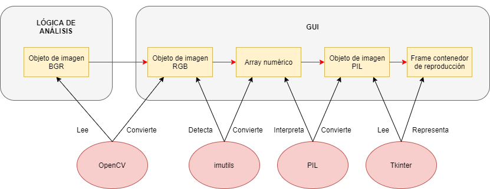

## **Anexo L**

El siguiente diagrama representa el comportamiento de la conexión Pipe entre dos procesos, con los métodos de emisión y recepción pertenecientes a cada uno de sus extremos.

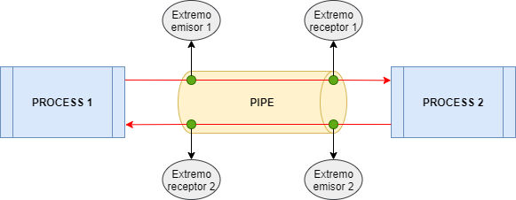

## **Anexo M**

El siguiente diagrama representa la comunicación entre el o los procesos de análisis con el proceso de la GUI, en el que se reproduce el video analizado. El gráfico representa los dos procesos ejecutándose de forma paralela, manteniendo una comunicación mediante el pipe e intercambiando el objeto imagen. En este caso, la emisión del objeto imagen comienza en el proceso de análisis y finaliza con la recepción de este en el proceso de interfaz gráfica de usuario.

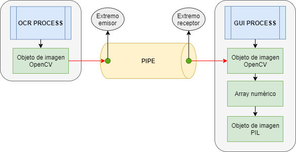

## **Anexo N**

Se representa a continuación, el diagrama de flujo correspondiente al comportamiento del capturador de salidas construido en el módulo de herramienta de software.

## **Anexo Ñ**

Se representa a continuación, el diagrama representativo de la comunicación entre el proceso de análisis y el proceso de la GUI, comunicación que mantienen mediante un Pipe, el cual es utilizado para el intercambio de la variable contenedora de outputs.

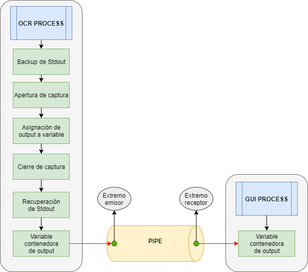

## **Anexo O**

El siguiente diagrama representa el comportamiento del proceso de análisis y el proceso de la GUI, ambos procesos en ejecución paralela, intercambiando los datos de imagen y outputs a través de Pipes de forma simultánea, manteniendo una comunicación estable y ordenada. Se representa, mediante flechas y líneas de color rojo, la comunicación e intercambio del objeto de imagen a través del primer Pipe, por otro lado, las flechas y líneas de color azul, representan la comunicación e intercambio de los outputs capturados.

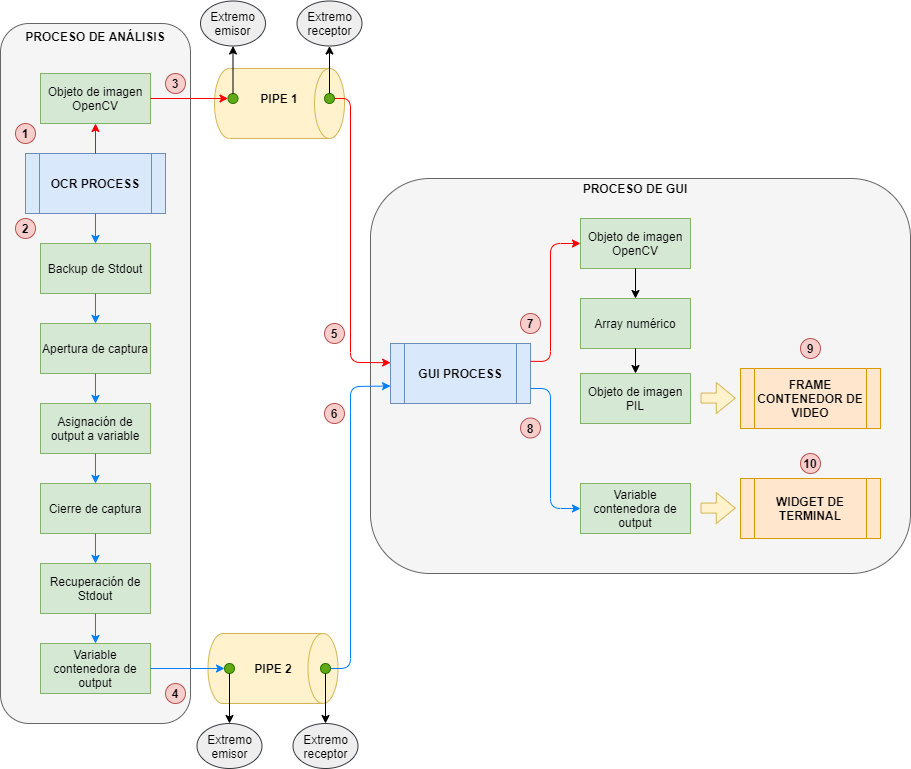

Para un mejor entendimiento del comportamiento simultáneo de ambos procesos, se detalla a continuación cada uno de los pasos enumerados dentro del diagrama.

<table><tbody><tr><td>

</td><td>
El proceso de análisis implementa las funcionalidades OCR utilizando el objeto de imagen como material de análisis.
</td></tr><tr><td>

</td><td>
El proceso de análisis ejecuta de forma secuencial los métodos necesarios para instanciar y utilizar el capturador de salidas, obteniendo finalmente la variable contenedora de outputs.
</td></tr><tr><td>

</td><td>
El proceso de análisis envía, a través del primer canal de conexión, el objeto de imagen OpenCV hacia el proceso de la GUI.
</td></tr><tr><td>

</td><td>
El proceso de análisis envía a través del segundo canal de conexión los outputs capturados.
</td></tr><tr><td>

</td><td>
El proceso de la GUI recibe a través del primer canal de conexión el objeto de imagen en formato OpenCV.
</td></tr><tr><td>

</td><td>
El proceso de la GUI recibe a través del segundo canal de conexión la variable contenedora de outputs
</td></tr><tr><td>

</td><td>
El proceso de la GUI ejecuta de forma secuencial todos los métodos necesarios para el cambio de formato en el objeto de imagen, haciendo uso de las bibliotecas necesarias para dicha conversión. Finalmente, envía el objeto de imagen en formato PIL hacia el frame contenedor de video.
</td></tr><tr><td>

</td><td>
El proceso de la GUI envía la variable contenedora de outputs hacia el widget de terminal.
</td></tr><tr><td>

</td><td>
El proceso de la GUI hace uso del objeto de imagen dentro del frame contenedor y reproduce el video en proceso de análisis.
</td></tr><tr><td>

</td><td>
El proceso de la GUI hace uso de la variable contenedora de outputs y representa en el widget, de forma secuencial, los registros e indicadores arrojados por la consola del sistema y el intérprete de Python3.
</td></tr></tbody></table>

## **Anexo P**

A continuación, se detallan las especificaciones de los casos de uso correspondientes al módulo de salidas del software.

Caso de uso “crear grilla con datos extraídos” (ilustrado en el caso de uso padre):

<table><tbody><tr><td>
NOMBRE
</td><td>
Crear grilla con datos extraídos
</td></tr><tr><td>
OBJETIVO
</td><td>
Generar un almacenamiento temporal, en formato de grilla y de forma estructurada, de los datos extraídos por la herramienta.
</td></tr><tr><td>
ACTOR PRINCIPAL
</td><td>
Herramienta de software
</td></tr><tr><td>
PRECONDICIÓN
</td><td>
La herramienta debe haber completado exitosamente el proceso de análisis y extracción de datos.

Se debe haber importado la biblioteca de análisis y manipulación de datos Pandas.
</td></tr><tr><td>
POST CONDICIÓN
</td><td>
El módulo almacena en memoria temporal los datos extraídos en formato de grilla, para posteriormente hacer posible su manipulación.
</td></tr><tr><td>
FLUJO NORMAL
</td><td>
<strong>1 – </strong>creación de un diccionario (estructura de datos) con los datos ya extraídos por la herramienta, datos válidos e íntegros.

<strong>2 – </strong>creación de un Pandas dataframe basado en el diccionario contenedor de datos de extracción.
</td></tr><tr><td>
FLUJO ALTERNATIVO
</td><td>
-
</td></tr><tr><td>
OBSERVACIONES
</td><td>
Ninguna
</td></tr></tbody></table>

Caso de uso “leer datos de salida ya existentes” (ilustrado en el caso de uso padre):

<table><tbody><tr><td>
NOMBRE
</td><td>
Leer datos de salida ya existentes
</td></tr><tr><td>
OBJETIVO
</td><td>
Cargar, leer y almacenar en memoria temporal los datos ya existentes en el archivo contenedor de salidas, es decir, los datos que ya se encuentran escritos en el archivo .xlsx antes de ejecutar una nueva orden de almacenamiento.
</td></tr><tr><td>
ACTOR PRINCIPAL
</td><td>
Herramienta de software
</td></tr><tr><td>
PRECONDICIÓN
</td><td>
La herramienta debe haber completado exitosamente el proceso de análisis y extracción de datos.

Se debe haber importado la biblioteca de análisis y manipulación de datos Pandas.
</td></tr><tr><td>
POST CONDICIÓN
</td><td>
El módulo almacena en memoria temporal, en formato de grilla y de forma estructurada, los datos ya existentes en el archivo contenedor de salidas de tipo .xlsx.
</td></tr><tr><td>
FLUJO NORMAL
</td><td>
<strong>1 –</strong> importación de archivo .xlsx.

<strong>2 – </strong>lectura y extracción mediante la biblioteca Pandas de los datos contenidos en el archivo.

<strong>3 – </strong>almacenamiento temporal, en formato Pandas dataframe, de los datos ya existentes en el archivo
</td></tr><tr><td>
FLUJO ALTERNATIVO
</td><td>
-
</td></tr><tr><td>
OBSERVACIONES
</td><td>
Es posible que el archivo .xlsx esté vacío, especialmente si es la primera vez que se ejecuta el análisis en la herramienta, de todos modos, este es un caso válido, el módulo ignora las celdas o espacios vacíos y procede a efectuar el almacenamiento escribiendo sobre estos.
</td></tr></tbody></table>

Caso de uso “escribir nuevos datos de salida” (ilustrado en el caso de uso padre):

<table><tbody><tr><td>
NOMBRE
</td><td>
Escribir nuevos datos de salida
</td></tr><tr><td>
OBJETIVO
</td><td>
Almacenar los nuevos datos extraídos por la herramienta en el archivo de almacenamiento.
</td></tr><tr><td>
ACTOR PRINCIPAL
</td><td>
Herramienta de software
</td></tr><tr><td>
PRECONDICIÓN
</td><td>
Se deben haber ejecutado y finalizado con éxito los casos de uso “crear grilla con datos extraídos” y “lectura de datos de salida ya existentes”.

Se debe haber importado la biblioteca de análisis y manipulación de datos Pandas.

Se debe haber importado el módulo xlsxwriter para la manipulación de archivos en formato .xlsx o .xls.
</td></tr><tr><td>
POST CONDICIÓN
</td><td>
La herramienta de software, posterior al análisis del material de entrada, almacena exitosamente dentro del archivo los datos de interés extraídos.
</td></tr><tr><td>
FLUJO NORMAL
</td><td>
<strong>1 –</strong> creación de un nuevo dataframe, dataframe final que será insertado en el archivo de almacenamiento.

<strong>2 – </strong>se adjunta en el dataframe final, el dataframe contenedor de los datos ya existentes, creado en el caso de uso “lectura de datos ya existentes”.

<strong>3 – </strong>se adjunta en el dataframe final, el dataframe contenedor de nuevos datos creado en el caso de uso “crear grilla con datos extraídos”.

<strong>4 – </strong>creación de objeto de escritura Pandas junto a método xlsxwriter.

<strong>5 – </strong>sobreescritura del archivo de almacenamiento con la inserción del dataframe final.
</td></tr><tr><td>
FLUJO ALTERNATIVO
</td><td>
-
</td></tr><tr><td>
OBSERVACIONES
</td><td>
Ninguna
</td></tr></tbody></table>

Caso de uso “cambiar formato” (ilustrado en el caso de uso padre):

<table><tbody><tr><td>
NOMBRE
</td><td>
Cambiar formato
</td></tr><tr><td>
OBJETIVO
</td><td>
Implementar un cambio de formato correspondiente a cada una de las columnas del archivo contenedor.
</td></tr><tr><td>
ACTOR PRINCIPAL
</td><td>
Herramienta de software
</td></tr><tr><td>
PRECONDICIÓN
</td><td>
Se deben haber completado los casos de uso “crear grilla con datos extraídos”, “leer datos de salida ya existentes” y “escribir nuevos datos de salida”.

Se debe haber importado el contenedor workbook perteneciente a la biblioteca openpyxl.
</td></tr><tr><td>
POST CONDICIÓN
</td><td>
El módulo, posterior a la correcta ejecución del análisis del material y la sobreescritura de los nuevos datos de interés en el documento de almacenamiento, procede a efectuar un cambio de formato en las celdas añadidas, con el propósito de mantener el orden requerido en el trabajo de relevamiento.
</td></tr><tr><td>
FLUJO NORMAL
</td><td>
<strong>1 – </strong>creación de objeto de lectura y escritura workbook.

<strong>2 – </strong>lectura de formato de todas las celdas escritas, lectura que es delimitada por coordenadas de ancho y alto.

<strong>3 – </strong>ejecución de cambio de formato actual a formato genérico mediante el objeto workbook.

<strong>4 – </strong>cierre de los métodos utilizados por el objeto de lectura y escritura.
</td></tr><tr><td>
FLUJO ALTERNATIVO
</td><td>
-
</td></tr><tr><td>
OBSERVACIONES
</td><td>
Ninguna
</td></tr></tbody></table>

*Diagrama de secuencia para el caso de uso “crear grilla con datos extraídos” (ilustrado en el caso de uso padre):*

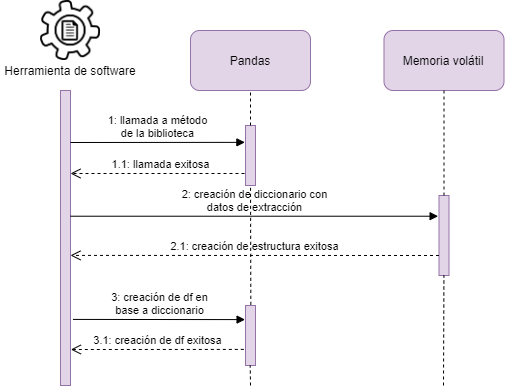

*Entiéndase “df” como estructura de datos dataframe (abreviación mencionada en diversas secuencias del gráfico).*

*Diagrama de secuencia para el caso de uso “leer datos de salida ya existentes” (ilustrado en el caso de uso padre):*

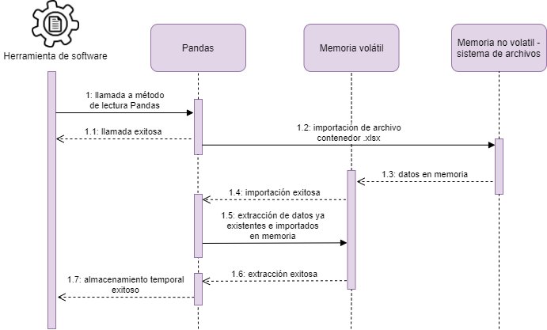

*Diagrama de secuencia para el caso de uso “escribir nuevos datos de salida” (ilustrado en el caso de uso padre):*

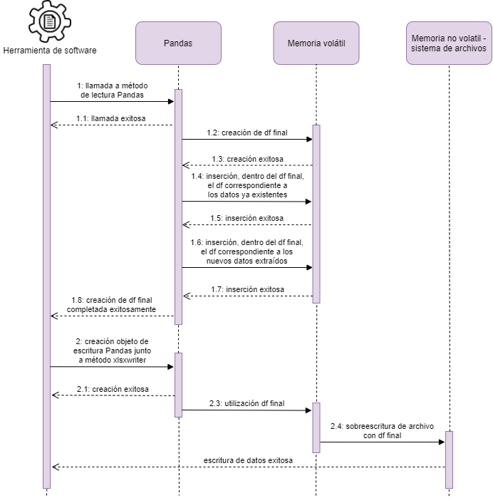

*Entiéndase “df” como estructura de datos dataframe (abreviación mencionada en diversas secuencias del gráfico).*

*Diagrama de secuencia para el caso de uso “cambiar formato” (ilustrado en el caso de uso padre):*

*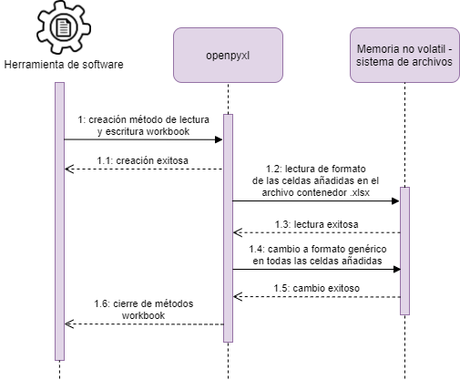*

## **Anexo Q**

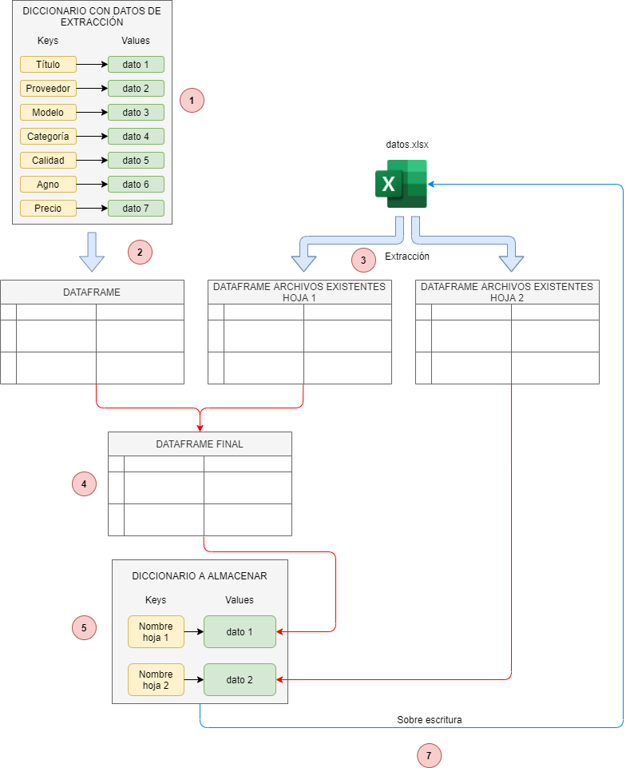

El diagrama anterior, representa el comportamiento del exportador cumpliendo con su labor de almacenar los datos extraídos de forma persistente en memoria. Para una mayor claridad, se enumeró, dentro del diagrama, cada uno de los métodos detallados sobre la secuencia que da lugar a la estructura del exportador, documentación presente en el apartado “producto de software y procedimientos administrativos”. Durante la enumeración de los métodos secuenciales dentro del diagrama, se obvió el sexto método, correspondiente a la instanciación del objeto de lectura y escritura, debido a que este se considera evidente para el funcionamiento del exportador, y, de esta forma, también se evita una saturación en la representación del diagrama.

## **Anexo R**

En la siguiente imagen, se representa el formato utilizado para el registro de los títulos de tipo premium y los títulos de tipo alquiler en una misma hoja Excel.

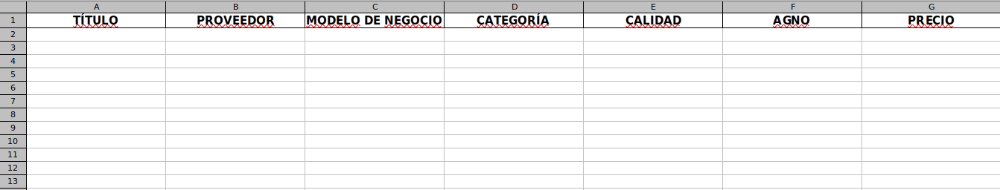

En la siguiente imagen, se presenta el formato utilizado para la hoja Excel restante, en la que se realiza el registro de los títulos de tipo series.

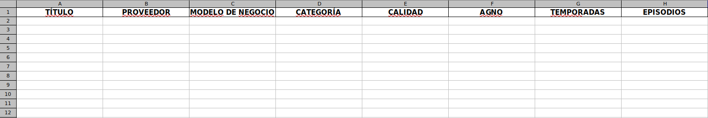

## **Anexo S**

Se representa a continuación, dos capturas efectuadas en el preciso instante en el que acontece la desincronización en las imágenes.

-   Primera imagen:

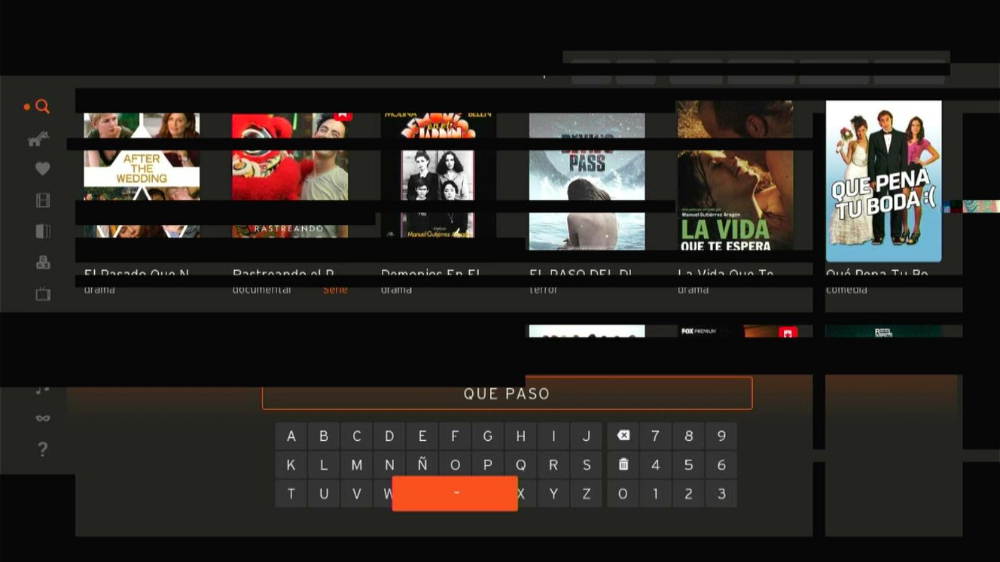

-   Segunda imagen:

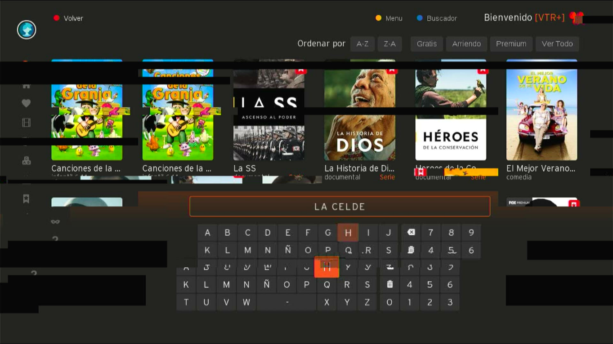

Las capturas anteriores demuestran con claridad la desincronización o “cortes” en las imágenes transmitidas por el decodificador de señal. Una imagen de este tipo, al tener una apariencia dividida e incompleta, genera confusión y distracciones en el funcionamiento del motor OCR, provocando, finalmente, que la herramienta no sea capaz de extraer los datos de interés.

## **Anexo T**

Se representan a continuación, las preguntas formuladas en la encuesta de satisfacción realizada a los ejecutores del servicio, antes y después de la implementación de la herramienta.

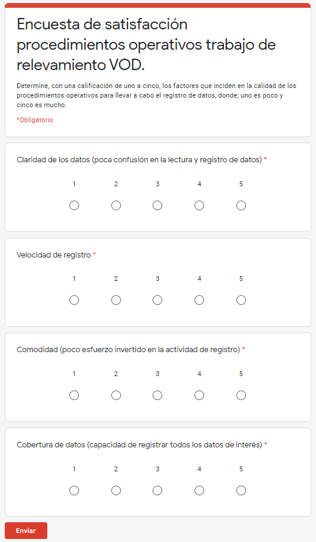

## **Anexo U**

Se representa a continuación, una imagen del repositorio dedicado al versionamiento de código fuente de la herramienta de software.

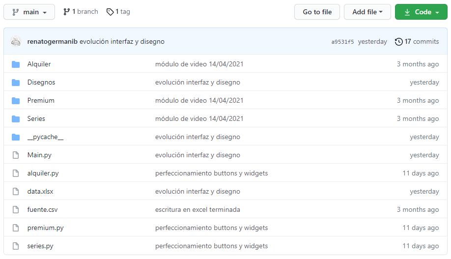

Por otro lado, en la siguiente imagen, se representa el repositorio dedicado al versionamiento de la documentación del proyecto.

